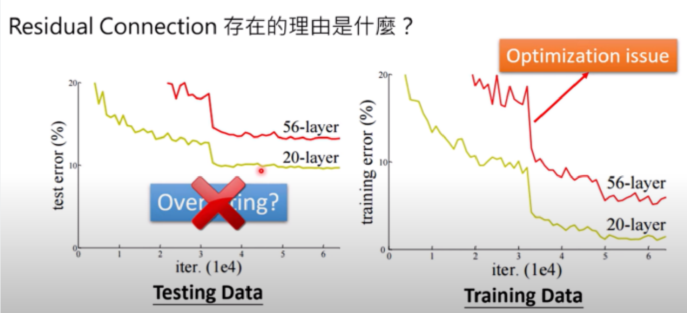
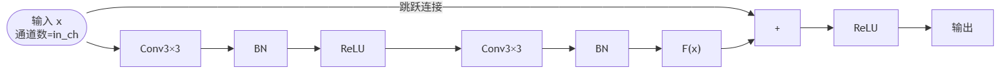
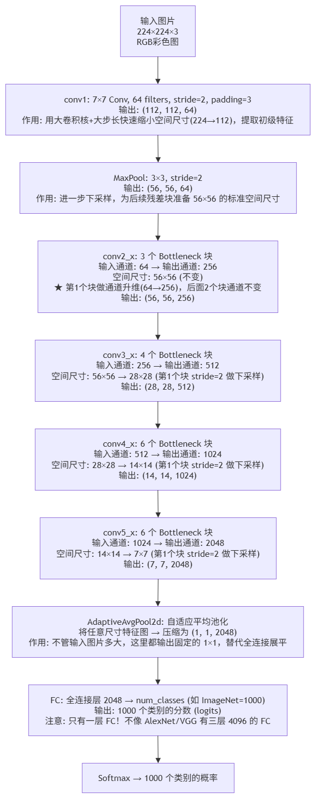

# 卷积神经网络CNN2

## [AlexNet](https://docs.pytorch.org/vision/main/models/generated/torchvision.models.alexnet.html)

AlexNet是由Alex Krizhevsky、Ilya Sutskever和Geoffrey Hinton在2012年提出的一种深度卷积神经网络结构，被广泛认为是深度学习领域的重要突破之一。其中，Alex Krizhevsky是该模型的主要贡献者之一，他与Sutskever和Hinton共同设计和实现了这个模型。他们ImageNet大规模视觉识别挑战赛上以远超其他竞争者的优异成绩夺得冠军，证明了深度学习在计算机视觉任务中的巨大潜力。AlexNet的成功促进了深度学习的发展，并启发了许多后来的研究工作。

**Ilya Sutskever（伊利亚·苏茨克弗）** 是一位著名的人工智能科学家，现为OpenAI的联合创始人和首席研究科学家。他在深度学习、机器翻译、生成模型等领域做出了许多重要贡 献，并被认为是深度学习领域的杰出代表之一。

Sutskever于2012年与Alex Krizhevsky和Geoffrey Hinton一起提出了AlexNet，这是一种深度卷积神经网络结构，引领了计算机视觉和深度学习的发展方向。他还在序列建模领域做出了突出的工作，如提出了 **Seq2Seq** 模型，极大地提高了机器翻译的准确性与效率。


### 网络架构的特点

- 第一个、第二个卷积层是独立的
- 第三个卷积层进行了交叉
- 第四个卷积层又保持独立
- 第5个卷积层保持独立
- 最后的全连接直接计算
- 当时GPU显存不够，所以采用多GPU训练，把**模型**拆成两半分别放到 2 个 GPU 上
  - **多GPU设计的真正原因（模型并行，不是数据并行）**：当时使用的 NVIDIA GTX 580 显存只有 **3GB**。AlexNet 有约 **6000万参数**，加上前向传播中的中间激活值（feature maps），一张 GPU 根本放不下整个模型。所以作者把每一层的**卷积核（channel 维度）拆成两半**，分别放在两个 GPU 上，只在特定层做跨 GPU 通信（详见下文"独立/交叉"的说明）。这种"把同一个模型切开分到多卡"的做法叫 **模型并行 (model parallelism)**。
  - ⚠️ **注意区分**：把一个 batch 的**样本**平均分到多张卡、每张卡跑完整模型，那叫 **数据并行 (data parallelism)**，是今天最常用的多卡方式——但 AlexNet 用的**不是**这种。另外，AlexNet 论文里的 batch size 是 **128**，不是 256。
- **输出层：** Softmax: 1000类，输出概率值
- **输入层：** AlexNet的输入是彩色图像，通常使用大小为224×224像素的图像作为输入

> **⚠️ 注意：论文中的 224×224 实际上是笔误。** 用特征图公式验证：第一层输出要求是 55×55，$N=\frac{W-11}{4}+1=55$，解得 $W=227$。所以**实际输入尺寸是 227×227**。这是深度学习领域一个众所周知的"历史错误"，PyTorch 的 torchvision 实现做了自适应处理，可接受任意尺寸输入。

### 卷积层和池化层

- 第一层（卷积层）
  - 卷积核大小：11×11
  - 卷积核数量：96个
  - 步长（stride）：4
  - 激活函数：ReLU（修正线性单元）
  - 后接 **LRN（局部响应归一化）**
- 第二层（池化层）
  - 池化类型：最大池化（Max Pooling）
  - 池化核大小：3×3
  - 步长：2
- 第三层（卷积层）
  - 卷积核大小：5×5
  - 卷积核数量：256个
  - 步长：1
  - 激活函数：ReLU
  - 后接 **LRN（局部响应归一化）**
- 第四层（池化层）
  - 池化类型：最大池化（Max Pooling）
  - 池化核大小：3×3
  -  步长：2
- 第五层（卷积层）
  - 卷积核大小：3×3
  - 卷积核数量：384个
  - 步长：1
  - 激活函数：ReLU
- 第六层（卷积层）
  - 卷积核大小：3×3
  - 卷积核数量：384个
  - 步长：1
  - 激活函数：ReLU
- 第七层（卷积层）
  - 卷积核大小：3×3
  - 卷积核数量：256个
  - 步长：1
  - 激活函数：ReLU
- 第八层（池化层）
  - 池化类型：最大池化
  - 池化核大小：3×3
  - 步长：2

### 全连接层

- 全连接层（第九层）
  - 全连接神经元数量：4096个
  - 激活函数：ReLU
- Dropout层
  - 用于减少过拟合的正则化手段
- 全连接层(第十层)
  - 全连接神经元数量：4096个
  - 激活函数：ReLU
- Dropout层
  - 用于减少过拟合的正则化手段
- 输出层(第十一层)
  - 全连接神经元数量：对应分类的类别数量
  - 激活函数：Softmax

### AlexNet 的创新意义

#### ReLU 的突破

在 AlexNet 之前，神经网络普遍使用 **tanh** 或 **sigmoid**（S型）作为激活函数。这两种函数在输入值较大或较小时，梯度趋近于 0（称为**饱和区**），导致深层网络中梯度在反向传播时逐层衰减，最终消失——这就是著名的**梯度消失**问题。

ReLU 的公式很简单：$f(x)=\max(0, x)$。它的关键优势是：
- **正数区梯度恒为 1**：无论输入多大，梯度都不会衰减
- **计算极快**：只需一个 if 判断，不需要指数运算
- AlexNet 论文报告 ReLU 的训练速度比 tanh 快 **6 倍**

> **ReLU 的缺点**：负数区梯度为 0，可能导致神经元永远"死去"（Dead ReLU）。后来的 LeakyReLU、PReLU、SELU 等变体通过给负数区一个小的非零斜率来解决这个问题。

#### 参数量分布：大部分参数在全连接层

```python
import torch
import torchvision.models as models

alexnet = models.alexnet()
total_params = sum(p.numel() for p in alexnet.parameters())
print(f"总参数量: {total_params:,}")  # 约 61,100,840

# 查看各层参数量分布
for name, param in alexnet.named_parameters():
    if 'weight' in name:
        print(f"{name:30s} shape={str(param.shape):20s} params={param.numel():>10,}")

# 全连接层参数量
fc_params = sum(p.numel() for name, p in alexnet.named_parameters()
                if 'classifier' in name)
print(f"\n全连接层参数量: {fc_params:,}")
print(f"全连接层占比: {fc_params/total_params*100:.1f}%")  # 约 96%
```

> **关键发现**：全连接层占了 96% 的参数！这也是为什么后来的网络（如 ResNet、GoogLeNet）大幅减少全连接层的使用——参数太多，容易过拟合，计算也慢。

#### Dropout

AlexNet 在全连接层引入了 **Dropout**：训练时以一定概率 p（如 0.5）随机"丢弃"神经元（将其输出置零）。这迫使每个神经元不能依赖特定同伴的存在，从而学习到更鲁棒的特征。

> **直觉理解**：如果把神经网络看作一个团队，Dropout 就是每次随机让一半成员"休假"，剩下的必须学会独立完成任务。这样在测试时全员到齐，效果自然更好。

**补充：训练和测试时 Dropout 的行为完全不同（初学者最容易踩的坑）**

Dropout 只在**训练时**丢神经元；**测试（推理）时不丢，全员参与**。但这里有个问题：训练时平均只有一半神经元在工作，测试时全员上阵，那这一层输出的总量（期望值）就会比训练时大一倍，导致训练和测试对不上。

PyTorch 用的解决办法叫 **inverted dropout（反向缩放）**：训练时把没被丢掉的神经元输出**除以 (1-p) 放大**，测试时则原样通过、什么都不做。这样两个阶段的期望输出就一致了。

关键是：这套切换靠 `model.train()` 和 `model.eval()` 两个开关自动完成，**忘记调用 `model.eval()` 是新手最常见的 bug**——会导致推理结果每次都随机抖动。

```python
import torch
import torch.nn as nn

torch.manual_seed(0)
drop = nn.Dropout(p=0.5)
x = torch.ones(1, 10)  # 全 1，方便观察

# 训练模式：随机置零一部分，其余 ×2（即 ÷(1-0.5)）来补偿
drop.train()
print("train 模式输出:", drop(x))
# 例如: tensor([[2., 0., 2., 2., 0., 0., 2., 0., 2., 2.]])
#      被保留的变成 2（放大了），被丢的变成 0
print("train 两次结果不同（随机）:", not torch.equal(drop(x), drop(x)))

# 测试模式：不丢弃、不缩放，原样输出
drop.eval()
print("eval  模式输出:", drop(x))   # tensor([[1., 1., 1., ..., 1.]])
print("eval  两次结果相同（确定）:", torch.equal(drop(x), drop(x)))
```

> **一句话记住**：训练前写 `model.train()`，推理/验证前写 `model.eval()`。Dropout 和下文的 BatchNorm 都依赖这个开关来切换行为。

## [VGGNet](https://docs.pytorch.org/vision/main/models/vgg.html)

VGG是由牛津大学Visual Geometry Group的Karen Simonyan和Andrew Zisserman于2014年提出的一种深度卷积神经网络结构，是深度学习领域中非常著名的模型之一。该模型采用了非常深的网络结构，具有很好的特征提取能力和泛化性能，在计算机视觉领域中被广泛应用。

Karen Simonyan和Andrew Zisserman都是英国知名的计算机视觉科学家，在图像分类、物体检测、人脸识别等领域做出了许多重要贡献。他们在VGG中使用了小尺寸的卷积核和多个同样大小的卷积层堆叠，通过增加网络深度来提高特征表达的能力，最终将输入图像映射到类别概率上。VGG在当时的ImageNet挑战赛上取得了很好的成绩，被视为深度学习模型设计的经典案例之一。


### 网络结构特点

- 网络结构层次更深
- 多使用**3×3的卷积核**
  - 2个3×3的卷积层可以看做一层5×5的卷积层
  - 3个3×3的卷积层可以看做一层7×7的卷积层
  - 1×1的卷积层可以看做是通道间的**线性变换**（矩阵乘法），常用于降维或升维。加上 ReLU 激活函数后才成为非线性变换。详情参考 CNN1 笔记中的"深度可分离卷积 → Pointwise（1×1 卷积）"部分
- **每经过一个pooling层，通道数目翻倍（直到 512 封顶）** —— 经过 pooling (2×2, stride=2) 后空间分辨率变为原来的 1/4，如果通道数不变，总信息容量会剧烈衰减。把通道数翻倍（×2），总容量为原来的 (1/4)×2 = 1/2，在可控范围内逐步压缩，不会丢失太多信息。类比：一根粗管分流成多根细管，总数大致守恒
  - ⚠️ **注意**："翻倍"是设计意图，不是严格规律。VGG 的实际通道走向是 **64 → 128 → 256 → 512 → 512**，最后一级 pooling 后通道数**保持 512、不再翻倍**——因为 512 通道的参数量和显存开销已经很大，继续翻到 1024 代价太高。真正每次都严格翻倍的是后面的 ResNet（planes 走向 64 → 128 → 256 → 512）

> **补充说明——"信息守恒"的直觉**：VGG 中各阶段的计算量大致均匀，前面空间大、通道少（关注空间细节），后面空间小、通道多（关注语义抽象），这是一个精心设计的平衡策略。

### 创新点

- **使用小尺寸的卷积核**

  VGG使用了3×3的小尺寸卷积核来代替较大的卷积核，这样可以增加网络深度而不会增加计算量。

- **堆叠多个同样大小的卷积层**

  VGG采用了堆叠多个相同大小的卷积层的方式来提高网络的性能。这样做可以增加非线性映射和特征抽取的能力，使得网络更好地学习图像中的复杂特征。

- **使用最大池化层进行下采样**

  VGG使用了最大池化层来对特征图进行下采样，从而使得网络对位置的变化更加鲁棒。

- **预训练和权重初始化**

  VGGNet采用了一种Pre-training（预训练）的方式，即先训练层数较少的网络，然后使用这些网络的权重来初始化更深层次的网络，加快了训练的收敛速度。

- **多尺度训练与预测**

  VGGNet在训练和预测时采用了多尺度的方法，即对输入图像进行不同尺寸的缩放，增加了训练数据量，防止过拟合，提升了预测准确率。（数据增强）

- **1×1卷积核的探索**

  VGG 论文中**实验过**带 1×1 卷积的配置（Config C），可看作对输入通道的线性变换。但最终获奖并且成为标准的 **VGG16（Config D）和 VGG19（Config E）只用了 3×3 卷积，没有 1×1 卷积**。真正把 1×1 卷积发扬光大的是后来的 GoogLeNet（Inception）和 ResNet（瓶颈结构中的降维/升维）。

- **网络结构清晰简单**

  VGG的网络结构非常清晰简单，由若干个卷积层、池化层和全连接层组成。这使得网络易于理解和实现，并且在各种计算机视觉任务中都表现出较好的性能。

### VGG16和VGG19

全名为**Visual Geometry Group**

VGG以其简单、规整的结构而闻名，其主要特点是将多个较小的卷积核堆叠在一起，形成较深的网络

#### VGG16

VGG16有16个卷积和全连接层：

- **输入层：** 224×224像素的彩色图像
- **Convolutional Block 1：**
  - 2个卷积层，每层有64个3×3大小的卷积核
  - 每个卷积层后接一个ReLU激活函数
  - 1个2×2最大池化层，步长为2
- **Convolutional Block 2：**
  - 2个卷积层，每层有128个3×3大小的卷积核
  - 每个卷积层后接一个ReLU激活函数
  - 1个2×2最大池化层，步长为2
- **Convolutional Block 3：**
  - 3个卷积层，每层有256个3×3大小的卷积核
  - 每个卷积层后接一个ReLU激活函数
  - 1个2×2最大池化层，步长为2
- **Convolutional Block 4：**
  - 3个卷积层，每层有512个3×3大小的卷积核
  - 每个卷积层后接一个ReLU激活函数
  - 1个2×2最大池化层，步长为2
- **Convolutional Block 5：**
  - 3个卷积层，每层有512个3×3大小的卷积核
  - 每个卷积层后接一个ReLU激活函数
  - 1个2×2最大池化层，步长为2
- **全连接层：**
  - 3个全连接层，每层有4096个神经元
  - 每个全连接层后接一个ReLU激活函数
  - 最后一个全连接层后接一个Softmax激活函数（用于多分类任务）

#### VGG19

VGG19相较于VGG16，增加了3个额外的卷积层，具有更深的网络结构。

除了卷积核数量和层数的不同，VGG16和VGG19的网络结构是非常相似的。这种简单规整的结构使得VGG模型易于理解和实现，并为深度学习的研究和应用提供了基础。然而，由于其较深的结构，VGG模型在训练和推理过程中较慢，后续的一些模型如ResNet和 Inception等则采取了更高效的结构。


- 从11层（没有参数的层不算）增至19层

- **去掉了 AlexNet 的 LRN（局部响应归一化）**：VGG 作者实验发现 LRN 对准确率几乎没有提升，反而增加计算开销，所以直接移除

  >**LRN (Local Response Normalization，局部响应归一化)** 是 AlexNet 中使用的一项技术，灵感来自生物神经元的**侧抑制（lateral inhibition）**——一个活跃的神经元会抑制它周围神经元的活性。
  >
  >- **做法**：对同一空间位置上、相邻通道间的激活值做归一化（让激活值较大的通道抑制周围的通道）
  >- **为什么 AlexNet 用了 LRN？** 在 Batch Normalization (BN) 还没被发明的 2012 年，LRN 被认为能帮助训练
  >- **为什么 VGG 不用 LRN？** VGG 作者实验发现 LRN **对准确率几乎没有提升**，反而增加了计算开销和内存消耗。所以 VGG 直接去掉了 LRN，让网络结构更简洁
  >
  > **历史线索**：AlexNet(2012) 用 LRN → VGG(2014) 发现 LRN 没用，去掉 → ResNet(2015) 大量使用 Batch Normalization（比 LRN 强大得多）。这个演进反映了深度学习社区对"归一化技术"的认知深化过程。
  
- **为什么都在后面加层：** 前面空间尺寸大（224×224、112×112），在 3×3 卷积的计算量公式 $K^2 \times C_{in} \times C_{out} \times H \times W$ 中，H×W 很大，如果在前面加太多层，计算量会爆炸。后面经过 pooling 后空间变小（14×14、7×7），虽然通道数翻倍了，但 H×W 缩小为原来的 1/4，计算量大致平衡。所以"后面加层"本质上是在计算量可控的前提下，让深层网络学到更抽象的语义特征。VGG 5个阶段的计算量分布大致均匀，正体现了这一设计智慧

- 总体参数数目基本保持不变（VGG11→VGG16→VGG19 的参数量递增: ~133M → ~138M → ~144M，差异主要来自后几层增加的 3×3×512 卷积）

> **VGG 的致命弱点——参数量集中在哪里？**
>
> VGG16 的 ~138M 参数中，**约 124M（90%）都在全连接层！** 具体来说：
> - 第一个 FC (25088→4096): 约 102M 参数
> - 第二个 FC (4096→4096): 约 17M 参数
> - 第三个 FC (4096→1000): 约 4M 参数
> - 所有卷积层加起来: 仅约 15M 参数
>
> 这就是为什么后来的网络（ResNet、GoogLeNet）都在"去全连接化"——用全局平均池化替代庞大的 FC 层。VGG 虽然思路正确（小而深的卷积核），但巨大的 FC 层让它在实际部署中非常笨重。

```python
import torchvision.models as models

vgg16 = models.vgg16()
total = sum(p.numel() for p in vgg16.parameters())
conv_params = sum(p.numel() for n, p in vgg16.named_parameters()
                  if 'features' in n)
fc_params = sum(p.numel() for n, p in vgg16.named_parameters()
                if 'classifier' in n)
print(f"VGG16 总参数量:      {total/1e6:.0f}M")
print(f"  卷积层参数:        {conv_params/1e6:.1f}M ({conv_params/total*100:.0f}%)")
print(f"  全连接层参数:      {fc_params/1e6:.1f}M ({fc_params/total*100:.0f}%)")
# 输出: 卷积层仅占约 10%，全连接层占了 ~90%！
```

### 卷积核是奇数的原因

- 为了方便same padding时的处理

  如步长为1时，要补充k-1的zero padding才能使输入输出的尺寸一致，这时候如果核大小k是偶数，则需要补充奇数的zero padding，不能平均分到feature map的两侧。

- 为了统一标准

  卷积核的滑动是默认使用中心点作为基准而进行的，而奇数核拥有这样天然的基准。（其实自己定义偶数核的基准也是可以的，如使用核的左上角作为基准）

- 为了更好地获取中心信息

  由于奇数核拥有天然的绝对中心点，因此在做卷积的时候能更好地获取到中心这样的概念信息。

## [ResNet](https://arxiv.org/abs/1512.03385)

ResNet是由微软亚洲研究院的何凯明（Kaiming He）和他的团队在2015年提出的一种深度卷积神经网络结构，被广泛认为是深度学习领域中的重要突破之一。ResNet通过引入残差连接来解决深层神经网络训练时出现的梯度消失和梯度爆炸等问题，使得网络可以更加深层、更加高效地训练。

### 加深层次的问题

模型深度达到某个程度后继续加深，反而会导致**训练集**准确率下降。下图是 **56 层和 20 层普通网络（plain network）在 CIFAR-10 上的对比效果图**：



**注意：** 并不是过拟合，因为**训练集**的 error 也很高（过拟合的典型特征是训练误差低、测试误差高，这里训练误差本身就高）。真正的原因是较深的网络**比较难优化（收敛）**。

**退化：** 模型层次加深后，模型的性能不仅没有提升，反而出现了显著的下降，把这种现象称为退化。

### 残差网络

#### 核心思想：学习"残差"而不是直接学习"映射"

**传统网络的做法：**

```
输入 x → 权重层 → ReLU → 权重层 → ReLU → 输出 H(x)
目标：直接学习从 x 到正确输出 H(x) 的映射
```

**残差网络的做法：**


数学表达：
$$H(x) = F(x) + x$$


> **上图解读（残差块 Residual Block）**：输入 $x$ 兵分两路——一路经过两层权重层（通常是卷积层）和 ReLU，学习出**残差映射** $F(x)$；另一路通过一条**捷径连接（shortcut / identity mapping）** 原封不动地跳过这些权重层。两路在末端相加得到 $F(x)+x$，再过一次 ReLU 作为输出。正因为多了这条"什么都不做"的捷径，网络只需学习输入与目标之间的**差值（残差）**，而不必从头学习整个复杂映射，从而缓解了深层网络的梯度消失和退化问题。

其中：
- $H(x)$：我们希望网络学习的**目标映射**
- $x$：**输入（恒等映射）**，通过跳跃连接直接传过来
- $F(x) = H(x) - x$：权重层需要学习的**残差**（residual）

**为什么叫"残差"？** 残差 = 目标值 - 当前值，即 $F(x) = H(x) - x$。网络不再学习整个 $H(x)$，而是学习 $H(x)$ 与 $x$ 之间的"差距"。

> **关键直觉**：如果理想输出就是输入本身（$H(x) = x$，即恒等映射），传统网络需要费力气去学习"什么也不做"，而残差网络只需把 $F(x)$ 的权重推向 0 即可。**把权重推向 0，比让权重组合成恒等映射容易得多！**

#### 为什么残差连接能解决退化问题

退化不是因为过拟合（训练集误差也高），而是因为**深层网络难以优化**。具体来说：

1. **梯度消失的角度**：
   - 传统深层网络：梯度在反向传播时经过许多乘法，每层的雅可比矩阵可能 < 1，连乘导致梯度指数级衰减
   - 残差网络的梯度：$x_{l+1} = x_l + F(x_l)$，求导得 $\frac{\partial x_{l+1}}{\partial x_l} = 1 + \frac{\partial F}{\partial x_l}$——**常数 1 保证梯度有一条"高速公路"直达浅层，不会被衰减到 0**

2. **优化景观的角度**：
   - 残差连接让损失平面（loss landscape）变得更"平滑"，优化器更容易找到好的解
   - 没有残差连接时，损失平面充满陡峭的峡谷和局部极小值

> **类比**：传统的深层网络像是让信息通过一条长长的、有很多关卡的传送带——每过一关，信息可能丢失一点。残差网络在每个关卡旁边加了一条"紧急通道"（跳跃连接），信息可以绕过关卡直接向后传，不会丢失。

#### 残差块（Residual Block）—— ResNet 的基本单元

**残差块**是 ResNet 中最小的可重复构建单元。一个残差块由两部分组成：

```
残差块 = 主路径（权重层）+ 捷径（shortcut / skip connection）
```

**数学定义：**

$$\mathbf{y} = \mathcal{F}(\mathbf{x}, \{W_i\}) + \mathbf{x}$$

其中：
- $\mathbf{x}$：残差块的**输入**
- $\mathcal{F}(\mathbf{x}, \{W_i\})$：**残差函数**（residual function），即主路径上若干权重层学习到的映射
- $\mathbf{y}$：残差块的**输出**，是残差函数与输入的逐元素相加
- $\{W_i\}$：主路径中各层的权重参数

**残差块的关键特征：**

1. **"+ x" 的跳跃连接是残差块的灵魂**：没有它，残差块就退化成一个普通的卷积序列（和 VGG 没什么区别）
2. **残差块的输入输出维度必须匹配**才能直接相加（**+** 是逐元素加法）。当维度不匹配时，捷径上需要额外的投影层（如 1×1 卷积）来对齐维度
3. **一个残差块内通常包含 2~3 个卷积层**，层数太少则残差学习的能力不够，太多则退化为小型的普通网络

> **直觉理解**：残差块就像一个"修正器"——它不从头学习答案，而是在输入的基础上做**微调**。如果输入已经够好了，网络可以把 $\mathcal{F}(\mathbf{x})$ 学成接近 0；只有当输入不够好时，才学一个有意义的修正量。这种"按需修正"的机制，比"每次从零开始算"要高效得多。

---

#### 残差层（Residual Layer / Stage）—— 多个残差块的组合

如果说**残差块**是 ResNet 的"积木"，那**残差层**就是由多个相同通道数的残差块堆叠而成的"功能模块"。

在 ResNet 论文和代码中，残差层通常用 `conv2_x`、`conv3_x`、`conv4_x`、`conv5_x` 来命名，共 **4 个残差层**，对应 4 个不同的空间分辨率阶段：

```
输入图片
  │
  ├── conv1 (初始卷积 + 池化)        空间: 224×224 → 56×56
  │
  ├── conv2_x (残差层1)             空间: 56×56  (保持不变)
  │     ├── 残差块 2-1              通道: 64 (或 256 for Bottleneck)
  │     ├── 残差块 2-2
  │     └── ...
  │
  ├── conv3_x (残差层2)             空间: 56×56 → 28×28 (第一个块 stride=2)
  │     ├── 残差块 3-1              通道: 128 (或 512 for Bottleneck)
  │     ├── 残差块 3-2
  │     └── ...
  │
  ├── conv4_x (残差层3)             空间: 28×28 → 14×14
  │     ├── 残差块 4-1              通道: 256 (或 1024 for Bottleneck)
  │     ├── 残差块 4-2
  │     └── ...
  │
  ├── conv5_x (残差层4)             空间: 14×14 → 7×7
  │     ├── 残差块 5-1              通道: 512 (或 2048 for Bottleneck)
  │     ├── 残差块 5-2
  │     └── ...
  │
  └── 全局平均池化 → 全连接 → 输出
```

**残差层的设计规律：**

| 属性 | 规律 | 原因 |
|------|------|------|
| **空间分辨率** | 每个残差层的第一个块做一次下采样（stride=2），层内后续块保持分辨率不变 | 逐步压缩空间信息，提取越来越抽象的特征 |
| **通道数** | 每进入一个新残差层，通道数翻倍（64→128→256→512 或 256→512→1024→2048） | 空间缩小后增加通道数，保持总信息容量大致平衡（和 VGG 的设计哲学一脉相承） |
| **块数** | 中间的残差层（conv3_x、conv4_x）块数最多，首尾较少 | 中等分辨率（28×28、14×14）是"语义抽象"的关键阶段，需要更多层来学习 |

**四个残差层的块数分配（以各版本为例）：**

| 残差层 | 输出尺寸 | ResNet-18 | ResNet-34 | ResNet-50 | ResNet-101 | ResNet-152 |
|--------|---------|-----------|-----------|-----------|------------|------------|
| conv2_x | 56×56 | 2 块 | 3 块 | 3 块 | 3 块 | 3 块 |
| conv3_x | 28×28 | 2 块 | 4 块 | 4 块 | 4 块 | 8 块 |
| conv4_x | 14×14 | 2 块 | 6 块 | 6 块 | 23 块 | 36 块 |
| conv5_x | 7×7 | 2 块 | 3 块 | 3 块 | 3 块 | 3 块 |

> **关键观察**：ResNet-50/101/152 在 conv4_x（14×14 分辨率）大量堆叠残差块——这个阶段是"从局部特征过渡到全局语义"的黄金窗口。空间已经小到计算成本可控，但又没有小到丢失所有空间结构，是堆深度的最佳位置。

**残差块 vs 残差层 —— 概念对比：**

| | 残差块（Residual Block） | 残差层（Residual Layer / Stage） |
|------|------|------|
| **层级** | 微观：最小的可重复单元 | 宏观：由多个同通道数的残差块组成 |
| **功能** | 学习一个局部残差映射 $\mathcal{F}(\mathbf{x}) + \mathbf{x}$ | 处理一个空间分辨率下的所有特征提取 |
| **内部结构** | 2~3 个卷积层 + 1 条跳跃连接 | 若干个残差块 + 1 次下采样（第一个块） |
| **空间变化** | 层内大部分块保持分辨率不变 | 层的第一个块将空间减半 |
| **通道变化** | 块内输入输出通道相同（或通过投影对齐） | 进入新层时通道数翻倍 |
| **代码体现** | `BasicBlock` / `Bottleneck` 类 | `_make_layer()` 方法，返回 `nn.Sequential` |
| **数量** | ResNet-18 有 8 个，ResNet-152 有 50 个 | 所有 ResNet 固定 4 个残差层 |

---

#### ResNet 中的两种残差块

**BasicBlock（基础残差块）—— ResNet-18/34 使用：**



- 两个 3×3 卷积，通道数不变
- 当需要改变维度时（stride=2 或通道数变化），跳跃连接通过 1×1 卷积做投影（projection shortcut）

**Bottleneck（瓶颈残差块）—— ResNet-50/101/152 使用：**


- **为什么叫"瓶颈"？** 先用 1×1 卷积把通道压缩（256→64），在低维度做 3×3 卷积（省钱），再用 1×1 恢复（64→256）
- **参数对比**（输入输出均为 256 通道）：
  - 两个 3×3 直接卷积：$2 \times 3^2 \times 256^2$ ≈ **118 万**参数
  - Bottleneck：$1^2 \times 256 \times 64 + 3^2 \times 64 \times 64 + 1^2 \times 64 \times 256$ ≈ **7 万**参数
  - **节省了约 94% 的参数量！** 所以 ResNet-50 虽然比 ResNet-34 层数更多，但参数增加并不多

#### 代码实现

```python
import torch
import torch.nn as nn


class BasicBlock(nn.Module):
    """ResNet-18/34 使用的基础残差块"""
    expansion = 1  # 输出通道不扩张

    def __init__(self, in_channels, out_channels, stride=1, downsample=None):
        super().__init__()

        # 第一个 3×3 卷积（可能在此层做下采样: stride=2）
        self.conv1 = nn.Conv2d(in_channels, out_channels, kernel_size=3,
                               stride=stride, padding=1, bias=False)
        self.bn1 = nn.BatchNorm2d(out_channels)

        # 第二个 3×3 卷积（stride=1，不改变尺寸）
        self.conv2 = nn.Conv2d(out_channels, out_channels, kernel_size=3,
                               stride=1, padding=1, bias=False)
        self.bn2 = nn.BatchNorm2d(out_channels)

        self.relu = nn.ReLU(inplace=True)
        # 当输入输出维度不匹配时，跳跃连接通过 1×1 卷积做投影
        self.downsample = downsample

    def forward(self, x):
        identity = x  # 保存输入，用于跳跃连接

        # 主路径：Conv → BN → ReLU → Conv → BN
        out = self.conv1(x)
        out = self.bn1(out)
        out = self.relu(out)

        out = self.conv2(out)
        out = self.bn2(out)

        # 跳跃连接：如果维度不匹配则调整
        if self.downsample is not None:
            identity = self.downsample(x)

        # ★ 核心操作：F(x) + x
        out += identity
        out = self.relu(out)

        return out


class Bottleneck(nn.Module):
    """ResNet-50/101/152 使用的瓶颈残差块"""
    expansion = 4  # 输出通道 = out_channels × 4

    def __init__(self, in_channels, out_channels, stride=1, downsample=None):
        super().__init__()
        mid_channels = out_channels  # 中间层（瓶颈）通道数

        # 1×1 降维：in_channels → mid_channels
        self.conv1 = nn.Conv2d(in_channels, mid_channels, kernel_size=1,
                               stride=1, bias=False)
        self.bn1 = nn.BatchNorm2d(mid_channels)

        # 3×3 空间卷积（做实际的特征提取）
        self.conv2 = nn.Conv2d(mid_channels, mid_channels, kernel_size=3,
                               stride=stride, padding=1, bias=False)
        self.bn2 = nn.BatchNorm2d(mid_channels)

        # 1×1 升维：mid_channels → out_channels × 4
        self.conv3 = nn.Conv2d(mid_channels, out_channels * self.expansion,
                               kernel_size=1, stride=1, bias=False)
        self.bn3 = nn.BatchNorm2d(out_channels * self.expansion)

        self.relu = nn.ReLU(inplace=True)
        self.downsample = downsample

    def forward(self, x):
        identity = x

        out = self.conv1(x)
        out = self.bn1(out)
        out = self.relu(out)

        out = self.conv2(out)
        out = self.bn2(out)
        out = self.relu(out)

        out = self.conv3(out)
        out = self.bn3(out)

        if self.downsample is not None:
            identity = self.downsample(x)

        out += identity  # F(x) + x
        out = self.relu(out)

        return out


# ---- 验证梯度流：残差连接如何防止梯度消失 ----
block = BasicBlock(in_channels=16, out_channels=16, stride=1)
x = torch.randn(2, 16, 32, 32, requires_grad=True)

y = block(x)
loss = y.sum()
loss.backward()

# 检查输入的梯度（因为有跳跃连接，梯度不会全是零）
print(f"输入梯度非零比例: {(x.grad != 0).float().mean()*100:.1f}%")
print(f"输入梯度均值: {x.grad.abs().mean():.6f}")
print("✓ 跳跃连接保证梯度有直通路径，不会完全消失")
```

#### ResNet 各版本一览

| 模型 | 层数 | 残差块类型 | 各阶段块数 | 参数量 |
|------|------|-----------|-----------|--------|
| ResNet-18 | 18 | BasicBlock | [2, 2, 2, 2] | 11.7M |
| ResNet-34 | 34 | BasicBlock | [3, 4, 6, 3] | 21.8M |
| ResNet-50 | 50 | Bottleneck | [3, 4, 6, 3] | 25.6M |
| ResNet-101 | 101 | Bottleneck | [3, 4, 23, 3] | 44.5M |
| ResNet-152 | 152 | Bottleneck | [3, 8, 36, 3] | 60.2M |

> **规律**：ResNet-18 和 ResNet-34 用 BasicBlock（两个 3×3 卷积），ResNet-50 及以上用 Bottleneck（三个卷积，1×1→3×3→1×1）。Bottleneck 虽然层数更多，但因为 1×1 卷积的"压缩→计算→恢复"机制，参数量并没有随层数线性增长。

```python
# 在 PyTorch 中加载不同版本 ResNet，验证参数量
import torchvision.models as models

for name in ['resnet18', 'resnet34', 'resnet50', 'resnet101', 'resnet152']:
    model = getattr(models, name)()
    params = sum(p.numel() for p in model.parameters()) / 1e6
    print(f"{name:12s}: {params:.1f}M 参数")
```

#### Batch Normalization —— ResNet 能够训练 152 层的关键

**一个重要的历史事实**：AlexNet (2012) 和 VGGNet (2014) 都**没有使用 Batch Normalization**，因为 BN 是 2015 年才提出的（与 ResNet 同年）。

BN 在训练时对每个 mini-batch 的数据做标准化（均值 0，方差 1），然后通过可学习的参数 $\gamma$（缩放）和 $\beta$（平移）恢复网络的表达能力：
$$\hat{x} = \frac{x - \mu_{batch}}{\sqrt{\sigma^2_{batch} + \epsilon}}, \quad y = \gamma\hat{x} + \beta$$

BN 的作用：
1. **加速收敛**：每层输入分布稳定，可以用更大的学习率
2. **缓解梯度消失**：激活值不会跑到饱和区
3. **正则化效果**：mini-batch 的统计量带有噪声，相当于一种随机正则化，减轻了对 Dropout 的依赖
4. **让深层网络可训**：没有 BN，ResNet-152 根本无法收敛

> **AlexNet → VGG → ResNet 的归一化演进**：
> - AlexNet (2012)：使用 LRN（本地响应归一化）→ 后来发现作用不大
> - VGG (2014)：实验证明 LRN 没用，直接去掉
> - ResNet (2015)：大量使用 Batch Normalization（每个卷积层后都有 BN）→ 真正有效的归一化方案

**补充：BN 在训练和测试时也不一样（和 Dropout 一样依赖 `train()`/`eval()`）**

上面的公式里，$\mu_{batch}$ 和 $\sigma^2_{batch}$ 是"当前这一批数据"算出来的均值和方差。这在**训练**时没问题，但**测试**时会出两个麻烦：

1. 推理常常一次只来 1 张图，一个样本算不出有意义的方差；
2. 我们希望同一张图的预测结果是**确定的**，不该因为它和谁凑在一个 batch 里而改变。

所以 BN 在训练时会用**滑动平均（running mean / running var）**偷偷记下整个训练集的均值和方差；到了测试时，就**不再看当前 batch**，而是直接用这套存好的全局统计量。这套切换同样由 `model.eval()` 触发。

```python
import torch
import torch.nn as nn

torch.manual_seed(0)
bn = nn.BatchNorm1d(3)   # 3 个特征通道

# ---- 训练阶段：用每个 batch 的统计量，并更新 running 统计量 ----
bn.train()
print("初始 running_mean:", bn.running_mean)   # [0., 0., 0.]
for _ in range(5):
    x = torch.randn(8, 3) * 2 + 5   # 均值≈5, 标准差≈2 的假数据
    bn(x)                            # 前向一次，running_mean/var 被更新
print("训练几步后 running_mean:", bn.running_mean)  # 逐渐逼近 5

# ---- 测试阶段：不再用当前 batch，而用存好的 running 统计量 ----
bn.eval()
one_sample = torch.randn(1, 3) * 2 + 5    # 只有 1 个样本也能正常推理
print("eval 单样本输出:", bn(one_sample))
print("eval 两次结果相同（确定性）:",
      torch.equal(bn(one_sample), bn(one_sample)))
```

> **踩坑提醒**：正因为 BN 依赖 batch 内的统计量，**batch size 太小（比如 1、2）时 BN 效果会明显变差**——统计量噪声太大。这也是后来出现 GroupNorm、LayerNorm 等替代方案的原因之一。

### 残差连接的方法

在ResNet中，为了确保残差连接时两个尺寸一致，有几种常见的方法：

- Padding和Stride

  残差连接在特征图尺寸不同时，可以通过合适的填充（padding）和步幅（stride）来保持尺寸一致。使用填充可以在特征图边界周围添加额外的像素，以便在卷积操作中保持尺寸。同时，调整步幅可以控制特征图的尺寸变化。

  **优势：** 这种方法直接在卷积层中进行填充或者调整步幅，能够直接控制特征图的尺寸变化，减少额外的计算开销。

  **劣势：** 对于深度较大的网络，可能需要大量的填充或者调整步幅，导致网络计算复杂度增加，同时可能会限制网络的有效信息提取能力。

- 1×1卷积（Projection Shortcut）

  如果残差连接中输入和输出的尺寸不同，可以通过在残差连接中使用额外的1×1卷积来进行尺寸匹配。这种方法在残差连接中引入一个额外的卷积层，以调整特征图的尺寸，使得输入和输出的尺寸一致，从而能够进行元素级的相加。

  **优势：** 通过引入额外的1×1卷积进行尺寸匹配，能够更精确地调整特征图的尺寸，同时避免了大量的填充操作，有利于保持网络的参数效率。

  **劣势：** 需要额外的计算成本和参数数量，并且可能增加模型的复杂性，容易导致过拟合的风险。

- 平均池化（Average Pooling Shortcut）

  当输入和输出的尺寸不同时，可以使用平均池化来降低输入特征图的尺寸，使其与输出特征图的尺寸一致。这种方法将输入特征图经过平均池化操作，以匹配输出特征图的尺寸。

  **优势：** 通过平均池化操作降低输入特征图的尺寸，能够直接匹配输出特征图的尺寸，避免了额外的填充或卷积操作。

  **劣势：** 可能会导致信息丢失，因为池化操作会丢失部分细节信息，可能影响模型性能。同时，池化操作会降低特征图的分辨率，可能会影响模型的感知能力。

这些方法中的选择取决于网络结构和层之间的尺寸变化情况。通过这些手段，ResNet中的残差连接可以确保在不同层之间传递信息时，输入和输出的尺寸保持一致，以便进行元素级的相加操作。

需要综合考虑，选择合适的方法取决于具体的网络架构、数据集特征以及性能需求。Padding和 Stride是直接且简单的方法，但可能会增加计算复杂度；1×1卷积需要更多的参数，但能够更精确地匹配尺寸；平均池化简单有效，但可能损失信息。在实际应用中，根据具体情况选择合适的方法是关键。

### 模型结构图解析

#### ResNet 整体数据流

**整体数据流（以 ResNet-50 为例）：**



**关键观察：**
- ResNet 只有**一个全连接层**（2048 → 1000），而 AlexNet/VGG 有三层 4096 的 FC。这是因为 ResNet 把"特征提取"的工作全部交给了卷积层（通过残差连接可以堆到 152 层），最后的 FC 只做简单的分类
- 每次空间减半（stride=2）时，通道数翻倍，保持计算量大致平衡

---

#### Bottleneck瓶颈层

在ResNet中，Bottleneck layer是一种特定的卷积层，它通常由三个卷积操作组成：首先是1×1的卷积，然后是3×3的卷积，最后又是1×1的卷积。这种结构的设计使得1×1的卷积层在3×3卷积层的前后起到降维和升维的作用，因此被称为瓶颈层，**进一步减少了计算量和参数量**。

#### 五个 ResNet 版本的配置对比


这张图（ResNet 原论文 Table 1）对比了五个 ResNet 版本的**残差块数量**和**卷积核配置**。下面把它整理成文字表格：

```
层名      输出尺寸    ResNet-18     ResNet-34     ResNet-50      ResNet-101     ResNet-152
─────────────────────────────────────────────────────────────────────────────────────────
conv1     112×112    7×7, 64, stride 2  (所有版本相同)
─────────────────────────────────────────────────────────────────────────────────────────
conv2_x   56×56     [3×3,64] ×2   [3×3,64] ×3   [1×1, 64] ×3  [1×1, 64] ×3  [1×1, 64] ×3
                    [3×3,64]       [3×3,64]       [3×3, 64]      [3×3, 64]      [3×3, 64]
                                                   [1×1,256]      [1×1,256]      [1×1,256]
─────────────────────────────────────────────────────────────────────────────────────────
conv3_x   28×28     [3×3,128]×2   [3×3,128]×4   [1×1,128] ×4  [1×1,128] ×4  [1×1,128] ×8
                    [3×3,128]      [3×3,128]      [3×3,128]      [3×3,128]      [3×3,128]
                                                   [1×1,512]      [1×1,512]      [1×1,512]
─────────────────────────────────────────────────────────────────────────────────────────
conv4_x   14×14     [3×3,256]×2   [3×3,256]×6   [1×1,256] ×6  [1×1,256] ×23 [1×1,256] ×36
                    [3×3,256]      [3×3,256]      [3×3,256]      [3×3,256]      [3×3,256]
                                                   [1×1,1024]     [1×1,1024]     [1×1,1024]
─────────────────────────────────────────────────────────────────────────────────────────
conv5_x   7×7      [3×3,512]×2   [3×3,512]×3   [1×1,512] ×3  [1×1,512] ×3  [1×1,512] ×3
                    [3×3,512]      [3×3,512]      [3×3,512]      [3×3,512]      [3×3,512]
                                                   [1×1,2048]     [1×1,2048]     [1×1,2048]
─────────────────────────────────────────────────────────────────────────────────────────
分类器    1×1       AdaptiveAvgPool → FC(1000) → Softmax
─────────────────────────────────────────────────────────────────────────────────────────
总参数量            11.7M          21.8M          25.6M          44.5M          60.2M
FLOPs               1.8G           3.6G           3.8G           7.6G           11.3G
```

**如何读懂这个表格：**

1. **BasicBlock（ResNet-18/34）**：每行只有一个数字，如 `[3×3, 64]`，表示一个 3×3 卷积，输出 64 通道。`×2` 表示这个阶段有 2 个 BasicBlock（即 4 个卷积层）

2. **Bottleneck（ResNet-50/101/152）**：每行有三个卷积，如 `[1×1, 64] [3×3, 64] [1×1, 256]`——这就是 Bottleneck 的三层结构：
   - 第1个 1×1：降维到 64 通道
   - 第2个 3×3：在 64 通道下做空间卷积（最省钱！）
   - 第3个 1×1：升维到 256 通道
   - `×3` 表示 3 个这样的 Bottleneck

3. **为什么 ResNet-50 比 ResNet-34 层多但参数差不多？** 因为 Bottleneck 中的 1×1 卷积大大减少了 3×3 卷积的输入输出通道数（64 而非 256）

---

#### 卷积降采样和池化降采样差异

降采样（Downsampling）是指减少特征图空间分辨率（H×W）的操作。在 CNN 中主要有两种实现方式：卷积降采样和池化降采样。ResNet 中两种方式都会用到——卷积降采样用于改变通道数时同时降尺寸，池化降采样用于卷积前的初始下采样。

**卷积降采样**（如 stride>1 的卷积）是通过卷积操作本身直接让输出特征图尺寸变小，同时可以改变通道数，还能通过卷积权重学习到更有代表性的特征，具备更强的表达能力。但这样会引入新的可学习参数，使模型复杂度上升。

> **举例**：ResNet conv1 用 7×7 卷积 + stride=2 将 224×224 压缩到 112×112；每个残差层的第一个 Bottleneck 的 3×3 卷积用 stride=2 将空间减半。

**池化降采样**（如最大池化、平均池化）是通过对一定区域内的特征进行聚合（如取最大值或均值）来降低空间分辨率，不引入新参数，只是统计操作，能够让特征具有平移不变性，但表达能力相对卷积弱一些。池化会丢失一些信息，但通常有助于缓解过拟合。

> **举例**：ResNet conv1 之后跟的 3×3 MaxPool(stride=2) 将 112×112 进一步压缩到 56×56。

**两者如何选择？**

| 场景 | 推荐方式 | 原因 |
|------|---------|------|
| 需要同时改变通道数 | 卷积降采样 (stride=2) | 一步完成尺寸+通道的转换，ResNet 各阶段过渡的标准做法 |
| 仅缩小尺寸、不改变通道数 | 池化降采样 | 简单高效，无额外参数 |
| 减小最终特征图到固定大小 | 自适应平均池化 (AdaptiveAvgPool) | 无论输入多大都能输出固定尺寸，ResNet 最后的池化层就用它 |

```python
import torch
import torch.nn as nn

x = torch.randn(1, 64, 56, 56)

# 方式1: 卷积降采样 —— 尺寸减半 + 通道翻倍（ResNet 做法）
conv_down = nn.Conv2d(64, 128, kernel_size=3, stride=2, padding=1)
out_conv = conv_down(x)
print(f"卷积降采样: {x.shape} → {out_conv.shape}")  # [1,64,56,56] → [1,128,28,28]

# 方式2: 池化降采样 —— 尺寸减半，通道数不变
pool_down = nn.MaxPool2d(kernel_size=2, stride=2)
out_pool = pool_down(x)
print(f"池化降采样: {x.shape} → {out_pool.shape}")  # [1,64,56,56] → [1,64,28,28]

# 方式3: 自适应平均池化 —— 无论输入多大，强制输出固定尺寸（如 1×1）
adaptive_pool = nn.AdaptiveAvgPool2d((1, 1))
out_adapt = adaptive_pool(x)
print(f"自适应池化: {x.shape} → {out_adapt.shape}")  # [1,64,56,56] → [1,64,1,1]
```

#### VGG-19 vs Plain-34 vs ResNet-34 结构对比


**左：VGG-19（2014年）**

```
输入 (224×224×3)
    │
    ├── conv3-64  ─┐
    ├── conv3-64   ├─ 空间 224×224 → 112×112 (MaxPool)
    │
    ├── conv3-128 ─┐
    ├── conv3-128  ├─ 112×112 → 56×56 (MaxPool)
    │
    ├── conv3-256 ─┐
    ├── conv3-256  │
    ├── conv3-256  │
    ├── conv3-256  ├─ 56×56 → 28×28 (MaxPool)
    │
    ├── conv3-512 ─┐
    ├── conv3-512  │
    ├── conv3-512  │
    ├── conv3-512  ├─ 28×28 → 14×14 (MaxPool)
    │
    ├── conv3-512 ─┐
    ├── conv3-512  │
    ├── conv3-512  │
    ├── conv3-512  ├─ 14×14 → 7×7 (MaxPool)
    │
    ├── FC-4096
    ├── FC-4096
    └── FC-1000 (Softmax)

特点：19 层，纯串联结构，无跳跃连接，3个巨大的全连接层
参数量：约 144M（主要集中在那两个 4096 的 FC 层！）
```

**中：Plain-34（去掉残差连接的 34 层网络）**

```
与 ResNet-34 结构完全相同，但把所有的跳跃连接（+x 的虚线/实线）全部去掉。
纯粹一层接一层的卷积 → ReLU → 卷积 → ReLU ...

输入→conv1(7×7,/2)→pool(/2)
    → [conv3-64  ×6层]  → pool(/2)    ← ResNet-18/34 的 BasicBlock 去掉 +x
    → [conv3-128 ×8层]  → pool(/2)
    → [conv3-256 ×12层] → pool(/2)
    → [conv3-512 ×6层]  → pool(/2)
    → AvgPool → FC-1000

34 层，无跳跃连接
实验结论: 训练误差和测试误差都比 18 层的 Plain-18 高 → 退化！
```

**右：ResNet-34（带残差连接的 34 层网络）**

```
输入→conv1(7×7,/2)→pool(/2)        ←─┐
    → [残差块 ×3]  → pool(/2)        │
    → [残差块 ×4]  → pool(/2)        │ 每个残差块内部有 +x 的跳跃连接
    → [残差块 ×6]  → pool(/2)        │ (图中用弯曲箭头表示)
    → [残差块 ×3]  → pool(/2)      ←─┘
    → AvgPool → FC-1000

34 层，有跳跃连接
实验结论: 不仅没有退化，反而比 18 层的 ResNet-18 更好！
```

**图中三种连接线的含义：**

| 线型 | 含义 | 示例 |
|------|------|------|
| **实线跳跃连接** | 输入输出维度相同，直接 `x + F(x)` | 大多数残差块内 |
| **虚线跳跃连接** | 输入输出维度不同（通道数或空间尺寸变化），跳跃连接需要通过 1×1 卷积做**投影**（projection）来匹配维度 | 每个阶段的第一块，空间减半/通道翻倍时 |
| **普通直线** | 数据主流，一层接一层 | 所有层的前向传播路径 |

**虚线跳跃连接的具体工作方式（维度不匹配时）：**

```
输入: (56, 56, 64)   ← 来自上一阶段
目标输出: (28, 28, 128)  ← 新阶段：空间减半 + 通道翻倍

主路径 F(x):
  Conv3×3(64→128, stride=2) → BN → ReLU → Conv3×3(128→128, stride=1) → BN
  输出: (28, 28, 128)

跳跃连接（虚线）:
  Conv1×1(64→128, stride=2) → BN    ← 用 1×1 卷积把 64 通道变成 128，同时 stride=2 匹配空间尺寸
  输出: (28, 28, 128)

最终: F(x) + 投影后的 x → 维度匹配，可以相加！
```

---

**这张对比图的实验结论（论文中的核心发现）：**

| 网络 | 层数 | 跳跃连接 | 训练误差 | 测试误差 |
|------|------|---------|---------|---------|
| Plain-18 | 18 | 无 | 较低 | 较低 |
| Plain-34 | 34 | 无 | **更高！** | **更高！** ← 退化 |
| ResNet-18 | 18 | 有 | 较低 | 较低 |
| ResNet-34 | 34 | 有 | **更低** | **更低** ← 没有退化！ |

- Plain-34 比 Plain-18 更深，但误差反而更高 → **退化**
- ResNet-34 比 ResNet-18 更深，误差如其期望地降低了 → **残差连接解决了退化**
- 这说明退化**不是过拟合**（Plain-34 的训练误差也高），而是**优化困难**

### 示例--VGG11 + ResNet18训练CIFAR-10

## [InceptionNet](https://arxiv.org/abs/1409.4842)

InceptionNet是由Google Brain团队的Christian Szegedy、Wei Liu、Yangqing Jia等人在2014年提出的一种深度卷积神经网络结构，被广泛应用于图像分类、目标检测、人脸识别等领

域。InceptionNet通过引入多个不同大小和不同结构的卷积核来提高特征提取的能力，并采用了模块化设计的思想，使得神经网络可以更加高效地训练和优化。

**InceptionNet V3** 是由Google Brain团队的Christian Szegedy、Vincent Vanhoucke、Sergey Ioffe、Jonathon Shlens和Zbigniew Wojna等人在2015年提出的一种深度卷积神经网络结构，是InceptionNet系列中的第三个版本。与之前的版本相比，InceptionNet V3采用了更加高效的网络设计，引入了一系列创新的技术，如分支结构、增强的侧面输出、标签平滑等，进一步提高了网络的性能和泛化能力。

除了Christian Szegedy以外，Vincent Vanhoucke、Sergey Ioffe、Jonathon Shlens和Zbigniew Wojna也都是Google Brain团队的资深研究员，在计算机视觉和深度学习领域做出了多项重要贡献。他们的工作为图像分类、目标检测、语义分割等领域提供了有力的支持和帮助。

InceptionNet V3的成功推动了图像识别和计算机视觉领域的发展，并成为深度学习领域中一个重要的里程碑。

### 创新点

- 引入了多尺度卷积

  InceptionNet通过使用不同大小的卷积核来处理不同尺度的特征，从而提高了网络对图像中不同尺度目标的识别能力。

- 使用了多个并行分支

  InceptionNet采用了多个并行分支来同时学习不同层次的特征，这些分支可以在不同的尺度上提取特征并将它们合并起来（concat）。这样可以增加网络的表达能力，使得网络更加适应于任务的需求。

- 采用 1×1 卷积降维（Bottleneck）减少特征冗余

  InceptionNet 通过在 3×3 和 5×5 卷积前插入 1×1 卷积，先将输入通道数"压缩"到一个较小的中间维度，做完空间卷积后再通过 concat 与其他分支汇合。这种"先压缩→再卷积"的瓶颈设计大幅降低了计算量，同时 1×1 卷积本身也起到通道间信息融合和去冗余的作用，提高了网络的泛化能力和参数效率。

  > **⚠️ 注意**：有些资料误将此称为"卡方正则化"，这是一个术语错误。Inception 论文中减少特征冗余的手段是 **1×1 卷积降维（Dimension Reduction）**，而非统计学中的卡方检验或卡方正则化。

- 网络结构模块化

  InceptionNet采用了模块化设计的思想，在网络中加入了多个类似的Inception模块，这样可以使得网络结构更加清晰、简单，并且易于扩展和修改。

### Inception优势

- 一层上同时使用多种卷积核，看到各种层级的feature
- 不同组之间的feature不交叉计算，减少了计算量

- 256到480通道，就是64(1×1通道）+128(3×3通道）+32(5×5通道）+256=480


> **上图解读（Naive Inception 模块）**：输入分别通过 1×1 卷积、3×3 卷积、5×5 卷积、3×3 最大池化四条并行路径，各自提取不同尺度的特征，最后在通道维度上**拼接（concatenate）**。但这会带来计算量爆炸——尤其是 3×3 和 5×5 卷积直接作用在高维输入上。因此 Inception V1 在 3×3 和 5×5 卷积前**增加了 1×1 卷积 bottleneck**（图中未画出，见下方"带降维的 Inception 模块"），先压缩通道再做大核卷积，大幅降低计算量。

### Inception 模块代码实现

```python
import torch
import torch.nn as nn


class InceptionModule(nn.Module):
    """
    带 1×1 降维的 Inception 模块（Inception V1 / GoogLeNet 标准模块）
    
    结构（自下而上，四个并行分支）:
      ┌──────────────────────────────────────────────────────┐
      │                    输入 (in_channels)                 │
      ├──────────┬──────────────┬──────────────┬─────────────┤
      │ 1×1 Conv │ 1×1 Conv     │ 1×1 Conv     │ 3×3 MaxPool │
      │          │ (降维)        │ (降维)        │ (stride=1)  │
      │          │   ↓          │   ↓          │   ↓         │
      │          │ 3×3 Conv     │ 5×5 Conv     │ 1×1 Conv    │
      │          │              │              │ (升维/降维)   │
      ├──────────┼──────────────┼──────────────┼─────────────┤
      │   out1   │    out2      │    out3      │    out4     │
      └──────────┴──────────────┴──────────────┴─────────────┘
                            ↓ 拼接 (concat)
                        最终输出
    """
    
    def __init__(self, in_channels, out_1x1, reduce_3x3, out_3x3, reduce_5x5, out_5x5, out_pool):
        """
        参数说明（以 GoogLeNet 第一个 Inception 模块 3a 为例）:
          in_channels=192   — 输入通道数
          out_1x1=64        — 1×1 卷积分支输出通道
          reduce_3x3=96     — 3×3 卷积前的 1×1 降维通道
          out_3x3=128       — 3×3 卷积分支输出通道
          reduce_5x5=16     — 5×5 卷积前的 1×1 降维通道
          out_5x5=32        — 5×5 卷积分支输出通道
          out_pool=32       — 池化分支输出通道
        最终输出 = 64 + 128 + 32 + 32 = 256 通道
        """
        super().__init__()
        
        # 分支1: 1×1 卷积（最简单，不做降维）
        self.branch1 = nn.Sequential(
            nn.Conv2d(in_channels, out_1x1, kernel_size=1),
            nn.BatchNorm2d(out_1x1),
            nn.ReLU(inplace=True),
        )
        
        # 分支2: 1×1 降维 → 3×3 卷积
        self.branch2 = nn.Sequential(
            nn.Conv2d(in_channels, reduce_3x3, kernel_size=1),   # 先压缩
            nn.BatchNorm2d(reduce_3x3),
            nn.ReLU(inplace=True),
            nn.Conv2d(reduce_3x3, out_3x3, kernel_size=3, padding=1),  # 小通道做大核卷积
            nn.BatchNorm2d(out_3x3),
            nn.ReLU(inplace=True),
        )
        
        # 分支3: 1×1 降维 → 5×5 卷积
        self.branch3 = nn.Sequential(
            nn.Conv2d(in_channels, reduce_5x5, kernel_size=1),
            nn.BatchNorm2d(reduce_5x5),
            nn.ReLU(inplace=True),
            nn.Conv2d(reduce_5x5, out_5x5, kernel_size=5, padding=2),
            nn.BatchNorm2d(out_5x5),
            nn.ReLU(inplace=True),
        )
        
        # 分支4: 3×3 最大池化 → 1×1 卷积（池化后不改尺寸）
        self.branch4 = nn.Sequential(
            nn.MaxPool2d(kernel_size=3, stride=1, padding=1),
            nn.Conv2d(in_channels, out_pool, kernel_size=1),
            nn.BatchNorm2d(out_pool),
            nn.ReLU(inplace=True),
        )
    
    def forward(self, x):
        b1 = self.branch1(x)
        b2 = self.branch2(x)
        b3 = self.branch3(x)
        b4 = self.branch4(x)
        # 在通道维度（dim=1）上拼接四个分支的输出
        return torch.cat([b1, b2, b3, b4], dim=1)


# ---- 测试 Inception 模块 ----
module = InceptionModule(in_channels=192, out_1x1=64, reduce_3x3=96,
                         out_3x3=128, reduce_5x5=16, out_5x5=32, out_pool=32)
x = torch.randn(2, 192, 28, 28)
y = module(x)
print(f"Inception 模块: {x.shape} → {y.shape}")  # [2,192,28,28] → [2,256,28,28]
print(f"输出通道 = 64 + 128 + 32 + 32 = {64+128+32+32}")

# ---- 计算量对比: 有 vs 没有 1×1 降维 ----
# 以分支2 (3×3卷积) 为例，输入 192 通道，输出 128 通道，特征图 28×28
# 无降维: 3×3 Conv(192→128)
ops_no_reduce = 3 * 3 * 192 * 128 * 28 * 28
# 有降维: 1×1 Conv(192→96) + 3×3 Conv(96→128)
ops_with_reduce = (1 * 1 * 192 * 96 * 28 * 28) + (3 * 3 * 96 * 128 * 28 * 28)
print(f"\n分支2 计算量对比:")
print(f"  无 1×1 降维: {ops_no_reduce/1e6:.1f}M")
print(f"  有 1×1 降维: {ops_with_reduce/1e6:.1f}M")
print(f"  节省: {(1 - ops_with_reduce/ops_no_reduce) * 100:.0f}%")
```

> **关键洞察**：如果没有 1×1 降维（Naive Inception），3×3 和 5×5 卷积直接在 192 通道的输入上做——计算量巨大！加上 1×1 bottleneck 后，先把通道"拧窄"，在窄通道上做昂贵的空间卷积，最后再把各分支拼回来。这就是 "bottleneck" 的精髓。

### 为什么要同时用多种卷积核？

不同大小的卷积核相当于在不同尺度上"看"图像：
- **1×1**：像素级通道融合，关注"点"信息
- **3×3**：小范围局部纹理、边缘
- **5×5**：更大范围的区域特征
- **池化分支**：提供全局的统计信息

一层内同时用多种核，等于在同一层上并行提取不同粒度的特征，然后拼接——网络不需要"选择"用哪种核，而是每种都用，让后续层自行决定哪些特征更重要。这就是"让网络自己学，而不是手工设计"思想的体现。

### Inception 版本演进路线

```
Inception V1 (GoogLeNet, 2014)
  │  核心: Naive Inception → 加 1×1 bottleneck → 9 个堆叠的 Inception 模块
  │  创新: 用全局平均池化替代最后的全连接层，大幅减少参数
  │
  ├─→ Inception V2 (2015, 与 V3 同期)
  │    核心: 加入 Batch Normalization
  │    创新: 用两个 3×3 替代 5×5（和 VGG 的思路一致）
  │
  ├─→ Inception V3 (2015)
  │    核心: 卷积核因式分解 (Factorization)
  │    创新: 把大卷积核拆成小卷积核的序列
  │          • n×n → 1×n 接 n×1（空间分解，如 3×3 = 1×3→3×1，节省 33% 计算量）
  │          • 把卷积沿深度或宽度方向拆分
  │          • 标签平滑 (Label Smoothing): 防止模型"过度自信"
  │
  └─→ Inception V4 + Inception-ResNet (2016)
       核心: 引入残差连接 (Residual Connection)
       创新: Inception 模块 + 跳跃连接，训练更深更快
             统一的网格化模块设计（Inception-A/B/C + Reduction Block）
```

**Inception V3 卷积因式分解的代码验证：**

```python
import torch
import torch.nn as nn

# 验证: 1×3 + 3×1 的参数量比 3×3 少，感受野却相同
x = torch.randn(2, 64, 8, 8)

# 方案A: 单个 3×3 卷积
conv_3x3 = nn.Conv2d(64, 64, kernel_size=3, padding=1, bias=False)

# 方案B: 1×3 接 3×1 (因式分解)
conv_1x3 = nn.Conv2d(64, 64, kernel_size=(1, 3), padding=(0, 1), bias=False)
conv_3x1 = nn.Conv2d(64, 64, kernel_size=(3, 1), padding=(1, 0), bias=False)

params_3x3 = sum(p.numel() for p in conv_3x3.parameters())  # 3×3×64×64 = 36,864
params_factor = (sum(p.numel() for p in conv_1x3.parameters()) +
                 sum(p.numel() for p in conv_3x1.parameters()))  # 1×3×64² + 3×1×64²
print(f"3×3 卷积参数量:       {params_3x3:,}")
print(f"1×3+3×1 参数量:       {params_factor:,}")
print(f"节省:                 {(1-params_factor/params_3x3)*100:.0f}%")

# 验证感受野一致: 都输出 8×8 (padding 一致时)
out_3x3 = conv_3x3(x)
out_factor = conv_3x1(conv_1x3(x))
print(f"3×3 输出 shape:       {out_3x3.shape}")
print(f"1×3+3×1 输出 shape:   {out_factor.shape}")  # 相同！
```

##### 标签平滑技术

在传统的分类任务中，模型的训练目标是最小化预测结果与真实标签之间的交叉熵损失（Cross-Entropy Loss）。真实标签通常是one-hot编码的，即对于每个样本，只有一个类别被标记为1，其他类别都被标记为0。这种方法虽然直观，但在某些情况下可能导致模型对训练数据过拟合，尤其是在标签噪声较大或类别不平衡的情况下。

标签平滑通过在one-hot编码的基础上，对标签进行轻微的修改，使得模型不再完全依赖于某个特定的类别，而是对所有类别都有一个较小的置信度。这种方法可以防止模型过于自信地预测某个类别，从而提高泛化能力。

假设我们有一个三分类任务，真实标签是[1, 0, 0]，类别数K=3，$\epsilon=0.1$，则标签平滑后的标签计算公式为：
$$
y^{'}=(1-\epsilon) \times y + \frac{\epsilon}{K}
$$

- 第一类：$(1-0.1) \times 1 + 0.1/3=0.9+0.0333=0.9333$
- 第二类：$(1-0.1) \times 0 + 0.1/3=0+0.0333=0.0333$
- 第三类：$(1-0.1) \times 0 + 0.1/3=0+0.0333=0.0333$

 所以，标签平滑后的标签为[0.9333, 0.0333, 0.0333]。

这样，模型在训练过程中不仅会关注真实类别，还会关注其他类别，从而提高泛化能力。

#### V4结构

InceptionNet V4是由Google Brain团队在2016年提出的一种深度卷积神经网络结构，是 InceptionNet系列中的第四个版本。它采用了比InceptionNet V3更加复杂的网络结构和更多的技术创新，如引入残差连接（Residual Connection）与 Inception 模块结合、统一的网格化模块设计（Inception-A/B/C）、更高效的下采样模块（Reduction Block）等，进一步提高了网络的性能和泛化能力。

##### 残差连接在 Inception V4 中的应用

> **核心概念已在 ResNet 章节详细讲解**（数学推导、梯度流分析、退化问题的本质等），这里只聚焦于残差连接**如何与 Inception 模块结合**，以及它给 Inception 系列带来的变化。

**为什么 Inception 需要残差连接？**

Inception V3 虽然已经很高效，但当堆叠更多 Inception 模块时，仍然会遇到深层网络的**优化困难**——梯度经过多个分支的 concat 和卷积操作后逐渐衰减。残差连接给 Inception 模块加了一条"直通高速公路"，让梯度可以绕过多分支的复杂计算直接回传。

**Inception V4 的两种"口味"：**

Inception V4 论文实际上提出了两个网络：

| 网络 | 关系 |
|------|------|
| **Inception V4（纯版）** | 统一网格化 Inception 模块，不依赖残差连接 |
| **Inception-ResNet V1 / V2** | Inception 模块 + 残差连接的混合体 |

> Inception-ResNet V1 的计算量和 Inception V3 相近；Inception-ResNet V2 的计算量和 Inception V4 相近。两个版本的核心区别是是否使用残差连接，方便做消融对比实验。

**残差连接如何"嫁接"到 Inception 模块上？**

传统的 Inception 模块是"多分支 → concat → 输出"，没有跳跃连接。Inception-ResNet 的做法是：**在多分支 concat 之后，加上原始输入 x（通过一条 1×1 卷积对齐维度），再做 ReLU。**

```
传统 Inception 模块:                     Inception-ResNet 模块:
                                       
输入 x                                   输入 x
  │                                        ├──────────────────┐
  ├── 1×1 ──────────────────┐              ├── 1×1 ───────────┐
  ├── 1×1 → 3×3 ────────────┤              ├── 1×1 → 3×3 ─────┤
  ├── 1×1 → 5×5 ────────────┤              ├── 1×1 → 3×3 → 3×3┤
  ├── MaxPool → 1×1 ────────┘              └── 1×1 (投影) ────┘
  │       ↓ concat                         │       ↓ concat
  │       输出                                      ↓ + x  ← ★ 残差连接
                                                   ↓ ReLU
                                                   输出
```

**关键差异**：

- 传统 Inception：多分支 concat 后**直接输出**，没有跳跃连接
- Inception-ResNet：多分支 concat 后，**加上原始输入**（经 1×1 对齐维度），再过 ReLU

```python
import torch
import torch.nn as nn


class InceptionResNetBlock(nn.Module):
    """
    Inception-ResNet-A 模块（简化版）
    
    结构: 输入 x
            ├─ 分支1: 1×1 Conv ──────────────┐
            ├─ 分支2: 1×1→3×3 Conv ───────────┤ concat
            ├─ 分支3: 1×1→3×3→3×3 Conv ───────┘
            └─ 跳跃连接: 1×1 Conv（维度对齐）──→ + → ReLU → 输出
    
    这是 Inception-ResNet 的标准模式:
      out = ReLU( concat([branch1, branch2, branch3]) + projection(x) )
    """
    
    def __init__(self, in_channels, scale=0.1):
        """
        scale: 残差缩放因子，是 Inception-ResNet 的特殊技巧
               将残差分支的输出乘以一个小于 1 的系数（如 0.1），
               防止残差信号过强导致训练不稳定
        """
        super().__init__()
        self.scale = scale
        
        # 分支1: 纯 1×1，输出 32 通道（不改变感受野，只做通道融合）
        self.branch1 = nn.Sequential(
            nn.Conv2d(in_channels, 32, kernel_size=1), nn.ReLU(inplace=True))
        
        # 分支2: 1×1 降维 → 3×3，输出 32 通道
        self.branch2 = nn.Sequential(
            nn.Conv2d(in_channels, 32, kernel_size=1), nn.ReLU(inplace=True),
            nn.Conv2d(32, 32, kernel_size=3, padding=1), nn.ReLU(inplace=True))
        
        # 分支3: 1×1 降维 → 3×3 → 3×3，输出 32 通道（感受野 = 5×5）
        self.branch3 = nn.Sequential(
            nn.Conv2d(in_channels, 32, kernel_size=1), nn.ReLU(inplace=True),
            nn.Conv2d(32, 32, kernel_size=3, padding=1), nn.ReLU(inplace=True),
            nn.Conv2d(32, 32, kernel_size=3, padding=1))
        
        # 拼接后（32+32+32=96 通道）→ 用 1×1 映射回原输入通道数，方便做 +x
        self.expand = nn.Conv2d(96, in_channels, kernel_size=1, bias=False)
        
        # 投影层: 如果输入输出维度不匹配，用 1×1 对齐
        #         这里输入输出通道数相同，所以用恒等映射
        self.projection = nn.Identity()  # 输入输出同维度，不需要 1×1
    
    def forward(self, x):
        # 三个分支并行计算
        b1 = self.branch1(x)
        b2 = self.branch2(x)
        b3 = self.branch3(x)
        print(f"  分支输出: b1={b1.shape[1]}ch, b2={b2.shape[1]}ch, b3={b3.shape[1]}ch")
        
        # 拼接后做 1×1 融合，映射回输入通道数
        residual = self.expand(torch.cat([b1, b2, b3], dim=1))
        print(f"  拼接→1×1映射: {b1.shape[1]+b2.shape[1]+b3.shape[1]}ch → {residual.shape[1]}ch")
        
        # ★ 残差连接: 输出 = 恒等映射 + 缩放后的残差（Inception-ResNet 特有技巧）
        out = self.projection(x) + self.scale * residual
        out = torch.relu(out)
        print(f"  +x(残差) + ReLU → 输出: {out.shape[1]}ch")
        return out


# ---- 测试 Inception-ResNet 模块 ----
print("=== Inception-ResNet-A 模块数据流 ===")
block = InceptionResNetBlock(in_channels=64, scale=0.1)
x = torch.randn(2, 64, 16, 16)
y = block(x)
print(f"输入: {x.shape} → 输出: {y.shape} (空间尺寸不变)")

# 验证残差连接的存在: 输出应该反映输入 + 残差的特征
print(f"\n总参数量: {sum(p.numel() for p in block.parameters()):,}")
```

> **Inception-ResNet 的独门技巧——残差缩放 (Residual Scaling)**：
>
> 上面代码中的 `scale=0.1` 不是随意写的。Inception-ResNet 论文发现：当 Inception 模块的残差分支输出太大时，梯度会爆炸，导致网络在训练初期"死掉"（激活值全部变成 0）。解决方案很巧妙——给残差分支的输出乘上一个小于 1 的系数（如 0.1），让残差信号"温柔"地加入主路径。这是 Inception-ResNet 独有的技巧，普通 ResNet 不需要这样做，因为 ResNet 的残差分支更"克制"（只有 2~3 层卷积）。

**和普通 ResNet 残差连接的区别：**

| | ResNet 残差块 | Inception-ResNet 模块 |
|------|------|------|
| **主路径** | 2~3 个**串联**卷积 | 3~4 个**并行**分支 → concat |
| **跳跃连接加在哪** | 最后一个卷积的输出上 | 所有分支 concat + 1×1 融合**之后** |
| **残差缩放** | 不需要（直接用 `x + F(x)`） | 需要（`x + 0.1×F(x)`），防止训练爆炸 |
| **梯度路径** | 1 条直通路径 | 多分支梯度汇聚后 + 1 条直通路径 |

### 示例--InceptionNet训练CIFAR-10
