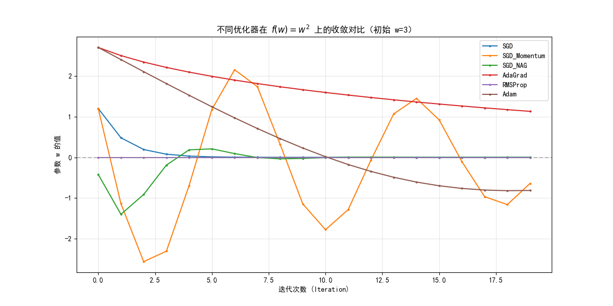
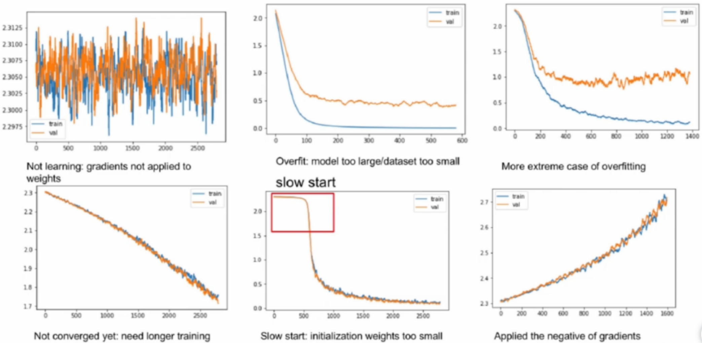

# 卷积神经网络CNN3

## 优化器

### 随机梯度下降--**SGD**优化器

**SGD原理：** 与传统的梯度下降（Batch Gradient Descent，每次用全部数据计算梯度）不同，**严格意义上的 SGD** 每次只使用一个样本来计算梯度，因此具有随机性。但在实际使用中，我们通常使用的是 **Mini-batch SGD**（小批量随机梯度下降），每次使用一小批样本（如 32 或 64 张图片）来计算梯度——既保留了随机性带来的泛化优势，又能利用 GPU 的并行计算能力。

**SGD公式：** $\theta_{t+1}=\theta_t-\eta \nabla_{\theta}J(\theta_t)$

- $\theta_t$是第$t$次迭代的参数
- $\eta$是学习率
- $\nabla_{\theta}J(\theta_t)$是损失函数对参数的梯度

**带动量的SGD公式：** $v_t=\gamma v_{t-1} + \eta \nabla_{\theta}J(\theta_t)$，$\theta_{t+1}=\theta_t - v_t$

- $v_t$是动量项
- $\gamma$是动量系数（通常设为0.9）
- 如果有了动量，错误方向上的梯度将会被抵消，会沿着最正确的方向更新梯度

> **补充：Nesterov 加速梯度（NAG，Nesterov Accelerated Gradient）**
>
> NAG 是动量方法的改进版。标准动量是"先在当前位置算梯度，再结合历史动量更新"；NAG 则是**先沿着动量方向"偷跑一步"，在"前瞻位置"算梯度**，相当于"看一眼前面的路况再调整步伐"：
>
> 标准动量：$v_t = \gamma v_{t-1} + \eta \nabla_{\theta}J(\theta_t)$，更新：$\theta_{t+1} = \theta_t - v_t$
>
> Nesterov：$v_t = \gamma v_{t-1} + \eta \nabla_{\theta}J(\theta_t - \gamma v_{t-1})$，更新：$\theta_{t+1} = \theta_t - v_t$
>
> 注意梯度是在 $\theta_t - \gamma v_{t-1}$（前瞻位置）计算的，而不是当前位置。这通常能让收敛更快、更稳定。PyTorch 中使用方法：`optim.SGD(params, lr=0.01, momentum=0.9, nesterov=True)`

#### SGD优化器的优缺点

- 优点：
  - 算法简单，易于实现，资源消耗较少
  - 动量（Momentum）等技巧可缓解优化陷入局部极值（鞍点）的风险，加速收敛（加速正确方向，抑制震荡方向）
  - 每迭代只用一个或少量样本，内存占用低，支持大规模训练
  - 能较好地处理在线学习和动态数据集
- 缺点：
  - 学习率调参敏感，初始学习率若设置不合适易造成训练不稳定或收敛缓慢
  - 每个参数采用相同学习率，不能自适应每一维度，稀疏特征学习效果不佳
  - 容易在鞍点或局部最优附近徘徊，收敛速度慢
  - 损失函数震荡大，更新不稳定，常需结合动量、学习率衰减等方法提升效果

### AdaGrad优化器（Adaptive Gradient 自适应梯度）

**调整学习率：** 学习率随着训练次数的增加越来越小

**AdaGrad公式：** $G_t=G_{t-1}+g_t^2$， $\theta_{t+1}=\theta_t-\frac{\eta}{\sqrt{G_t+\epsilon}} · g_t$

- $G_t$是梯度平方的累计和
- $g_t$是第$t$次迭代的梯度
- $\epsilon$是平滑项（防止分母为0，通常为1e-8）

#### AdaGrad算法特点

- **前期：** regularizer（分母）较小，放大梯度
- **后期：** regularizer（分母）较大，缩小梯度，梯度随训练次数降低

- 每个分量有不同的学习率

- **优点：** 相对简单易实现，适用于稀疏数据和非平稳目标函数

- **非平稳目标函数：** 目标函数的性质（如梯度、局部最小值、全局最小值等）会随时间或迭代次数发生变化。这种变化可能是由于数据分布的变化、模型参数的更新或其他外部因素引起的

- **缺点：** 初始学习率设置太大会导致 regularizer（分母）影响过于敏感；后期 regularizer（分母）累积值太大，容易提前结束训练；学习率衰减过快，难以选择合适的初始学习率

### RMSProp优化器

RMSProp全名Root Mean Square Propagation（自适应 均方根 梯度优化）方法，是一种基于梯度平方信息来自适应调整学习率的算法

与AdaGrad不同的是，它考虑了当前和之前一段时间内的梯度平方和的加权平均值，**并通过对梯度做指数加权移动平均来缓解累计梯度平方和带来的影响**

**RMSProp公式：** $E[g^2]_t=\beta E[g^2]_{t-1}+(1-\beta)g_t^2$，$\theta_{t+1}=\theta_t-\frac{\eta}{\sqrt{E[g^2]_t+\epsilon}} ·g_t$

- $E[g^2]_t$是梯度平方的指数移动平均
- $\beta$是衰减率（通常设置为0.9）
- $g_t$是第$t$次迭代的梯度
- $\epsilon$是平滑项（防止分母为0）

**优点：** 相对稳定，更适合处理非平稳和异方差问题。

> **补充：什么是"异方差"？** 在深度学习中，"异方差"指的是不同参数（或不同维度）的梯度在不同训练阶段的波动幅度不一致。比如有些参数的梯度一直很大，有些一直很小。RMSProp 通过为每个参数自适应调整学习率（梯度平方大的参数学习率自动变小），缓解了这种不平衡。

**缺点：** 可能会过度减小学习率。

### Adam优化器

Adam全名Adaptive Momentum Estimation（自适应动量）方法，是一种结合了Momentum和 RMSProp思想的算法。它既考虑了梯度的一阶矩估计（即梯度的指数移动平均），又考虑了梯度的二阶矩估计（即梯度平方的指数移动平均），并通过偏置校正来修正由于梯度估计不准确导致的偏差。

**核心思想：** 同时利用**动量法**（M，管方向）和**RMSProp**（R，管步长）

Adam的主要工作流程：

- **方向估计（动量法）：** 利用梯度的指数加权平均，$m_t=\beta_1m_{t-1}+(1-\beta_1)g_t$
- **步长估计（RMSProp思想）：** 利用梯度平方的指数加权平均，$v_t=\beta_2 v_{t-1}+(1-\beta_2)g_t^2$
- **参数更新：** 用动量分子、RMSProp分母的合体式，$\theta_{t+1}=\theta_t-\frac{\eta \cdot \hat{m_t}}{\sqrt{\hat{v_t}}+\epsilon}$
- **要注意两个$\beta$：** $\beta_1$用于一阶矩（动量），$\beta_2$用于二阶矩（方差），不是一个参数

**为什么Adam更新初始时不准？要偏差修正！**

默认$m_0=0,v_0=0$，第一步算出的$m_1$其权重大部分其实还在"0"，导致数值偏小，不反映实际梯度

**原因：** 加权平均在初始阶段偏向0，需要校正（偏差修正Bias Correction）

**修正方法：** 每次将$m_t,v_t$分别除以$(1-\beta_1^t),(1-\beta_2^t)$，还原实际量级

所以 Adam 的偏差修正推导与意义——真正原因在于初始化0，前期权重的偏置

**Adam公式：** $m_t=\beta_1m_{t-1}+(1-\beta_1)g_t$，$v_t=\beta_2 v_{t-1}+(1-\beta_2)g_t^2$，$\hat{m_t}=\frac{m_t}{1-\beta_1^t}$，$\hat{v_t}=\frac{v_t}{1-\beta_2^t}$，$\theta_{t+1}=\theta_t-\frac{\eta \cdot \hat{m_t}}{\sqrt{\hat{v_t}}+\epsilon}$

- $m_t$是梯度的一阶矩估计（动量项）
- $v_t$是梯度的二阶矩估计（梯度平方的移动平均项）
- $\hat{m_t}$和$\hat{v_t}$是偏置校正后的估计
- $\beta_1$和$\beta_2$是指数衰减率（通常$\beta_1=0.9$，$\beta_2=0.999$）
- $t$是时间步

> **补充：Adam 偏差修正的直观验证**
>
> 假设每步梯度恒为 1，$\beta_1=0.9$，来看看前几步 $m_t$ 的变化：
>
> | 步数 t | 原始 $m_t$ | 修正后 $\hat{m}_t$ | 真实期望 |
> |--------|-----------|-------------------|---------|
> | 1 | 0.100 | 1.000 | 1.0 |
> | 2 | 0.190 | 1.000 | 1.0 |
> | 3 | 0.271 | 1.000 | 1.0 |
> | 5 | 0.410 | 1.000 | 1.0 |
> | 10 | 0.651 | 1.000 | 1.0 |
>
> 原始 $m_t$ 在前几步被严重"缩水"，除以 $1-\beta_1^t$ 后立即恢复到真实期望值。

**优点：** 在训练的初期和中期能够快速收敛，同时也具有一定的鲁棒性

**缺点：** 需要进行大量的超参数调整，否则可能会导致性能下降

#### AdamW

**AdamW公式：** $m_t=\beta_1m_{t-1}+(1-\beta_1)g_t$，$v_t=\beta_2 v_{t-1}+(1-\beta_2)g_t^2$，$\hat{m_t}=\frac{m_t}{1-\beta_1^t}$，$\hat{v_t}=\frac{v_t}{1-\beta_2^t}$，$\theta_{t+1}=\theta_t-\eta (\frac{\hat{m_t}}{\sqrt{\hat{v_t}}+\epsilon}+\lambda \theta_t)$

- $\lambda$是权重衰减系数（weight decay）
- $\lambda \theta_t$是**解耦的权重衰减项**（注意：在 Adam 等自适应优化器中，它与传统 L2 正则化**不等价**）
- 其余参数与Adam相同

**AdamW与Adam的区别：**  AdamW将权重衰减从梯度计算中分离出来，直接应用于参数更新，这样可以更好地控制正则化效果。

> **关键理解：为什么 AdamW 要把 weight decay "解耦"出来？**
>
> 在传统 Adam 中，如果把 L2 正则化加在损失函数里（$L_{total} = L_{original} + \frac{\lambda}{2}\|\theta\|^2$），梯度变为 $g_t = \nabla L_{original} + \lambda\theta_t$。这个梯度进入 Adam 后，Adam 会按**梯度平方的移动平均 $\sqrt{\hat{v}_t}$** 来缩放更新步长——这意味着每个参数被衰减的力度不一样，L2 正则化的效果被"扭曲"了。
>
> AdamW 的做法是：**把 $\lambda\theta_t$ 直接从梯度中拿掉**，在参数更新时单独减去 $\eta\lambda\theta_t$。这样所有参数以统一速率衰减，正则化效果更好、更可控。实验证明 AdamW 的泛化性能通常优于 Adam + L2 正则化。
>
> **一句话区分**：SGD 中 weight decay = L2 正则化（等价）；Adam 中 weight decay ≠ L2 正则化（所以需要 AdamW）。

#### weight_decay

weight_decay是一种正则化技术，用于防止神经网络过拟合。它通过在优化过程中对权重来限制权重的大小，从而使模型更加简单和平滑

**L2正则化损失函数：** $L_{total}=L_{original}+\frac{\lambda}{2} \sum_i \theta_i^2$

- $L_{original}$是原始损失函数
- $\lambda$是权重衰减系数（weight decay coefficient）
- $\theta_i$是模型的第$i$个参数

**权重更新公式：** 对于每一个模型参数$\theta$，weight_decay的梯度计算：
$$
\frac{\partial L_{total}}{\partial \theta}=\frac{\partial L_{original}}{\partial \theta}+\lambda \theta
$$

**在SGD优化器中的参数更新：** 在PyTorch中，当使用`torch.optim.SGD`优化器时，`weight_decay`会在每次参数更新时按以下公式计算：
$$
\theta_{t+1}=\theta_{t}-\eta(\frac{\partial L_{original}}{\partial \theta_t} + \lambda \theta_t)
$$

- $\theta_t$是第$t$次迭代的参数值
- $\eta$是学习率
- $\frac{\partial L_{original}}{\partial \theta_t}$是原始损失函数对参数的梯度
- $\lambda$是权重衰减系数
- $\lambda \theta_t$是L2正则化项

**在Adam优化器中的应用：** 在Adam等自适应优化器中，权重衰减通常有两种实现方式：

- **L2正则化方式（传统Adam）：** 将权重衰减项加入到梯度中，$g_t=\nabla L_{original}(\theta_{t-1})+\lambda\theta_{t-1}$
- **解耦权重衰减方式（AdamW)：** 直接在参数更新时应用权重衰减，$\theta_t=\theta_{t-1}-\eta(\frac{\hat{m}_t}{\sqrt{\hat{v}_t}+\epsilon}+\lambda \theta_{t-1})$

权重衰减系数的选择：

- 常用值范围：1e-5 到 1e-2

- 较小的值（如1e-5）适用于预训练模型的微调
- 较大的值（如1e-2）适用于从头开始训练的模型
- 需要通过验证集性能来调优确定最佳值


## 优化器代码示例：直观感受不同优化器的行为

```python
import torch
import torch.optim as optim
import matplotlib.pyplot as plt

# 用一个简单的二次函数 f(w)=w² 来直观感受不同优化器的收敛行为
# 目标：从 w=3 出发，找到最小值 w=0

def demo_optimizer(optimizer_name, lr=0.1, epochs=20):
    """演示不同优化器在 f(w)=w² 上的收敛轨迹"""
    w = torch.tensor([3.0], requires_grad=True)  # 从 w=3 开始
    w_history = []

    if optimizer_name == "SGD":
        opt = optim.SGD([w], lr=lr)
    elif optimizer_name == "SGD_Momentum":
        opt = optim.SGD([w], lr=lr, momentum=0.9)
    elif optimizer_name == "SGD_NAG":
        opt = optim.SGD([w], lr=lr, momentum=0.9, nesterov=True)
    elif optimizer_name == "AdaGrad":
        opt = optim.Adagrad([w], lr=lr)
    elif optimizer_name == "RMSProp":
        opt = optim.RMSprop([w], lr=lr)
    elif optimizer_name == "Adam":
        opt = optim.Adam([w], lr=lr)

    for _ in range(epochs):
        opt.zero_grad()
        loss = w ** 2          # 目标函数 f(w) = w²
        loss.backward()
        opt.step()
        w_history.append(w.item())

    return w_history

# 对比所有优化器
plt.figure(figsize=(12, 6))
for name in ["SGD", "SGD_Momentum", "SGD_NAG", "AdaGrad", "RMSProp", "Adam"]:
    hist = demo_optimizer(name, lr=0.3)
    plt.plot(hist, label=name, marker='.', markersize=4)

plt.axhline(y=0, color='gray', linestyle='--', alpha=0.5)  # 最优解 w=0
plt.xlabel("迭代次数 (Iteration)")
plt.ylabel("参数 w 的值")
plt.title("不同优化器在 f(w)=w² 上的收敛对比（初始 w=3）")
plt.legend()
plt.grid(True, alpha=0.3)
plt.show()
```



观察结论：

- 普通 SGD 震荡明显，缓慢逼近最优解

- SGD+Momentum 利用历史梯度抵消震荡、加速正确方向

- SGD+NAG（Nesterov）在动量基础上"提前看一眼"，收敛更平稳

- AdaGrad 后期学习率衰减太快，还没到最优解就几乎不动了

- RMSProp 使用指数移动平均避免了 AdaGrad 的学习率过快衰减问题

- Adam 结合动量 + 自适应学习率 + 偏差修正，收敛最快


## 优化器对比


### Adagrad（Adaptive Gradient Algorithm）：

- **适用场景：** 适合处理稀疏数据和具有不同尺度的特征的问题。由于Adagrad可以根据每个参数的历史梯度调整学习率，它在处理具有不同尺度特征的问题时更具优势。对于很多NLP任务，如自然语言处理，输入数据通常是稀疏的，Adagrad也表现良好。

- **注意事项：** Adagrad在训练过程中会累积梯度的平方，导致学习率逐渐减小。这可能会导致后期的学习率过小，导致学习速度减慢。因此，在一些问题中，Adagrad可能不太适合。

### RMSprop（Root Mean Square Propagation）：

- **适用场景：** 适合处理非平稳和具有不同尺度特征的问题。RMSprop通过采用指数加权平均来平衡学习率，从而有效地处理非平稳问题。它也可以缓解Adagrad学习率过快减小的问题。

- **注意事项：** RMSprop在某些情况下仍然可能遭受学习率逐渐减小的问题，尤其是在长时间的训练中。因此，尽管RMSprop在很多情况下表现良好，但在一些问题上可能还需要进一步调优。

### Adam（Adaptive Moment Estimation）：

- **适用场景：** Adam综合了Momentum和RMSprop的优点，适用于大多数深度学习任务。 Adam在处理大规模训练数据和高维特征空间的问题时表现优异，通常是一种可靠且高效的优化器选择。

- **注意事项：** 尽管Adam在很多问题上表现良好，但在某些情况下，它可能对超参数敏感。需要仔细调整学习率、动量和指数衰减率等超参数，以获得最佳性能。

总体来说，对于大多数深度学习问题，Adam是一个不错的默认选择，因为它通常能在训练过程中自适应地调整学习率，并对不同类型的问题表现良好。然而，对于一些特殊的问题，如稀疏数据或非平稳问题，Adagrad和RMSprop可能会更适合。最终，选择哪个优化器应该基于具体问题和实验结果来做出决策。

## 学习率自适应（学习率图）

K是一个系数，t是迭代次数（**注意：t 是 iteration（迭代次数），不是 epoch！** 一个 epoch 包含多次 iteration。例如 10000 张训练图片、batch_size=64，则 1 个 epoch ≈ 157 次 iteration）。学习率调度通常按 iteration 来调整，因为每一步参数更新（iteration）后都可以改变学习率。


### 经验

- 对于稀疏数据，使用学习率可自适应方法

- SGD通常训练时间更长，最终效果比较好，但需要好的初始化和learning rate

- 需要训练较深较复杂的网络且需要快速收敛时，推荐使用Adam，设定一个比较小的learning rate值

- Adagrad、RMSprop、Adam是比较相近的算法，在相似的情况下表现差不多

### 学习率调整建议

学习率是深度学习中一个重要的超参数，它控制着模型参数在每一次迭代中的更新幅度。学习率设置合适与否对模型的训练和性能影响很大。然而，合适的学习率并没有一个固定的数值，它取决于许多因素，包括数据集、模型复杂度、优化算法等。

**初始设定：** 通常，初始学习率可以设置为较小的值，例如0.001或0.01。对于预训练模型，可以使用更小的学习率，因为模型参数已经相对接近较好的解。（借助AI来问初始学习率）

**学习率调度（Learning Rate Scheduling）：** 学习率调度可以帮助模型在训练过程中动态地调整学习率。例如，随着训练的进行，可以逐渐降低学习率，以便在接近收敛时更加稳定地优化模型。常见的学习率调度方法包括Step Decay、Exponential Decay和Cosine Annealing等。

> **三种常见学习率调度策略详解：**
>
> | 策略 | 行为 | 公式 | 适用场景 |
> |------|------|------|----------|
> | **StepLR** | 每隔 N 步，lr × gamma | $lr = lr_0 \times \gamma^{\lfloor t / N \rfloor}$ | 最简单常用，如每 30 epoch 减半 |
> | **ExponentialLR** | 每步 lr × gamma | $lr = lr_0 \times \gamma^t$ | 平滑连续衰减 |
> | **CosineAnnealingLR** | 按余弦曲线降到最低 | $lr = lr_{min} + \frac{1}{2}(lr_0 - lr_{min})(1 + \cos(\frac{t}{T_{max}}\pi))$ | SOTA 训练常用，如 ResNet、EfficientNet |
>
> ```python
> import torch.optim as optim
> import torch.optim.lr_scheduler as lr_scheduler
> import matplotlib.pyplot as plt
>
> # 模拟三种学习率调度策略的曲线
> model_params = [torch.nn.Parameter(torch.tensor([0.0]))]  # 虚拟参数
>
> schedulers_config = {
>     "StepLR (每30步×0.5)": lambda opt: lr_scheduler.StepLR(opt, step_size=30, gamma=0.5),
>     "ExponentialLR (γ=0.95)": lambda opt: lr_scheduler.ExponentialLR(opt, gamma=0.95),
>     "CosineAnnealing (T_max=100)": lambda opt: lr_scheduler.CosineAnnealingLR(opt, T_max=100),
> }
>
> plt.figure(figsize=(10, 5))
> for name, sched_fn in schedulers_config.items():
>     opt = optim.SGD(model_params, lr=0.1)
>     sched = sched_fn(opt)
>     lrs = []
>     for _ in range(100):
>         lrs.append(opt.param_groups[0]['lr'])
>         sched.step()
>     plt.plot(lrs, label=name)
>
> plt.xlabel("迭代次数 (Iteration)")
> plt.ylabel("学习率")
> plt.title("三种学习率调度策略对比")
> plt.legend()
> plt.grid(True, alpha=0.3)
> plt.show()
> ```

**学习率范围测试（Learning Rate Range Test）：** 这是一种试探性的方法，通过在较大范围内增加学习率来观察损失函数值的变化，从而找到一个合适的学习率范围。然后，可以在找到的学习率范围内进行进一步的训练。

**试错法：** 尝试不同的学习率，并观察模型在验证集上的性能。如果学习率过小，模型收敛速度会很慢；如果学习率过大，可能会导致模型发散。通过多次试验，找到一个在训练过程中收敛较快并且在验证集上表现较好的学习率。

**使用自适应学习率方法：** 一些自适应学习率优化算法（如Adam、Adagrad、RMSprop等）可以自动调整学习率，根据参数的历史梯度信息来更新学习率。这些算法通常能够在不同任务和数据集上表现较好，减轻了手动调节学习率的工作。

## 网络初始化（w和b）

### 如何分析初始化结果好不好？

卷积神经网络中的kernel（卷积核）初始化方式可以影响每一层的激活分布，进而影响整个网络的性能。不同的kernel初始化方式可能会导致不同的样本分布，因此观察样本分布可以帮助我们选择合适的初始化策略。

具体来说，当使用随机初始化的卷积核时，如果权重初始化得太小，那么将难以通过较浅的网络学习到复杂的特征，也就是所谓的"梯度消失"问题。但是，如果权重初始化得太大，则可能会导致数值不稳定和错误的收敛。为了避免这些问题，通常会使用一些先进的卷积核初始化方法，如Xavier Initialization（Glorot）或He Initialization。

在实践中，我们可以通过观察激活分布的标准差和均值来评估kernel初始化的效果，并确定是否需要调整初始化策略。例如，在网络训练过程中，如果发现激活分布的方差和平均值发生剧烈变化，那么就意味着当前的kernel初始化方式可能存在问题，需要考虑更改初始化策略或者增加正则化项来提高模型的稳定性。

**查看初始化后各层的激活值分布：** 激活值就是经过激活函数后的值（就是样本值），如果分布是固定的在[-1,1]，或者[0,1]之间，那没问题，如果集中在某一个值，那就不太好。

> **两种最重要的初始化方法（公式与代码）：**
>
> | 初始化方法 | 适用激活函数 | 权重采样分布 | 核心思想 |
> |-----------|-------------|-------------|----------|
> | **Xavier（Glorot）** | Sigmoid, Tanh | $W \sim \mathcal{N}(0, \frac{2}{n_{in} + n_{out}})$ | 同时考虑前向和反向传播，取输入输出神经元数的调和平均 |
> | **He（Kaiming）** | ReLU, LeakyReLU | $W \sim \mathcal{N}(0, \frac{2}{n_{in}})$ | ReLU 会"杀死"一半神经元，方差需×2补偿；只考虑前向 |
>
> 其中 $n_{in}$ = 输入神经元数，$n_{out}$ = 输出神经元数。
>
> ```python
> import torch
> import torch.nn as nn
>
> # 体会不同初始化对激活值分布的影响
> def check_init(init_name, n_layers=10, n_neurons=500):
>     """模拟多层网络前向传播，观察不同初始化下激活值标准差的变化"""
>     x = torch.randn(1000, n_neurons)  # 1000 个样本
>
>     for i in range(n_layers):
>         W = torch.randn(n_neurons, n_neurons)
>         if init_name == "Xavier":
>             W *= (2.0 / (n_neurons + n_neurons)) ** 0.5   # std = sqrt(2/(nin+nout))
>         elif init_name == "He":
>             W *= (2.0 / n_neurons) ** 0.5                  # std = sqrt(2/nin)
>         elif init_name == "Bad_Small":
>             W *= 0.01                                       # 太小 → 梯度消失
>         elif init_name == "Bad_Large":
>             W *= 1.0                                        # 太大 → 梯度爆炸
>
>         x = x @ W  # 线性变换（模拟无激活函数时的传播）
>
>     print(f"{init_name:12s}: 最终输出标准差 = {x.std().item():.4f}")
>
> for method in ["Xavier", "He", "Bad_Small", "Bad_Large"]:
>     check_init(method)
> # 输出示例:
> # Xavier      : 最终输出标准差 ≈ 1.0（稳定！）
> # He          : 最终输出标准差 ≈ 1.0（稳定！）
> # Bad_Small   : 最终输出标准差 ≈ 0.0000（消失！）
> # Bad_Large   : 最终输出标准差 ≈ 10^15（爆炸！）
>
> # PyTorch 中的实际用法：
> conv = nn.Conv2d(64, 128, kernel_size=3)
> nn.init.kaiming_normal_(conv.weight, mode='fan_out', nonlinearity='relu')  # He 初始化
> # 或
> nn.init.xavier_normal_(conv.weight)  # Xavier 初始化
> ```

### 初始化方式不好，怎么办？

**每个batch在每一层上都做归一化**

这就是 **Batch Normalization（BN，批归一化）** 的核心思想。BN 在训练时对每个 mini-batch 的数据做标准化（减均值、除标准差），然后通过可学习的参数 $\gamma$（缩放）和 $\beta$（平移）恢复网络的表达能力。详细推导见 `神经网络概念.md` 中"归一化与批归一化"章节。

为什么很早没有人去做这个事呢？因为当数据量很大时，因为是在每个batch上去做归一化，每一个batch并不能反映整体数据的分布，对每一个样本提取出来一个特征，在batch与batch之间不能区分出特征的样本了，因此又加入了逆归一化，当归一化不起作用时，去除归一化。

为了确保归一化能够起到作用，另设两个参数来逆归一化，通过$\gamma$和$\beta$来做逆归一化。

> **BN 的四个步骤（简要）：**
> 1. 计算 batch 均值：$\mu_B = \frac{1}{m}\sum x_i$
> 2. 计算 batch 方差：$\sigma_B^2 = \frac{1}{m}\sum (x_i - \mu_B)^2$
> 3. 标准化：$\hat{x}_i = \frac{x_i - \mu_B}{\sqrt{\sigma_B^2 + \epsilon}}$
> 4. 缩放平移：$y_i = \gamma \hat{x}_i + \beta$
>
> $\gamma$ 和 $\beta$ 是可学习参数——如果标准化后的分布就是最优的，网络可以学出 $\gamma\approx1, \beta\approx0$；如果需要恢复到原始分布，网络也能学回去（$\gamma=\sigma, \beta=\mu$）。这就是"逆归一化"的真正含义。

## 常见问题



- **第一个图（损失剧烈震荡）：** 原因可能是学习率过大，导致参数更新步长太大，在最优解附近来回跳跃而无法收敛。解决方法：降低学习率。

- **第二个图（验证损失开始上升）：** 有一些过拟合。训练损失持续下降但验证损失在后期开始上升——模型开始"背诵"训练数据而非学习通用规律。解决方法：增加 Dropout、weight_decay、数据增强，或使用早停（Early Stopping）。

- **第三个图（训练和验证严重分离）：** 过拟合很明显。训练损失很低但验证损失很高且持续上升，两条曲线严重分叉。解决方法同上，且程度需要更大。

- **第四个图（两曲线缓慢下降、趋势一致）：** 学习率偏小，模型学得太慢，但方向是正确的（没有过拟合迹象）。可以**适当增大学习率**，同时继续训练更多 epoch，两条曲线都还有下降空间。

- **第五个图（前期几乎不动、后期开始下降）：** 没有初始化好 w（模型的激活函数），导致一开始训练比较慢。可能是权重初始化不当，或者激活函数选择不合适（如 Sigmoid 在深层网络中的梯度消失），使得前期梯度非常小，参数更新几乎没有效果。

- **第六个图（损失不降反升）：** 梯度加错方向了，优化目标设成了相反值。例如损失函数取了负号，或者梯度上升代替了梯度下降。检查损失函数定义和优化器的更新方向。

---

## 优化器选择速查指南

```
你要训练什么模型？
├── 传统 CNN / MLP（图像分类等）
│   ├── 追求最佳效果、有调参经验 → SGD + Momentum + CosineAnnealing
│   ├── 快速原型验证、懒得调参 → Adam / AdamW（默认推荐）
│   └── 数据稀疏（如 NLP 词向量）→ AdaGrad / Adam
├── Transformer / 大语言模型 → AdamW（标配，weight_decay=0.01~0.1）
├── GAN / 生成对抗网络 → Adam（β₁=0.5, β₂=0.999）
├── 强化学习 → Adam / RMSProp
└── 需要极致收敛精度（打比赛）→ SGD + Momentum + 精心调参的学习率衰减
```

**一句话总结**：不知道该用什么的时候，**先用 Adam/AdamW 跑起来**。它收敛快、对超参数不敏感，适合快速迭代。等 baseline 稳定了，如果想榨干最后一点性能，再换 SGD + Momentum 精调。

## 精调示例--VGG11--CIFAR-10

