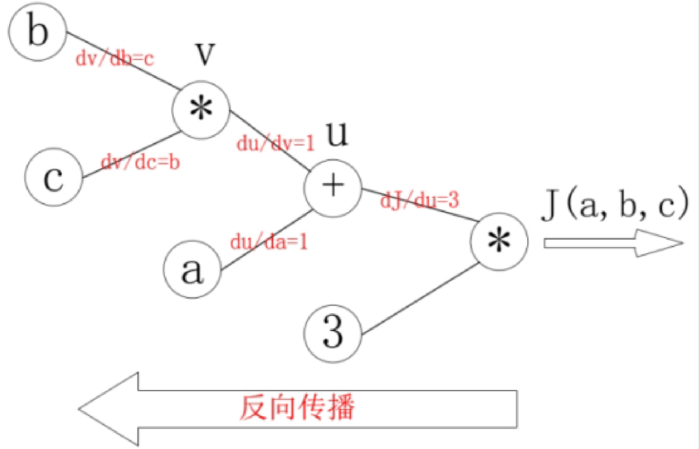
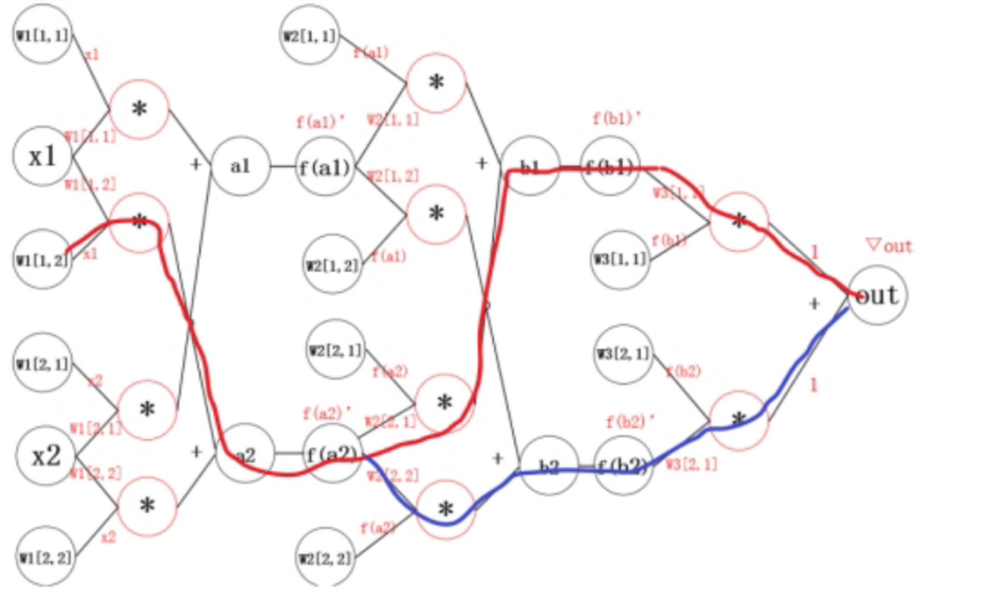
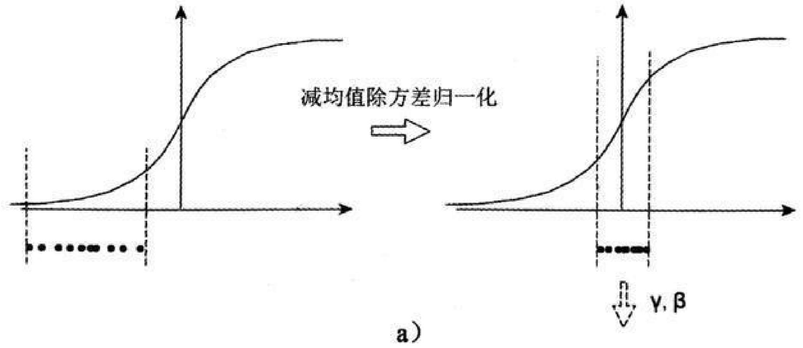
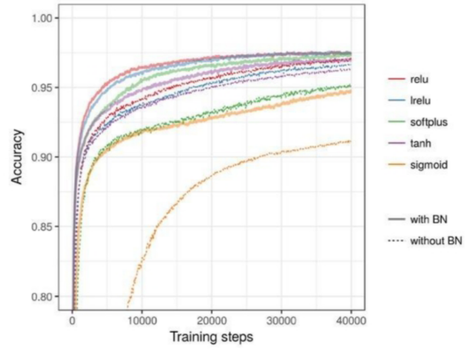
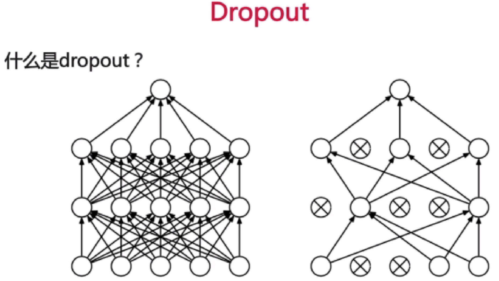

# 神经网络

## 神经网络的结构

### 什么是神经网络？

神经网络（Neural Network）是一种模仿生物神经系统构建的计算模型。它由大量**神经元（Neuron）** 按层次结构连接而成，能够从数据中自动学习复杂的映射关系。

**核心思想**：神经网络本质上是一个"万能函数逼近器"——给定足够的神经元和层数，它可以逼近任意连续函数。训练神经网络的过程，就是通过不断调整参数（权重和偏置），让这个函数尽可能拟合训练数据的过程。

### 神经元：网络的基本单元

每个神经元做的事情非常简单——**加权求和 + 非线性变换**：


数学上分为两步：

1. **线性组合**：$z = \sum_{i=1}^{n} w_i x_i + b = W^T x + b$
2. **激活函数**：$a = f(z)$

| 符号  | 名称            | 含义                                                         |
| ----- | --------------- | ------------------------------------------------------------ |
| $x_i$ | 输入            | 来自上一层神经元或原始数据的信号                             |
| $w_i$ | 权重（Weight）  | 控制每个输入对输出的"影响力"——权重越大，该输入越重要         |
| $b$   | 偏置（Bias）    | 控制神经元"被激活的容易程度"——偏置越大，神经元越容易输出正值 |
| $z$   | 加权和 / 净输入 | 激活函数**之前**的值（也称 logits）                          |
| $f$   | 激活函数        | 引入非线性，如 ReLU、Sigmoid、Tanh 等                        |
| $a$   | 激活值 / 输出   | 该神经元的最终输出，传递给下一层                             |

> **为什么要一个激活函数？** 如果 $f$ 是恒等函数（$f(z)=z$），那么无论堆多少层，整个网络等价于一层线性变换（见下文"纯线性网络的退化结论"）。激活函数打破了线性，让网络能拟合曲线、分类边界等复杂模式。

### 层的概念

一个神经元能做的事情非常有限（本质上就是一个线性分类器）

将大量神经元按**层（Layer）** 组织起来，形成层次结构，网络的表达能力就会大幅提升：

```
输入层          隐藏层 1        隐藏层 2        输出层
(第0层)         (第1层)         (第2层)         (第3层)

  x₁ ───→ 神经元₁⁽¹⁾ ───→ 神经元₁⁽²⁾ ───→
    ↘        ↗              ↗
  x₂ ───→ 神经元₂⁽¹⁾ ───→ 神经元₂⁽²⁾ ───→ 输出 ŷ
    ↗        ↗              ↗
  x₃ ───→ 神经元₃⁽¹⁾ ───→
```

| 层级                       | 位置          | 作用                                                         |
| -------------------------- | ------------- | ------------------------------------------------------------ |
| **输入层（Input Layer）**  | 第 0 层       | 接收原始数据（如一张图片的像素值），本身不做计算，只负责传递数据 |
| **隐藏层（Hidden Layer）** | 第 1 ~ L-1 层 | 网络的核心部分，"隐藏"在输入和输出之间。每一层提取比上一层更抽象的特征 |
| **输出层（Output Layer）** | 第 L 层       | 产生最终结果——回归任务输出连续值，分类任务输出概率分布（经 Softmax） |

> **"深度"学习的深度从哪来？** 隐藏层的数量就是网络的**深度**。传统神经网络可能只有 1~2 层隐藏层；"深度网络"可以有几十、几百甚至上千层。"深"意味着更多的特征抽象层次——浅层学边缘/纹理，中层学形状/部件，深层学语义/整体。

### 前向传播（Forward Propagation）

数据从输入层流入，逐层计算，最终到达输出层，这个过程叫**前向传播**。

对第 $l$ 层（$l = 1, 2, \dots, L$）：

$$z^{(l)} = W^{(l)} a^{(l-1)} + b^{(l)}$$

$$a^{(l)} = f(z^{(l)})$$

其中：

- $a^{(l-1)}$ 是第 $l-1$ 层的输出（也是第 $l$ 层的输入），$a^{(0)} = x$（原始输入）
- $W^{(l)}$ 是第 $l$ 层的权重矩阵
- $b^{(l)}$ 是第 $l$ 层的偏置向量
- $f$ 是激活函数
- $z^{(l)}$ 是第 $l$ 层激活前的值（净输入）
- $a^{(l)}$ 是第 $l$ 层激活后的输出

### 网络的矩阵表示

实际计算中，一个小批量（mini-batch）的多个样本会同时处理，此时输入变成矩阵：

$$X \in R^{m \times d}$$

其中 $m$ 是批量中的样本数，$d$ 是每个样本的特征数。

第 $l$ 层的前向传播变成：

$$Z^{(l)} = A^{(l-1)} W^{(l)} + b^{(l)}$$

$$A^{(l)} = f(Z^{(l)})$$

> **维度说明**：若第 $l-1$ 层有 $n_{in}$ 个神经元，第 $l$ 层有 $n_{out}$ 个神经元，则 $W^{(l)} \in R^{n_{in} \times n_{out}}$，$b^{(l)} \in R^{n_{out}}$。注意本文采用 $W^T x$ 的写法约定（见下文反向传播章节的详细说明）。

### 前向传播的代码调用原理：`model(x)` 背后发生了什么？

#### 核心调用链

```python
import torch.nn as nn

# 1. 定义一个简单的网络
class MyModel(nn.Module):
    def __init__(self):
        super().__init__()
        self.fc1 = nn.Linear(10, 20)   # 第1层：10维输入 → 20维
        self.fc2 = nn.Linear(20, 5)    # 第2层：20维 → 5维
        self.relu = nn.ReLU()

    def forward(self, x):
        x = self.fc1(x)                # 前向传播第1步
        x = self.relu(x)               # 激活函数
        x = self.fc2(x)                # 前向传播第2步
        return x

# 2. 实例化并"调用"
model = MyModel()
x = torch.randn(3, 10)                # batch_size=3, 特征维度=10
output = model(x)                      # ← 这一行到底发生了什么？
```

当你写 `model(x)` 时，触发的是 Python 的 `__call__` 魔法方法。整个调用链如下：

```
model(x)
  ↓
MyModel 类没有 __call__ → 查父类 nn.Module
  ↓
nn.Module.__call__(self, x)           # Python 魔法方法，让实例"可调用"
  ↓ 实际调用 _call_impl，内部做了四件事：
  ① 执行 forward_pre_hook（用户注册的前置钩子）
  ② 如有注册的 backward_hook，在此处注册到 autograd 计算图（供后续 .backward() 触发）
  ③ 调用 self.forward(x)              # ← 这才是你写的 forward 方法！
  ④ 执行 forward_hook（用户注册的后置钩子）
  ↓
返回 forward 的输出
```

> **补充说明**：上述步骤 ②（backward hook 注册）包含输入端的注册（在 `forward` 前）和输出端的注册（在 `forward` 后取到返回值时），但整体上 backward hook 的"准备工作"由 `_call_impl` 统一完成，用户无需感知。`_backward_hooks` 字典同时容纳 `register_backward_hook` 和 `register_full_backward_hook` 两种钩子，统一处理。

> **关键理解**：`nn.Module` 通过 `__call__`（指向 `_call_impl`）包裹了 `forward`，**你永远不应该直接调用 `model.forward(x)`**。直接调 `forward` 会跳过 hook 派发和 JIT 编译拦截——比如你注册的 `register_forward_pre_hook` 会完全失效。虽然 `self.training` 模式和 autograd 图记录在 `forward` 内部仍然正常工作，但丢失 Hook 这条"后门"会让调试、特征可视化等高级功能不可用。

#### `nn.Module.__call__` 的核心源码（简化版）

以下是 PyTorch 源码中 `nn.Module.__call__` 的逻辑简化版，帮助理解调用流程：

```python
# 以下代码是 PyTorch 源码的简化示意，非实际源码
# 实际中 __call__ = _call_impl（类型注解赋值，非传统 def 语句）
class Module:
    def _call_impl(self, *input, **kwargs):
        # ① 执行 forward_pre_hooks（用户注册的前置钩子）
        for hook in self._forward_pre_hooks.values():
            hook(self, input)

        # ② 如有 backward hooks，在此注册到 autograd（先注册 input hook，计算 result 后再注册 output hook）
        bw_hook = None
        if len(self._backward_hooks) > 0:
            bw_hook = BackwardHook(self, self._backward_hooks.values())
            input = bw_hook.setup_input_hook(input)

        # ③ 核心：调用用户定义的 forward 方法
        result = self.forward(*input, **kwargs)

        # 继续步骤②——output 端 backward hook 注册
        if bw_hook is not None:
            result = bw_hook.setup_output_hook(result)

        # ④ 执行 forward_hooks（用户注册的后置钩子）
        for hook in self._forward_hooks.values():
            hook_result = hook(self, input, result)

        return result
```

#### 嵌套调用：`self.fc1(x)` 也是同样的流程

`nn.Linear` 也是 `nn.Module` 的子类，所以：

```python
x = self.fc1(x)                       # 触发 nn.Linear.__call__
  ↓
nn.Module.__call__(self.fc1, x)
  ↓
self.fc1.forward(x)                   # nn.Linear 内置的 forward
  ↓
return x @ W.T + b                    # 矩阵乘法 + 偏置（即 z = Wx + b）
```

整个网络的前向传播就是一层层 `__call__` → `forward` 的嵌套调用链：

```
model(x)                              # 你的模型
  → __call__ → forward:
    → self.fc1(x)                     # 第1个线性层
      → __call__ → forward: x @ W₁.T + b₁
    → self.relu(x)                    # ReLU 激活
      → __call__ → forward: max(0, x)
    → self.fc2(x)                     # 第2个线性层
      → __call__ → forward: x @ W₂.T + b₂
```

#### 为什么要绕个弯子用 `__call__` 而不是直接调 `forward`？

设计 `__call__` 这个"中间层"是因为 PyTorch 需要在**每次前向计算前后**做一些框架级的"额外工作"，这些工作由 `_call_impl` 统一调度，框架使用者不需要关心：

| 机制                  | 做什么                                                       | 说明                                                |
| --------------------- | ------------------------------------------------------------ | --------------------------------------------------- |
| **Hook 派发**         | 在 `forward` 前后执行用户注册的钩子（打印中间值、修改梯度、特征可视化等） | `__call__` 的核心功能，直接调 `forward` 会跳过      |
| **反向 Hook 注册**    | 将 `full_backward_hook` 等反向钩子注册到 autograd 计算图     | 在 `_call_impl` 中完成注册，供 `.backward()` 时触发 |
| **JIT / 编译拦截**    | `torch.jit.script`、`torch.jit.trace`、`torch.compile` 对前向传播的拦截和优化 | 通过 `__call__` 入口统一处理                        |
| **全局 Forward Hook** | 注册在 `nn.Module` 全局的 hook（非单模块级别），对所有模块生效 | 在 `_call_impl` 中派发                              |

> **注意区分**：`model.train()` / `model.eval()` 设置的 `self.training` 标志，以及 autograd 的图记录（受 `torch.no_grad()` 控制），是**独立于 `__call__` 的机制**——它们在你的 `forward` 内部和 PyTorch 算子层面生效，无论你用 `model(x)` 还是 `model.forward(x)` 调用都一样。但直接调 `forward` 会丢失上述表格中的 Hook 和 JIT 能力，所以**仍然不应直接调用 `model.forward(x)`**。

#### 总结：数学公式与代码的对应关系

| 数学公式                                | 代码                                                        |
| --------------------------------------- | ----------------------------------------------------------- |
| $z^{(l)} = W^{(l)} a^{(l-1)} + b^{(l)}$ | `x = self.fc(x)` → 触发 `nn.Linear.forward` → `x @ W.T + b` |
| $a^{(l)} = f(z^{(l)})$                  | `x = self.relu(x)` → 触发 `nn.ReLU.forward` → `max(0, x)`   |
| 逐层串联                                | `__call__` → `forward` 的嵌套链                             |

> **一句话记住**：`model(x)` 本质就是 Python 的 `__call__` 魔法方法 → 内部调用你写的 `forward` → 而 `forward` 里每一层子模块（`self.fc`、`self.relu`）对输入的调用又走各自的 `__call__` → `forward`，以此形成一个递归嵌套的前向传播链。

### 网络的三要素

一个完整的神经网络由以下三要素定义：

| 要素                          | 说明                                 | 举例                                                |
| ----------------------------- | ------------------------------------ | --------------------------------------------------- |
| **架构（Architecture）**      | 多少层、每层多少神经元、层间如何连接 | 全连接（FC）、卷积（CNN）、循环（RNN）、Transformer |
| **激活函数（Activation）**    | 每层的非线性变换                     | ReLU、Sigmoid、Tanh、GELU                           |
| **损失函数（Loss Function）** | 衡量预测值和真实值的差距             | 均方误差（回归）、交叉熵（分类）                    |

训练神经网络 = 找到一组权重和偏置，使损失函数最小化。这通过**反向传播算法 + 梯度下降**实现——这也是下一章要详细展开的内容。

## 反向传播算法

### 前置概念：链式法则热身

已知：$J(a,b,c)=3(a+bc)$，令 $u=a+v$，$v=bc$，则：

$$
J(a,b,c)=3u
$$

> **符号说明**：
>
> - $J$：最终输出，可以理解为"损失值"，我们关心它随各变量怎么变化
> - $a, b, c$：三个自变量（类比神经网络中的权重和偏置）
> - $u, v$：中间变量，把复杂计算拆成简单步骤，方便链式求导
> - $\frac{dJ}{da}$：$J$ 对 $a$ 的偏导数，意思是"$a$ 变化一点点，$J$ 会变化多少"

**什么是链式法则？** 想象多米诺骨牌：$a$ 变化 $\rightarrow$ $u$ 变化 $\rightarrow$ $J$ 变化。你想知道推一下 $a$ 最终 $J$ 会倒多少，方法就是把路径上每一段的"影响力"乘起来。这就是链式法则的核心思想。

**求 $\frac{dJ}{da}$（路径：$a \rightarrow u \rightarrow J$）：**

$$
\frac{dJ}{da}=\frac{dJ}{du}·\frac{du}{da}=3 \times 1 = 3
$$

- 第 1 段 $u \rightarrow J$：$\frac{dJ}{du}=3$（因为 $J=3u$，对 $u$ 求导得 3）
- 第 2 段 $a \rightarrow u$：$\frac{du}{da}=1$（因为 $u=a+v$，对 $a$ 求导，$v$ 视为常数，得 1）
- 相乘得 3。直觉：$a$ 每增加 1，$J$ 就增加 3。

**求 $\frac{dJ}{db}$（路径：$b \rightarrow v \rightarrow u \rightarrow J$）：**
$$
\frac{dJ}{db}=\frac{dJ}{du}·\frac{du}{dv}·\frac{dv}{db}=3 \times 1 \times c = 3c
$$

- $\frac{dJ}{du}=3$，$\frac{du}{dv}=1$（$u=a+v$ 对 $v$ 求导），$\frac{dv}{db}=c$（$v=bc$ 对 $b$ 求导得 $c$）

**求 $\frac{dJ}{dc}$（路径：$c \rightarrow v \rightarrow u \rightarrow J$）：**

$$
\frac{dJ}{dc}=\frac{dJ}{du}·\frac{du}{dv}·\frac{dv}{dc}=3 \times 1 \times b = 3b
$$

- $\frac{dv}{dc}=b$（$v=bc$ 对 $c$ 求导得 $b$）

**具体数值例子**：假设某时刻 $a=1, b=2, c=3$：

- $v = 2 \times 3 = 6$
- $u = 1 + 6 = 7$
- $J = 3 \times 7 = 21$

此时各偏导为：

- $\frac{dJ}{da} = 3$（$a$ 增加 0.1，$J$ 约增加 0.3）
- $\frac{dJ}{db} = 3c = 3 \times 3 = 9$（$b$ 增加 0.1，$J$ 约增加 0.9）
- $\frac{dJ}{dc} = 3b = 3 \times 2 = 6$（$c$ 增加 0.1，$J$ 约增加 0.6）

---

绘制成为计算图之后，可以清楚的看到向前计算的过程：


对每个节点求偏导可有：



反向传播的过程就是一个上图的从右往左的过程，自变量 $a,b,c$ 各自的偏导就是连线上的梯度的乘积（**这就是链式法则，链式求导**）：

$$
\frac{dJ}{da}=3\times1
$$

$$
\frac{dJ}{db}=3\times1\times c
$$

$$
\frac{dJ}{dc}=3\times1\times b
$$

> **计算图上每条线上的数字是什么？** 就是"这个节点的输出对输入的偏导"。比如 $u \rightarrow J$ 的线上写 3，是因为 $\frac{dJ}{du}=3$。反向传播时，从右往左把路径上的数字乘起来，就得到了最左边变量对最右边输出的偏导。

**计算图的文字版描述**（配合上图理解）：

```
前向传播（左→右）：              反向传播（右→左）：
                                
  a ──────→┐                          a ←── ∂J/∂a = 3
           │                          ↑
           u ──→ J        对应         u ──→ ∂J/∂u = 3
           ↑                          ↑
  b ──→ v ─┘                          b ←── ∂J/∂b = 3c
           ↑                          ↑
  c ──────→┘                          c ←── ∂J/∂c = 3b
```

**前向传播时**（左图）：

1. 从 $b$ 和 $c$ 出发 → 乘法运算得到 $v = bc$
2. 从 $a$ 和 $v$ 出发 → 加法运算得到 $u = a + v$
3. 从 $u$ 出发 → 乘法运算得到 $J = 3u$

**反向传播时**（右图）：

1. 从 $J$ 开始，沿着边反向走
2. 每条边上标注的是**局部偏导数**（local derivative）
3. 到达某个变量的路径上所有边的数值**相乘**，就是该变量对 $J$ 的偏导
4. 如果有多条路径到达同一个变量，要把各条路径的结果**加起来**

> **举例：求 $\partial J/\partial b$**。从 $J$ 到 $b$ 只有一条路径：$J \leftarrow u \leftarrow v \leftarrow b$。路径上的数值分别是 3、1、c，相乘得 $3 \times 1 \times c = 3c$。而注入 $a=1,b=2,c=3$ 后，$\partial J/\partial b = 3 \times 3 = 9$。

---

### 神经网络中的反向传播


#### 什么是神经网络？（超简化理解）

神经网络就像一个多层的信息加工厂：

```
输入 → [第1层：加工] → [第2层：加工] → [第3层：加工] → 输出（预测值）
  x         z¹             z²           z³             ŷ
```

每一层做两件事：

1. **线性变换**：$z = Wx + b$（加权求和 + 偏置）
2. **激活函数**：$a = f(z)$（引入非线性，如 ReLU）

| 符号          | 含义                                      | 类比                               |
| ------------- | ----------------------------------------- | ---------------------------------- |
| $x$           | 输入数据                                  | 考试的 5 道题目的分数              |
| $W$（Weight） | 权重                                      | 每道题对最终成绩的"重要性"         |
| $b$（bias）   | 偏置                                      | 基础分（不管题目答得怎样都有的分） |
| $z$           | 加权和（激活前的值）                      | $Wx+b$ 算出来的中间结果            |
| $a$ / $f(z)$  | 激活后的输出                              | 经过"开关"（激活函数）处理后的值   |
| $\hat{y}$     | 预测值                                    | 网络猜的答案                       |
| $y$           | 真实值                                    | 标准答案                           |
| $L$（Loss）   | 损失                                      | 猜的答案和标准答案差多少           |
| 上标 $(l)$    | 第 $l$ 层                                 | $z^{(2)}$ = 第 2 层的 $z$          |
| 下标 $ij$     | $w_{ij}$ = 从输入 $j$ 到神经元 $i$ 的权重 |                                    |

---

如果把网络中所有的 ReLU 都去掉：

- 网络就变成了一个纯线性网络：$L_1 \rightarrow L_2 \rightarrow L_3$
- 每层只有 $z=Wx+b$
- 没有 $a=f(z)$，其中 $a$ 为激活函数 activation 的缩写

#### 网络结构

- 输入：$x=\begin{bmatrix}x_1 \\x_2 \\x_3 \\x_4 \\x_5 \\\end{bmatrix}$（5 维向量，比如一张图片的 5 个特征）

- 第一层：$z^{(1)}=W_1^Tx+b_1$，其中 $W_1\in R^{5 \times 3}$（3 个神经元，接收 5 维输入）

  > $R^{5 \times 3}$ 意思是 5 行 3 列的矩阵。5 行对应 5 维输入，3 列对应 3 个神经元。每个神经元有 5 个权重（每个输入一个）+ 1 个偏置。

- 第二层：$z^{(2)}=W_2^Tz^{(1)}+b_2$，其中 $W_2\in R^{3 \times 2}$（2 个神经元，接收 3 维输入）

- 第三层：$\hat y=z^{(3)}=W_3^Tz^{(2)}+b_3$，其中 $W_3\in R^{2 \times 1}$（1 个神经元，接收 2 维输入）

- 损失函数：$L=\frac{1}{2}(\hat y-y)^2$（均方误差）

> **为什么损失函数有个 $\frac{1}{2}$？** 纯粹为了方便求导。对 $\frac{1}{2}(\hat{y}-y)^2$ 求导，$\frac{1}{2}$ 和平方的 2 约掉，结果就是干净的 $\hat{y}-y$。去掉也不影响优化方向，只是梯度大小缩放一倍而已。

---

### 具体例子（贯穿全程，帮助理解）

假设我们有一个超小的网络，用来根据 2 个特征预测房价：

```
输入：x₁ = 1（面积=100㎡）, x₂ = 2（卧室数=3）
真实房价：y = 50（万元）

第1层（2个神经元, 输入维度=2）：
  权重矩阵 W₁ = [[w₁₁, w₁₂],     ← 输入x₁对神经元1、2的权重
               [w₂₁, w₂₂]]     ← 输入x₂对神经元1、2的权重
```

> ⚠️ **注意**：这里 $W_1$ 的行是**输入**，列是**神经元**（不是常见的"行=神经元"写法）。
> 因此计算时用 $z = W^T x + b$（需转置），展开为：
> $$z_1 = x_1 w_{11} + x_2 w_{21} + b_1 \quad\text{（第1列 = 神经元1的两个输入权重）}$$
> $$z_2 = x_1 w_{12} + x_2 w_{22} + b_2 \quad\text{（第2列 = 神经元2的两个输入权重）}$$
>
> **为什么不用常见的 $z=Wx$？** 两种写法本质相同——只要矩阵乘法维度匹配就行。本文统一用 $W^T x$，是为了后面的展开式（如 $z_1^{(1)} = x_1 w_{11} + x_2 w_{21} + ...$）中下标含义保持一致：$w_{ij}$ = 第 $i$ 个输入到第 $j$ 个神经元的权重。

```
具体数值：W₁ = [[0.5, 0.3],
              [0.1, 0.8]]
偏置：b₁ = [0.1, 0.2]

第2层（输出层，1个神经元）：
  权重：W₂ = [0.4, 0.6]
  偏置：b₂ = [0.3]
```

**前向传播（计算预测值）：**

第1层：

- $z^{(1)}_1 = 1 \times 0.5 + 2 \times 0.1 + 0.1 = 0.8$
- $z^{(1)}_2 = 1 \times 0.3 + 2 \times 0.8 + 0.2 = 2.1$

第2层：

- $\hat{y} = 0.8 \times 0.4 + 2.1 \times 0.6 + 0.3 = 0.32 + 1.26 + 0.3 = 1.88$

损失：$L = \frac{1}{2}(1.88 - 50)^2 = \frac{1}{2} \times 2315.5 = 1157.75$

> 😱 预测 1.88 万，实际 50 万，差太远了！**反向传播的目标就是算出每个权重该往哪个方向调、调多少，来减少这个差距。**

---

#### 求 $L_1$ 中的某个权重

$$
\frac{\partial L}{\partial w_{11}}
$$

其中 $w_{11}$ 表示：$L_1$ 第一个神经元上，来自输入 $x_1$ 的权重。

> **下标含义详解**：$w_{ij}^{(l)}$ 中，$l$ 是层号，$i$ 是**来源输入编号**，$j$ 是**目标神经元编号**。
>
> 例如 $w_{21}^{(1)}$ = 第 1 层中，第 2 个输入连到第 1 个神经元的权重。
>
> ⚠️ **注意**：本文的 $w_{ij}$ 下标含义和许多教科书相反（教科书常用 $i$=神经元，$j$=输入）。本文采用 $i$=输入，$j$=神经元，是为了让展开式 $z_j = \sum_i x_i w_{ij} + b_j$ 中下标顺序自然（输入 $i$ → 神经元 $j$）。两种写法没有对错之分，只要矩阵乘法维度匹配即可。

#### 前向表达式展开

把矩阵运算展开成标量，方便看清 $w_{11}$ 究竟影响了哪些东西。

- $L_1$ 第一个神经元：
  $$
  z_1^{(1)}=x_1w_{11}+x_2w_{21}+x_3w_{31}+x_4w_{41}+x_5w_{51}+b_1
  $$

- $L_2$ 第一个神经元：
  $$
  z_1^{(2)}=z_1^{(1)}w_{11}^{(2)} + z_2^{(1)}w_{21}^{(2)} + z_3^{(1)}w_{31}^{(2)}+b_1^{(2)}
  $$

- $L_2$ 第二个神经元：
  $$
  z_2^{(2)}=z_1^{(1)}w_{12}^{(2)} + z_2^{(1)}w_{22}^{(2)} + z_3^{(1)}w_{32}^{(2)}+b_2^{(2)}
  $$

- 输出层：
  $$
  \hat y=z_1^{(2)}w_1^{(3)}+z_2^{(2)}w_2^{(3)}+b_3
  $$

#### 影响链分析

$w_{11}$ 的影响力如何传导到损失？

因为：$w_{11} \rightarrow z_1^{(1)} \rightarrow (z_1^{(2)}, z_2^{(2)}) \rightarrow \hat y \rightarrow L$

> **关键观察**：$z_1^{(1)}$ 同时流向了第 2 层的**两个神经元**（$z_1^{(2)}$ 和 $z_2^{(2)}$），所以梯度要**把两条路径的贡献加起来**。这就是为什么下面"第二部分：预测值对 $z_1^{(1)}$ 求导"的式子有两项相加。

所以完整的链式法则为：

$$
\frac{\partial L}{\partial w_{11}}=\frac{\partial L}{\partial \hat y}·\frac{\partial \hat y}{\partial z_1^{(1)}}·\frac{\partial z_1^{(1)}}{\partial w_{11}}
$$

#### 第一部分：损失对预测值求导

损失函数：$L=\frac{1}{2}(\hat y-y)^2$

求导：$\frac{\partial L}{\partial \hat y}=\hat y - y$

> **推导过程**：$\frac{\partial}{\partial \hat y}\left[\frac{1}{2}(\hat y - y)^2\right] = \frac{1}{2} \cdot 2(\hat y - y) \cdot 1 = \hat y - y$。前面乘的 $\frac{1}{2}$ 就是为了和平方求导出来的 2 约掉，让结果简洁。

因此定义：$\delta=\hat y - y$（$\delta$ 称为**误差项**）

> **$\delta$ 的直觉**：
>
> - 如果 $\hat{y} > y$（预测偏高），$\delta > 0$，梯度下降会减小预测值
> - 如果 $\hat{y} < y$（预测偏低），$\delta < 0$，梯度下降会增大预测值
> - $\delta$ 的正负和大小告诉网络"往哪个方向、调整多少"来减少误差

#### 第二部分：预测值对 $z_1^{(1)}$ 求导

先求：$\frac{\partial \hat y}{\partial z_1^{(1)}}$

因为：$\hat y=w_1^{(3)}z_1^{(2)}+w_2^{(3)}z_2^{(2)}+b_3$

得到：$\frac{\partial \hat y}{\partial z_1^{(1)}}=w_1^{(3)}\frac{\partial z_1^{(2)}}{\partial z_1^{(1)}} + w_2^{(3)}\frac{\partial z_2^{(2)}}{\partial z_1^{(1)}}$

> ⚠️ **为什么有两项相加？** 因为 $\hat{y}$ 包含 $z_1^{(2)}$ 和 $z_2^{(2)}$ 两项，而这两项都依赖 $z_1^{(1)}$。根据多元函数链式法则，要把两条路径的偏导加起来。

纯线性网络，无激活函数，导数直接为权重本身：$\frac{\partial z_1^{(2)}}{\partial z_1^{(1)}}=w_{11}^{(2)}$，$\frac{\partial z_2^{(2)}}{\partial z_1^{(1)}}=w_{12}^{(2)}$

> **为什么 $\frac{\partial z_1^{(2)}}{\partial z_1^{(1)}}=w_{11}^{(2)}$？** 因为 $z_1^{(2)} = z_1^{(1)}w_{11}^{(2)} + z_2^{(1)}w_{21}^{(2)} + z_3^{(1)}w_{31}^{(2)} + b_1^{(2)}$，对 $z_1^{(1)}$ 求偏导时，其他项都是"常数"，只剩 $w_{11}^{(2)}$。

所以：$\frac{\partial \hat y}{\partial z_1^{(1)}}=w_1^{(3)}w_{11}^{(2)}+w_2^{(3)}w_{12}^{(2)}$

#### 最后一段链式

因为：$z_1^{(1)}=x_1w_{11}+x_2w_{21}+x_3w_{31}+x_4w_{41}+x_5w_{51}+b_1$

所以：$\frac{\partial z_1^{(1)}}{\partial w_{11}}=x_1$

> **为什么导数只有 $x_1$？** 因为展开式中 $w_{11}$ 只出现在 $x_1 w_{11}$ 这一项，其他项（$x_2 w_{21}$ 等）对 $w_{11}$ 求导都是 0。

#### 合并

$$
\frac{\partial L}{\partial w_{11}}=\frac{\partial L}{\partial \hat y} ·\frac{\partial \hat y}{\partial z_1^{(1)}} ·\frac{\partial z_1^{(1)}}{\partial w_{11}}
$$

代入得：

$$
\frac{\partial L}{\partial w_{11}}=(\hat y - y)(w_1^{(3)}w_{11}^{(2)} + w_2^{(3)}w_{12}^{(2)})x_1
$$

> **三个因子的含义**：
>
> - $(\hat{y} - y)$：预测误差。错得越离谱，梯度越大，调整越猛
> - $(w_1^{(3)}w_{11}^{(2)} + w_2^{(3)}w_{12}^{(2)})$：误差通过后续层权重传回来的"路径因子"
> - $x_1$：这个权重对应的输入值。输入越大，这个权重对结果的影响越大

---

### 与 ReLU 版本的对比

#### ReLU 是什么？

ReLU（Rectified Linear Unit，整流线性单元）是最常用的激活函数：

$$\text{ReLU}(z) = \max(0, z)$$

```
如果 z > 0：输出 = z（直接通过，导数 = 1）
如果 z ≤ 0：输出 = 0（关断，导数 = 0）
```

形象理解：**ReLU 就是一个"单向阀门"**，正数可以通过，负数或零被堵住。

ReLU 的导数就是指示函数 $I = \mathbf{1}(z > 0)$：$z>0$ 时 $I=1$，否则 $I=0$。

- 带 ReLU 时：

  $$
  \frac{\partial L}{\partial w_{11}}=(\hat y - y)·I_3·(w_1^{(3)}·I_{21}·w_{11}^{(2)} + w_2^{(3)}·I_{22}·w_{12}^{(2)})·I_{11}·x_1
  $$

  其中：$I=\mathbf{1}(z>0)$ 是 ReLU 的导数（$z>0$ 时为 1，否则为 0）

  > **每个 $I$ 就是一个"开关"**：
  >
  > ```
  > (ŷ - y) · I₃ · (w₁⁽³⁾·I₂₁·w₁₁⁽²⁾ + w₂⁽³⁾·I₂₂·w₁₂⁽²⁾) · I₁₁ · x₁
  >           ↑           ↑                 ↑             ↑
  >        第3层开关     第2层两个神经元的开关             第1层开关
  > ```
  >
  > 如果某个神经元输出 ≤ 0，该路径的 $I = 0$，这条路的梯度就被"截断"了，梯度不会通过它传播。这就是**梯度消失**的一种形式。

- 不带激活函数时：

  $$
  \frac{\partial L}{\partial w_{11}}=(\hat y - y)(w_1^{(3)}w_{11}^{(2)} + w_2^{(3)}w_{12}^{(2)})x_1
  $$

  所有的 ReLU 导数项 $I$ 全部变为 1（因为线性网络的"导数"恒为 1），公式更简洁。

### 纯线性网络的退化结论

- 如果整个网络都没有激活函数，那么：

  $$
  \hat y=W_3^TW_2^TW_1^Tx+b
  $$

- 实际上等价于：

  $$
  \hat y=W_{total}^Tx+b
  $$

- 即多层线性网络最终退化成**一层线性模型**（本质上就是线性回归）。这也是为什么深度网络必须引入 ReLU、Sigmoid、ELU 等非线性激活函数——没有非线性，再深的网络也无法表达复杂函数。

> **用数字理解**：三个矩阵相乘结果还是**一个矩阵**。令 $W_{total} = W_1 W_2 W_3$（注意顺序：因为 $(W_1 W_2 W_3)^T = W_3^T W_2^T W_1^T$，正好等于上式），则 $\hat{y} = W_{total}^T x + b$，和直接做线性回归没区别。**100 层的纯线性网络 = 1 层的线性网络**。激活函数打破了这种"坍缩"，让网络能拟合曲线、分类等复杂模式。

---

### 反向传播中的 3 个核心公式



其中：

- $\nabla out$ 是根据损失函数对预测值进行求导得到的结果（即 $\frac{\partial L}{\partial \hat{y}}$）
- $f$ 函数可以理解为激活函数，$f'$ 是其导数

> **这个图在说什么？** 一个 3 层网络，输入 $x_1, x_2$，经过隐藏层 $a, b$，到达输出 $out$。图中的红线和蓝线标注了从 $out$ 回到 $W_1[1,2]$ 的两条不同路径。
>
> **网络拓扑**：
>
> ```
> 输入层        隐藏层a       隐藏层b       输出层
> (2个)        (2个神经元)    (2个神经元)   (1个输出)
> 
> x₁ ────┬──→ a₁ ────┬──→ b₁ ──→ out
>        │           │         ↗
>        ├──→ a₂ ────┼──→ b₂ ──┘
> x₂ ────┘           │
>                    └── 红线路径: a₂→b₁→out
>                    └── 蓝线路径: a₂→b₂→out
> ```
>
> $W_1[1,2]$ 是 $x_1 \rightarrow a_2$ 的权重。从 out 回到它的梯度有两条路：经过 $b_1$ 的路（红线）+ 经过 $b_2$ 的路（蓝线）。

求 $W_1[1,2]$（即第 1 层中，从输入 $x_1$ 到第 2 个神经元（图中记作 $a_2$）的权重），从 $out$ 到 $W_1[1,2]$ 有两条路径：

$$
\frac{\partial out}{\partial W_1[1,2]}=x_1 \cdot f'(z_{a2}) \cdot \left(W_2[2,1] \cdot f'(z_{b1}) \cdot W_3[1,1] \cdot \nabla out \;+\; W_2[2,2] \cdot f'(z_{b2}) \cdot W_3[2,1] \cdot \nabla out\right)
$$

| 符号             | 含义                                                         |
| ---------------- | ------------------------------------------------------------ |
| $W_1[1,2]$       | 第 1 层权重矩阵中，第 1 个输入连到第 2 个神经元的权重（即 $w_{12}^{(1)}$） |
| $x_1$            | 第 1 个输入值                                                |
| $z_{a2}$         | 神经元 $a_2$ 的**激活前**值（$z_{a2} = W_{1}[1,2] \cdot x_1 + W_{1}[2,2] \cdot x_2 + b_{a2}$） |
| $f'(z_{a2})$     | 激活函数在 $z_{a2}$ 处的导数（ReLU 时：$z_{a2}>0$ 为 1，否则为 0） |
| $z_{b1}, z_{b2}$ | 神经元 $b_1, b_2$ 的激活前值                                 |
| $W_2[2,1]$       | 第 2 层中，从神经元 $a_2$ 到神经元 $b_1$ 的权重              |
| $W_3[1,1]$       | 第 3 层中，从神经元 $b_1$ 到输出 $out$ 的权重                |
| $\nabla out$     | 损失函数对输出 $out$ 的梯度，即 $\frac{\partial L}{\partial out}$ |

> ⚠️ **关于 $f'(a2)$ 的写法说明**：图中和旧版本文献中常写作 $f'(a2)$，但严格来说导数应对**激活前的值** $z$ 求导，即 $f'(z_{a2})$。对于 ReLU，两者结果相同（因为 $a>0 \Leftrightarrow z>0$）；但对于 Sigmoid/Tanh，$f'(z) \neq f'(a)$，必须用 $f'(z)$。本文后续统一使用 $f'(z)$ 的写法。

- 括号外为左边红线部分：$x_1 \rightarrow a_2$ 这段路径——输入对 $a_2$ 的影响
- 括号内是 $a_2$ 通过不同路径影响 $out$ 的**总和**：
  - 加号左边为右边红线部分：$a_2 \rightarrow b_1 \rightarrow out$ 这条路径
  - 加号右边为右边蓝线部分：$a_2 \rightarrow b_2 \rightarrow out$ 这条路径

> **为什么有两条路径？** 因为 $a_2$ 的输出同时喂给了第 2 层的两个神经元 $b_1$ 和 $b_2$，两条路径都会把 $out$ 的误差传回到 $a_2$，根据多元函数链式法则，要把两条路径的贡献**加起来**。

反向传播的思想就是对其中的某一个参数单独求梯度，之后更新。

**为什么上面要计算完毕一层的梯度以后再计算下一层呢？** 因为很多路径被重复访问了。a-c-e 和 b-c-e 就都走了路径 c-e。对于权值动则数万的深度模型中的神经网络，这样的冗余所导致的计算量是相当大的。

同样是利用链式法则，BP 算法则机智地避开了这种冗余，它对于每一个路径只访问一次就能求顶点对所有下层节点的偏导值。

> **BP 的核心思想类比**：想象你要从北京出发，分别计算到上海、杭州、南京的距离。如果你分别走三次，那"北京到济南"这段路你走了三次。聪明的方法是：先算"北京到济南"的距离存起来，到了济南再分叉算——每段路只走一次。BP 算法中的 $\delta$（误差项）就是这种"缓存"——每层的误差算好后存着，前面所有层直接复用。

---

#### 反向传播的三个公式详解

这三个公式是 BP 算法的精髓，分别回答三个问题：

| 公式   | 回答的问题                 | 通俗理解                                           |
| ------ | -------------------------- | -------------------------------------------------- |
| 公式 1 | 最后一层的误差是多大？     | 先量一下预测值和真实值差了多少                     |
| 公式 2 | 怎么把误差传到前面层？     | 从后往前递推，每层根据后面传来的误差算出自己的误差 |
| 公式 3 | 算出误差后，权重该怎么调？ | 每层用"自己的误差 × 收到的输入"算出权重该改多少    |

> **先建立一个全局认知**：反向传播本质上就是**二层循环**——外层从最后一层遍历到第一层（逐层回传），内层对每层做两件事：① 用公式 2 算本层误差（第一层用公式 1），② 用公式 3 算本层权重梯度。三个公式配合使用，一次前向 + 一次反向，所有参数的梯度都出来了。

---

#### 公式 1：计算输出层误差

$$
\delta ^L=\frac{\partial L}{\partial a^L} \odot f^{'}(z^L)
$$

| 符号       | 含义                                                         |
| ---------- | ------------------------------------------------------------ |
| $\delta^L$ | 输出层（最后一层，$L$ 表示 Last）的"误差信号"。**注意：$\delta^L = \frac{\partial L}{\partial z^L}$，不是 $\frac{\partial L}{\partial a^L}$** |
| $L$        | 损失函数。**注意区分两个 $L$**：单独出现的 $L$ 是损失；$\delta^L$、$z^L$ 上标里的 $L$ 是最后一层的层号（Last），两者是不同符号 |
| $a^L$      | 输出层激活**后**的值（即预测值 $\hat{y}$）                   |
| $z^L$      | 输出层激活**前**的值（$z^L = W^L a^{L-1} + b^L$）            |
| $f'(z^L)$  | 激活函数的导数在 $z^L$ 处的值                                |
| $\odot$    | **逐元素相乘**（Hadamard 积 / element-wise product），**不是矩阵乘法**。两个同形状矩阵对应位置相乘。例如 $[1,2] \odot [3,4] = [1\times3,\;2\times4] = [3,8]$；而矩阵乘法 $[1,2] \times [3,4]$ 维度要对齐，本质上是完全不同的运算 |

- $a^L$ 表示激活函数的输出
- $\delta^L = \frac{\partial L}{\partial z^L}$ 表示损失函数对输出层神经元输入 $z^L$ 的影响程度
- 原理：
  - $L \rightarrow a^L \rightarrow z^L$
  - 由链式法则：$\frac{\partial L}{\partial z^L}=\frac{\partial L}{\partial a^L} \times \frac{\partial a^L}{\partial z^L}$
  - $a^L$ 表示激活函数的输出，即 $a^L=f(z^L)$
  - 所以 $\frac{\partial a^L}{\partial z^L}=f^{'}(z^L)$
  - 于是得到 $\delta ^L=\frac{\partial L}{\partial a^L} \odot f^{'}(z^L)$

> **带数字的例子**（均方误差 + ReLU，单输出神经元）：
>
> 假设 $z^L = 0.5$，$\hat{y} = a^L = \text{ReLU}(0.5) = 0.5$，真实值 $y = 2$：
>
> - $\frac{\partial L}{\partial a^L} = 0.5 - 2 = -1.5$（预测偏低，误差为负）
> - $f'(z^L) = \text{ReLU}'(0.5) = 1$（因为 0.5 > 0，门开着）
> - $\delta^L = -1.5 \times 1 = -1.5$
>
> **解读**：$z^L$ 增加 1，损失会减少 1.5，所以我们应该**增大** $z^L$（也就是让预测值变大，更接近真实值 2）。

---

#### 公式 2：将误差向前传播（BP 的核心！）

$$
\delta ^l=(W^{l+1})^T\delta^{l+1}\odot f^{'}(z^l)
$$

- $l$ 为层数，$\delta ^l$ 为第 $l$ 层误差项的累计偏导值（即 $\frac{\partial L}{\partial z^l}$）
- BP 核心公式

> **这个公式在说什么？** 已知第 $(l+1)$ 层的误差 $\delta^{l+1}$，怎么算出第 $l$ 层的误差 $\delta^l$？就像传话游戏，不过是从后往前传：
>
> 1. $(W^{l+1})^T \delta^{l+1}$：把后一层的误差通过权重矩阵**反向传回来**。为什么是转置？因为前向时维度从 $l$ 到 $l+1$，反向时维度要从 $l+1$ 回到 $l$，正好需要转置。
> 2. $\odot f'(z^l)$：乘上当前层激活函数的导数（经过 ReLU 的门控，关闭的神经元梯度截断为 0）

> **带数字的例子**（为方便计算，此处选用一个与前面房价例子结构相同但数值不同的简化例子）：
>
> **简化例子设定**：
>
> - 输入 $x = [2, 3]$
> - 第 1 层 2 个神经元（ReLU 激活），第 2 层（输出层）1 个神经元
> - $W_1 = \begin{bmatrix} 0.5 & 0.2 \\ 0.4 & 0.6 \end{bmatrix}$，$b_1 = [0.1, 0.2]$
> - $z^{(1)}_1 = 2 \times 0.5 + 3 \times 0.4 + 0.1 = 2.3$，$z^{(1)}_2 = 2 \times 0.2 + 3 \times 0.6 + 0.2 = 2.4$
> - ReLU 后：$a^{(1)} = [2.3, 2.4]$（都 $>0$，导数为 1）
> - $W_2 = [0.4, 0.6]$，$b_2 = 0.1$
> - $\hat{y} = 2.3 \times 0.4 + 2.4 \times 0.6 + 0.1 = 2.46$
> - 真实值 $y = 3.96$
> - 损失：$L = \frac{1}{2}(2.46 - 3.96)^2 = \frac{1}{2} \times 2.25 = 1.125$
> - $\delta^{(2)} = \frac{\partial L}{\partial \hat{y}} \odot f'(z^{(2)}) = (2.46 - 3.96) \times 1 = -1.5$（输出层 ReLU 导数 = 1，因为 $z^{(2)} = 2.46 > 0$）
>
> **现在用公式 2 把误差传到第 1 层**：
>
> 第 1 层误差：
> $$\delta^{(1)} = (W_2)^T \delta^{(2)} \odot f'(z^{(1)})$$
> $$= \begin{bmatrix} 0.4 \\ 0.6 \end{bmatrix} \times (-1.5) \odot \begin{bmatrix} \text{ReLU}'(2.3) \\ \text{ReLU}'(2.4) \end{bmatrix}$$
> $$= \begin{bmatrix} -0.6 \\ -0.9 \end{bmatrix} \odot \begin{bmatrix} 1 \\ 1 \end{bmatrix} = \begin{bmatrix} -0.6 \\ -0.9 \end{bmatrix}$$
>
> **解读每步计算**：
>
> - $(W_2)^T \delta^{(2)}$ 这一步在做什么？$W_2 = [0.4, 0.6]$ 是第 2 层（输出层）的权重，转置后变成 $\begin{bmatrix}0.4 \\ 0.6\end{bmatrix}$，然后乘以输出层的误差 -1.5。相当于把输出层的误差按权重比例"分配"回第 1 层的两个神经元：
>   - 神经元 1 分到：$0.4 \times (-1.5) = -0.6$（权重 0.4，分到的误差信号较小）
>   - 神经元 2 分到：$0.6 \times (-1.5) = -0.9$（权重 0.6，分到的误差信号较大——因为输出层更"依赖"它）
> - $\odot [1, 1]$ 再逐元素乘上 ReLU 的导数。因为 $z^{(1)}_1 = 2.3 > 0$、$z^{(1)}_2 = 2.4 > 0$，两个神经元的"门"都开着（导数 = 1），误差顺利通过。
> - 最终 $\delta^{(1)} = [-0.6, -0.9]$，意味着神经元 2 对损失的贡献更大（需要调整更多）。

---

#### 公式 3：利用误差计算权重梯度

$$
\frac{\partial L}{\partial W^l}=\delta ^l(a^{l-1})^T
$$

> **这个公式在说什么？** 第 $l$ 层的权重梯度 = 该层的误差 $\delta^l$ × 该层接收到的输入 $a^{l-1}$。
>
> **为什么？** 因为 $z^l = W^l a^{l-1} + b^l$，对 $W^l$ 求偏导：
> $$\frac{\partial L}{\partial W^l} = \frac{\partial L}{\partial z^l} \cdot \frac{\partial z^l}{\partial W^l} = \delta^l \cdot (a^{l-1})^T$$
> $z^l$ 对 $W^l$ 的偏导就是输入 $a^{l-1}$（和前面 $z_1^{(1)}$ 对 $w_{11}$ 求导得 $x_1$ 是同一个道理）。

> **带数字的例子**（延续上面的 2 层网络例子）：
>
> $\delta^{(1)} = \begin{bmatrix} -0.6 \\ -0.9 \end{bmatrix}$（2×1 列向量），$a^{(0)} = x = \begin{bmatrix} 2 \\ 3 \end{bmatrix}$（2×1 列向量，原始输入）
>
> 使用公式 3：$\frac{\partial L}{\partial W^{(1)}} = \delta^{(1)} (a^{(0)})^T$
>
> 即 $(2 \times 1)$ 列向量 乘以 $(1 \times 2)$ 行向量，得到 $(2 \times 2)$ 矩阵：
>
> $$\frac{\partial L}{\partial W^{(1)}} = \begin{bmatrix} -0.6 \\ -0.9 \end{bmatrix} \times \begin{bmatrix} 2 & 3 \end{bmatrix} = \begin{bmatrix} -1.2 & -1.8 \\ -1.8 & -2.7 \end{bmatrix}$$
>
> 这个梯度矩阵的含义（注意本文的下标约定：$w_{ij}$ = 输入 $i$ → 神经元 $j$）：
>
> | 权重                      | 梯度值 | 含义                                         |
> | ------------------------- | ------ | -------------------------------------------- |
> | $w_{11}$（输入1→神经元1） | -1.2   | 增大 $w_{11}$ 会减少损失                     |
> | $w_{12}$（输入1→神经元2） | -1.8   | 增大 $w_{12}$ 会减少损失，效果比 $w_{11}$ 大 |
> | $w_{21}$（输入2→神经元1） | -1.8   | 增大 $w_{21}$ 会减少损失                     |
> | $w_{22}$（输入2→神经元2） | -2.7   | 增大 $w_{22}$ 会减少损失，效果最大           |
>
> **观察规律**：
>
> - 固定神经元、对比不同输入：$w_{21}$ 梯度是 $w_{11}$ 的 1.5 倍（两者都连向神经元 1，差别来自 $x_2=3$ 是 $x_1=2$ 的 1.5 倍）
> - 固定输入、对比不同神经元：连向神经元 2 的梯度都比连向神经元 1 的大（因为 $\delta^{(1)}_2=-0.9$ 比 $\delta^{(1)}_1=-0.6$ 绝对值更大）
> - 梯度 = 误差 × 输入，输入大的特征对权重的"牵引力"更强
>
> **更新权重**（梯度下降）：算出全部梯度后，用它们更新权重：
>
> $$W_{new} = W_{old} - \eta \cdot \frac{\partial L}{\partial W}$$
>
> 其中 $\eta$ 是**学习率**（比如 0.01），控制每一步调整多大。学习率太小 → 收敛慢；学习率太大 → 可能跳过最优解甚至发散。

---

### 反向传播完整流程总结

```
1. 前向传播：输入 → 逐层计算 z = Wx + b → 经激活函数 a = f(z) → 得到预测值 ŷ
2. 计算损失：L = loss(ŷ, y)，衡量预测和真实值的差距
3. 反向传播（从后往前）：
   ① 公式1：算出输出层的误差 δᴸ = (∂L/∂aᴸ) ⊙ f'(zᴸ)
   ② 公式2：逐层往前传误差 δᴸ → δᴸ⁻¹ → ... → δ¹
      （每层：δˡ = (Wˡ⁺¹)ᵀ δˡ⁺¹ ⊙ f'(zˡ)）
   ③ 公式3：用每层的 δˡ × aˡ⁻¹ 算出该层的权重梯度 ∂L/∂Wˡ
4. 更新参数：W_new = W_old - η · ∂L/∂W（梯度下降）
5. 重复 1-4，直到损失足够小（网络收敛）
```

> **为什么叫"反向"传播？** 前向传播是从输入到输出（左→右），反向传播是从损失到权重（右→左），沿着网络反方向把误差信号传回去。
>
> **BP 的效率优势**：如果对每个权重都从零开始链式求导（像第一部分那样手算），中间路径会被重复计算成千上万次。BP 算法用 $\delta$ 缓存每层的误差，让每段路径只算一次，效率提升了几个数量级。

### PyTorch 内部求梯度做的优化

> **前置问题：为什么需要"自动"求梯度？**
>
> 前面的反向传播推导中，我们手算了一个只有两层网络、单个权重 $w_{11}$ 的梯度，就已经写了一整页公式。真实网络有上百万个参数，手算是不可能的。PyTorch 的自动微分让我们只需要写前向传播代码，梯度自动算好。

PyTorch 使用自动微分（Automatic Differentiation）技术来计算梯度，并且提供了一些内部的优化机制来加速和改进梯度计算的效率。以下是 PyTorch 内部求梯度时所做的一些优化：

- 基于计算图的梯度计算：PyTorch 使用**计算图来记录模型的前向传播过程，并在反向传播时根据链式法则计算梯度**。通过构建计算图，PyTorch 可以在反向传播过程中自动计算梯度，无需手动推导和实现梯度计算过程

  > **什么是计算图？** 就是前面例子中画的那种有向无环图（DAG）——每个节点是一个运算（加法、乘法、ReLU 等），边是数据流向。前向时按拓扑序执行，反向时倒序遍历，每经过一个节点就乘上局部导数。

- 延迟执行（Deferred Execution）：PyTorch 延迟执行的特性使得梯度计算可以按需执行，而不是在每个操作上立即计算梯度。这种延迟执行的机制可以减少不必要的梯度计算，提高计算效率

  > **举个例子**：你写 `y = x * 2; z = y + 3`，PyTorch 不会在每一行代码后立即算梯度。它只是记录运算关系，等你调用 `.backward()` 时才一次性沿计算图反向算出所有梯度。这就像外卖平台"集单配送"——不是来一单送一单，而是攒一批一起送，效率高得多。

- 高效的梯度计算算法：PyTorch 使用高效的梯度计算算法来加速梯度计算过程。例如， PyTorch 使用反向自动微分（Reverse Mode Automatic Differentiation）来计算梯度，该算法通过计算图的反向遍历来计算梯度，避免了显式地计算所有中间变量的梯度

- 梯度优化算法：PyTorch 提供了一些内置的梯度优化算法，如随机梯度下降（SGD）、 Adam、Adagrad 等。这些优化算法在计算梯度的基础上，根据梯度的方向和大小来更新模型的参数，以最小化损失函数

- 分布式梯度计算：PyTorch 支持分布式训练，可以将梯度计算分布到多个设备或计算节点上进行并行计算。这种分布式的梯度计算可以加速训练过程，并处理大规模的数据和模型

在理解 PyTorch 的做法之前，先区分求导的三种方式：**数值微分（Numerical Differentiation）**、**符号微分（Symbolic Differentiation）**和**自动微分（Automatic Differentiation）**：

- 数值微分（近似求导）：使用近似方法计算导数，通过在函数的某个点附近进行有限差分来估计导数，如 $f'(x) \approx \frac{f(x+h)-f(x-h)}{2h}$。**优点是简单易用、适用于任何可求值的函数；缺点是精度受步长和浮点舍入误差影响，且参数一多计算量巨大**。PyTorch **并不用它来计算训练梯度**，只在 `torch.autograd.gradcheck` 中用有限差分来校验自定义算子的梯度实现是否正确

- 符号微分（代数求导）：对函数的符号表达式进行求导，得到导数的符号表达式（像 Mathematica / SymPy 那样）。优点是结果精确，缺点是对于复杂的函数，导数的符号表达式可能急剧膨胀（表达式膨胀问题），难以处理

- PyTorch 的自动微分（Automatic Differentiation）是**反向模式自动微分（Reverse Mode AD）**，它既不是纯数值微分也不是纯符号微分：它在每个基本运算（如加法、乘法、ReLU）上应用已知的导数规则（类似符号微分），但通过计算图把各运算的局部导数用链式法则串联起来（而非展开为完整符号表达式），从而实现高效、精确的梯度计算。`torch.autograd.grad` 和 `.backward()` 返回的都是这种方式算出的**精确梯度**（精确到浮点精度），不是数值近似。

> **三种微分方式的类比**：
>
> - **数值微分**：像用尺子一点一点地量坡度——简单但不够精确（有浮点误差）
> - **符号微分**：像推导出坡度的数学公式——精确但公式可能膨胀到无法处理
> - **自动微分（PyTorch 的做法）**：像把山路拆成台阶，每个台阶的坡度已知，走完一遍就知道总坡度——既精确又高效

总结来说，数值微分是通过近似方法计算导数，适用于任何函数，但精度受数值误差影响；符号微分通过代数方法计算导数，结果精确，但复杂函数的符号表达式会膨胀；PyTorch 的自动微分利用计算图构建和反向传播来实现梯度计算，兼具精确性和效率。

数值微分在 PyTorch 中唯一的用武之地是**验证梯度实现的正确性**：当你编写自定义算子（自定义 `autograd.Function`、手写 backward）时，可以用 `torch.autograd.gradcheck` 把手写梯度与有限差分算出的数值结果对比，确认 backward 写对了。它只是校验工具，不参与实际训练中的梯度计算。

### PyTorch 自动微分的代码示例

```python
import torch

# 定义一个简单的函数: J(a,b,c) = 3(a + bc)
a = torch.tensor(1.0, requires_grad=True)   # requires_grad=True 表示"我要对这个变量求梯度"
b = torch.tensor(2.0, requires_grad=True)
c = torch.tensor(3.0, requires_grad=True)

u = a + b * c          # PyTorch 自动记录这一运算
J = 3 * u              # PyTorch 自动记录这一运算

J.backward()           # 一键反向传播！

print(a.grad)  # dJ/da = 3.0    ✓
print(b.grad)  # dJ/db = 3c = 9.0  ✓
print(c.grad)  # dJ/dc = 3b = 6.0  ✓
```

> **关键点**：
>
> - `requires_grad=True`：告诉 PyTorch "这个变量我要算梯度"，PyTorch 就会在计算图中追踪它
> - `.backward()`：触发反向传播，沿计算图从后往前自动算出所有梯度
> - `.grad`：反向传播后，梯度就存在这个属性里
> - `torch.no_grad()`：在不需要梯度的场景（如模型推理）中使用，关闭计算图构建以节省内存


## 激活函数


### 常见激活函数速览

| 激活函数       | 公式                                           | 输出范围             | 特点                                                         |
| -------------- | ---------------------------------------------- | -------------------- | ------------------------------------------------------------ |
| **Sigmoid**    | $\sigma(z) = \frac{1}{1+e^{-z}}$               | (0, 1)               | 平滑，适合输出概率；但有梯度消失问题（两端导数趋近 0）       |
| **Tanh**       | $\tanh(z) = \frac{e^z - e^{-z}}{e^z + e^{-z}}$ | (-1, 1)              | Sigmoid 的改进版，零中心化，但仍有梯度消失                   |
| **ReLU**       | $\max(0, z)$                                   | $[0, +\infty)$       | 最常用！计算简单，缓解梯度消失；但负数区域梯度为 0（死神经元问题） |
| **Leaky ReLU** | $\max(0.01z, z)$                               | $(-\infty, +\infty)$ | ReLU 的改进版，负数区域给一个小斜率，避免死神经元            |
| **ELU**        | $z$ if $z>0$, else $\alpha(e^z-1)$             | $(-\alpha, +\infty)$ | 更平滑的 ReLU 变体，负数区域有负输出                         |
| **Softmax**    | $\frac{e^{z_i}}{\sum_j e^{z_j}}$               | (0, 1)               | 把一组数变成概率分布（所有输出加起来 = 1），多分类任务必用   |

- **Softmax 详解**：Softmax 和其他激活函数不同——它不是一个"逐元素"函数，而是一次处理**一整层**的所有输出。

  **公式拆解**：假设输出层有 3 个神经元，原始输出 $z = [2.0, 1.0, 0.1]$：

  | 步骤                        | 计算                                         | 结果                    |
    | --------------------------- | -------------------------------------------- | ----------------------- |
  | ① 对每个 $z_i$ 取 $e^{z_i}$ | $[e^{2.0}, e^{1.0}, e^{0.1}]$                | $[7.389, 2.718, 1.105]$ |
  | ② 求和 $\sum_j e^{z_j}$     | $7.389 + 2.718 + 1.105$                      | $11.212$                |
  | ③ 每个除以总和              | $[7.389/11.212, 2.718/11.212, 1.105/11.212]$ | $[0.659, 0.242, 0.099]$ |

  - 最终输出 $[0.659, 0.242, 0.099]$ 加起来 = 1.0 ✓
  - 解释：模型认为第 1 类的概率是 65.9%，第 2 类 24.2%，第 3 类 9.9%

  >  **为什么用 $e^z$ 而不是直接除？**
  >
  >  - $e^z$ 保证所有输出 > 0（概率不能为负）
  >  - $e^z$ 放大差异：$z_1=2.0, z_2=1.0$ 只差 1，但 $e^{2.0}/e^{1.0} \approx 2.7$ 倍，让"赢家"更突出
  >  - Softmax 常和**交叉熵损失**（Cross-Entropy Loss）搭配使用：$\text{Loss} = -\sum_i y_i \log(\hat{y}_i)$，其中 $y_i$ 是真实标签的 **one-hot 编码**（比如 3 分类问题，正确答案是第 2 类，则 $y = [0, 1, 0]$，只有正确类别的位置是 1，其余是 0）

- **Sigmoid**

  **① 饱和导致梯度消失**

  **Sigmoid** 函数饱和使梯度消失。**当神经元的激活在接近 0 或 1 处时会饱和**，在这些区域梯度几乎为 **0**，这就会导致梯度消失，几乎没有信号（信号来源于损失的变化）通过神经传回上一层。

  > **Sigmoid 导数的数学事实**：$f'(z) = f(z)(1-f(z))$，最大值为 0.25（在 $z=0$ 处）。当 $|z|$ 较大时，比如 $z=5$，$f(5) \approx 0.993$，$f'(5) \approx 0.0066$（接近于 0）。所以深度网络中经过多层 Sigmoid 后，梯度会以指数级衰减。

  **② 输出非零中心导致"Z 字型"下降**

  **Sigmoid** 函数的输出不是零中心的。因为如果输入神经元的数据总是正数，那么关于 w 的梯度在反向传播的过程中，将会要么全部是正数，要么全部是负数，这将会导致梯度下降权重更新时出现 Z 字型的下降。

  > **为什么非零中心会导致 Z 字形？** 假设输入 $x > 0$，那么所有对权重的梯度 $\frac{\partial L}{\partial w} = \delta \cdot x$ 的符号都取决于 $\delta$。如果 $\delta$ 的符号固定（比如一直为正），那么所有权重的梯度都是同号的——这意味着一轮更新中所有权重只能**一起增大**或**一起减小**，无法各自独立调整。这就像开车只能 45° 角走，想去正前方就得走 Z 字形先往左再往右——收敛路径变成锯齿状，效率很低。
  >
  > Tanh 输出范围是 $(-1, 1)$，均值为 0，所以解决了这个问题。

- **Tanh**

  Tanh解决了Sigmoid的输出是不是零中心的问题，但仍然存在饱和问题。
  为了防止饱和，现在主流的做法会在激活函数前多做一步batch normalization，尽可能保证每一层网络的输入具有均值较小的、零中心的分布

- **ReLU**

  相较于 sigmoid 和 tanh 函数，**ReLU** 对于随机梯度下降的收敛有巨大的加速作用；sigmoid 和 tanh 在求导时含有指数运算，而 ReLU 求导几乎不存在任何计算量（导数就是 0 或 1）。

  对比 sigmoid 类函数主要变化是：

  - **单侧抑制**：$z \leq 0$ 时输出为 0，神经元"不激活"。这带来了稀疏性——同一时刻只有部分神经元在工作，类似于人脑中只有部分神经元同时放电
  - **相对宽阔的兴奋边界**：$z > 0$ 时导数为 1，不管 $z$ 多大都不会饱和（sigmoid 在 $|z|$ 大时导数趋近 0）。这大幅缓解了梯度消失
  - **稀疏激活性**：对于随机初始化，约 50% 的神经元输出为 0，网络学到的是一种"稀疏表示"，每个样本只激活少数神经元

  > **ReLU 为什么计算快？** Sigmoid 的导数需要算 $e^{-z}$（指数运算），而 ReLU 的导数就是判断 $z > 0$（一个比较指令）。在百万级参数的训练中，这个差异会被放大到显著的训练时间差距。

  存在问题：

  ReLU 单元比较脆弱并且可能"死掉"Dead ReLU Problem（神经元坏死现象），而且是不可逆的，因此导致了数据多样化的丢失。通过合理设置学习率，会降低神经元"死掉"的概率。(死掉是指在 $z$ 为负时输出为零，梯度也为零，一旦某个神经元的所有输入都让它输出负数，它就再也学不回来了）

  > **"死神经元"是怎么发生的？** 假设某个 ReLU 神经元的权重被更新到这样一个状态：对所有训练样本输入，$z = Wx + b$ 都 ≤ 0。那么这个神经元对所有样本输出都是 0，反向传播时梯度也是 0，权重再也无法更新——它就永久"死"了。过大的学习率容易导致一次更新跳过头，把神经元送入死亡状态。

  **Leaky ReLU** 其中 ε 是很小的正数斜率值，比如 0.01。这样做目的是使负轴信息不会全部丢失，解决了 **ReLU** 神经元"**死掉**"的问题。更进一步的方法是 PReLU，即把 ε 当做每个神经元中的一个参数，是可以通过梯度下降求解的。

- **ELU**

  ELU 函数的公式为：$z$ if $z>0$, else $\alpha(e^z-1)$，其中 $\alpha$ 是一个正数，通常取 1。ELU 函数在 $x<0$ 时**具有负指数特性**，可以避免 ReLU 函数的死亡神经元问题，并且对于一些复杂的任务，效果会略微好于 **ReLU 函数**。（ELU 相对 Leaky ReLU 在负值计算时间更长，因为 $e^z$ 是指数运算）

- **SELU**

  SELU函数则是在ELU函数的基础上提出的改进方法，旨在通过对网络的初始化和激活函数进行约束来一定程度解决深层神经网络中的**梯度消失和梯度爆炸**等问题。具体地，SELU函数要求网络满足若干假设条件（例如权重应该服从一定的高斯分布），并且在这些条件成立的情况下，保证网络的输出服从一定的分布。

  SELU函数需要满足若干假设条件，因此并不是适用于所有类型的神经网络。对于那些”标准”的神经网络结构（例如MLP或CNN），使用SELU函数可能会带来较好的性能提升，但对于其他类型的网络（例如LSTM或GAN），使用SELU函数的效果则可能不如预期。

## 归一化与批归一化

归一化：

- Min-max归一化: $x'=(x- min)/(max-min)$
- Z-score标准化: $x'=(x- u)/σ$

批归一化：

每层的激活值都做归一化，得到的效果的形象图如下图所示：


### 为什么需要批归一化(Batch Normalization)

> **一句话理解 BN**：训练过程中，每一层的输入分布都在漂移（像在移动的船上打靶），BN 把每层的输入强行拉回标准正态分布，让船停下来。

通过使用 BN，每个神经元的激活变得（或多或少）高斯分布，即它通常中等活跃，有时有点活跃，罕见非常活跃。**内部协变量偏移（Internal Covariate Shift）** 是不满足需要的，因为后面的层必须不断适应分布类型的变化（而不仅仅是新的分布参数，例如高斯分布的新均值和方差值）。

神经网络学习过程本质上就是为了学习数据分布，如果训练数据与测试数据的分布不同，网络的泛化能力就会严重降低。

输入层的数据，已经归一化，后面网络每一层的输入数据的分布一直在发生变化，前面层训练参数的更新将导致后面层输入数据分布的变化，必然会引起后面每一层输入数据分布的改变。而且，网络前面几层微小的改变，后面几层就会逐步把这种改变累积放大。训练过程中网络中间层数据分布的改变称之为："Internal Covariate Shift(**内部协变量偏移**)"。

> **打个比方**：想象你在教一个学生做题。第 1 章学完后，你改了他的教材（更新了权重），第 2 章的内容就变了（输入分布变了）。你不断改前面的内容，后面章节的"前提知识"就不断漂移。学生（后面层）一直在追着跑。BN 就是每章开始前先做个"标准复习"（归一化），让每章学到的知识相对稳定。

BN的提出，就是要解决在训练过程中，中间层数据分布发生改变的情况。

减均值除方差：**远离饱和区**



中间层神经元激活输入 $x$ 从变化不拘一格的正态分布通过 BN 操作拉回到了均值为 0，方差为 1 的高斯分布。

> **BN 前后分布对比（具体数值体会）**：
>
> 假设某层有 4 个神经元，在一个 mini-batch 中，它们输出的原始值（激活前）是：
>
> ```
> 样本1: [ 2.5, -0.3, 15.0,  1.2 ]    ← 注意第3个神经元值超级大！
> 样本2: [ 3.1,  0.8,  8.0, -0.5 ]    ← 分布很散，有的-0.5有的15.0
> 样本3: [ 1.8, -0.1, 20.0,  0.9 ]    ← 下一层要处理这种"五花八门"的输入
> ```
>
> 对每个神经元（按列）做 BN：
>
> | 神经元  | 原始值（3个样本） | 均值 μ | 方差 σ² | BN 后（μ=0, σ=1）    |
> | ------- | ----------------- | ------ | ------- | -------------------- |
> | 神经元1 | [2.5, 3.1, 1.8]   | 2.47   | 0.28    | [0.06, 1.19, -1.25]  |
> | 神经元2 | [-0.3, 0.8, -0.1] | 0.13   | 0.22    | [-0.92, 1.42, -0.49] |
> | 神经元3 | [15.0, 8.0, 20.0] | 14.33  | 23.56   | [0.14, -1.30, 1.17]  |
> | 神经元4 | [1.2, -0.5, 0.9]  | 0.53   | 0.54    | [0.91, -1.41, 0.50]  |
>
> **观察**：BN 后每列的均值为 0、方差为 1。原来"五花八门"的值（-0.5~20.0）被拉到了同一尺度（约 -1.5~1.5），后续层处理起来稳定多了。加上 γ 和 β 后，网络还能自己调整到最佳分布。

> **BN 的完整计算步骤**（对应上图公式）：
>
> 对一个小批量（batch）数据 $\{x_1, x_2, ..., x_m\}$：
>
> **第 1 步 — 求均值**：$\mu_B = \frac{1}{m}\sum_{i=1}^{m} x_i$
>
> **第 2 步 — 求方差**：$\sigma_B^2 = \frac{1}{m}\sum_{i=1}^{m} (x_i - \mu_B)^2$
>
> **第 3 步 — 标准化**：$\hat{x}_i = \frac{x_i - \mu_B}{\sqrt{\sigma_B^2 + \epsilon}}$（$\epsilon$ 是极小值，防止除零）
>
> **第 4 步 — 缩放和平移**：$y_i = \gamma \hat{x}_i + \beta$
>
> 其中 $\gamma$（缩放因子）和 $\beta$（平移因子）是**可学习的参数**，让网络自己决定最佳分布。如果原始分布最优，网络可以学出 $\gamma=\sqrt{\sigma_B^2}, \beta=\mu_B$ 来还原；如果饱和区更好，网络可以把分布推过去。
>
> **具体例子**：假设一个 mini-batch 有 4 个样本，某个神经元的输出为 $[2, 4, 6, 8]$：
>
> - $\mu_B = 5$，$\sigma_B^2 = 5$
> - 标准化后：$[-\frac{3}{\sqrt{5}}, -\frac{1}{\sqrt{5}}, \frac{1}{\sqrt{5}}, \frac{3}{\sqrt{5}}] \approx [-1.34, -0.45, 0.45, 1.34]$
> - 如果 $\gamma=2, \beta=0$：$[-2.68, -0.9, 0.9, 2.68]$（方差变大）
> - 如果 $\gamma=0.5, \beta=1$：$[0.33, 0.78, 1.22, 1.67]$（平移到 1 附近）

这有两个好处：**1、避免分布数据偏移；2、远离导数饱和区。**

但这个处理对于在[-1,1]之间的梯度变化不大的激活函数，效果不仅不好，反而更差。比如sigmoid函数，sigmoid函数在[-1,1]之间几乎是线性，BN变换后就没有达到非线性变换的目的；而对于relu，效果会更差，因为会有一半的置零。总之换言之，**减均值除方差操作后可能会削弱网络的性能**

因此，必须进行一些转换才能将分布从0移开。使用缩放因子$\gamma$和移位因子$\beta$来执行此操作 。下面就是加了缩放加移位后的BN完整算法。

---

### BN 完整算法（含缩放与移位）

**算法输入**：一个小批量（mini-batch）在某一层上的输入值 $\mathcal{B} = \{x_1, x_2, \dots, x_m\}$（共 $m$ 个样本）；待学习的参数 $\gamma$ 和 $\beta$（与层输出维度相同）。

**算法输出**：批归一化后的输出 $\{y_i = \text{BN}_{\gamma, \beta}(x_i)\}$。

---

#### 训练阶段（Training）

对每个 mini-batch $\mathcal{B} = \{x_1, \dots, x_m\}$，执行以下步骤：

**第 1 步 — 计算批量均值（Mini-batch Mean）：**

$$
\mu_{\mathcal{B}} = \frac{1}{m} \sum_{i=1}^{m} x_i
$$

> 注释：对 mini-batch 内所有 $m$ 个样本在该神经元上的输出值求平均。$\mu_{\mathcal{B}}$ 是一个向量，每个元素对应该神经元的均值。

**第 2 步 — 计算批量方差（Mini-batch Variance）：**

$$
\sigma_{\mathcal{B}}^2 = \frac{1}{m} \sum_{i=1}^{m} (x_i - \mu_{\mathcal{B}})^2
$$

> 注释：求每个神经元在 mini-batch 上的方差。**注意这里分母是 $m$ 而非 $m-1$**——BN 用的是有偏估计（biased estimator），因为在 mini-batch 场景下我们更需要计算效率而非无偏性。

**第 3 步 — 标准化（Normalize）：**

$$
\hat{x}_i = \frac{x_i - \mu_{\mathcal{B}}}{\sqrt{\sigma_{\mathcal{B}}^2 + \epsilon}}
$$

> 注释：
>
> - $\epsilon$ 是一个极小常数（通常取 $10^{-5}$），添加在分母中防止 $\sigma_{\mathcal{B}}^2 = 0$ 时除零错误
> - 经过这步后，$\hat{x}_i$ 服从均值为 0、方差为 1 的分布（标准正态分布）
> - 这是逐元素运算（element-wise），每个神经元独立执行

**第 4 步 — 缩放与平移（Scale and Shift）：**

$$
y_i = \gamma \hat{x}_i + \beta
$$

> 注释：
>
> - $\gamma$（gamma）是**缩放因子**，控制输出的标准差（方差开方）。若 $\gamma > 1$，分布被拉宽（方差变大）；若 $0 < \gamma < 1$，分布被压缩（方差变小）
> - $\beta$（beta）是**平移因子**，控制输出的均值。$\beta > 0$ 将分布右移，$\beta < 0$ 将分布左移
> - $\gamma$ 和 $\beta$ 的维度与神经元数量一致，每个神经元拥有独立的一对 $(\gamma, \beta)$
> - 这两个参数通过反向传播**与网络权重一同学习**，初始值通常设为 $\gamma = 1$、$\beta = 0$（即初始时 BN 变换等价于纯标准化，不额外修改分布）

**第 5 步 — 维护全局统计量（Running Statistics，用于推理阶段）：**

训练过程中，持续维护一个全局的移动平均（running mean / running variance）：

$$
\mu_{\text{running}} \leftarrow \alpha \cdot \mu_{\text{running}} + (1 - \alpha) \cdot \mu_{\mathcal{B}}
$$

$$
\sigma_{\text{running}}^2 \leftarrow \alpha \cdot \sigma_{\text{running}}^2 + (1 - \alpha) \cdot \sigma_{\mathcal{B}}^2
$$

其中 $\alpha$ 是动量系数（momentum，通常取 0.9 或 0.99，PyTorch 默认 0.1，但含义是"新值的权重"——即 PyTorch 的 `momentum` 参数对应上式中的 $(1-\alpha)$）。

---

#### 推理/测试阶段（Inference / Testing）

推理时不再有 mini-batch 的概念（可能一次只来一个样本），因此**不能**用单样本的统计量做标准化。此时使用训练阶段积累的全局统计量：

$$
\hat{x} = \frac{x - \mu_{\text{running}}}{\sqrt{\sigma_{\text{running}}^2 + \epsilon}}
$$

$$
y = \gamma \hat{x} + \beta
$$

> 注释：
>
> - 推理时 $\gamma$ 和 $\beta$ 使用训练学好的固定值（不更新）
> - 推理时 $\mu_{\text{running}}$ 和 $\sigma_{\text{running}}^2$ 是固定的全局统计量（不更新）
> - 这保证了推理阶段的确定性和可复现性

---

#### 算法总结（一张表看清训练 vs 推理）

| 阶段     | 均值 $\mu$                             | 方差 $\sigma^2$                             | $\gamma, \beta$          | 计算公式                                                     |
| -------- | -------------------------------------- | ------------------------------------------- | ------------------------ | ------------------------------------------------------------ |
| **训练** | 当前 mini-batch 的 $\mu_{\mathcal{B}}$ | 当前 mini-batch 的 $\sigma_{\mathcal{B}}^2$ | 每轮通过反向传播更新     | $y = \gamma \cdot \frac{x - \mu_{\mathcal{B}}}{\sqrt{\sigma_{\mathcal{B}}^2 + \epsilon}} + \beta$ |
| **推理** | 全局 $\mu_{\text{running}}$（固定）    | 全局 $\sigma_{\text{running}}^2$（固定）    | 使用训练学好的值（固定） | $y = \gamma \cdot \frac{x - \mu_{\text{running}}}{\sqrt{\sigma_{\text{running}}^2 + \epsilon}} + \beta$ |

---

#### $\gamma$ 和 $\beta$ 为什么重要？

经过标准化后，$\hat{x}$ 被强行拉到均值为 0、方差为 1 的分布。但如果这个分布不是任务的最优分布怎么办？$\gamma$ 和 $\beta$ 给了网络"反悔"的机会：

- **如果标准化后的分布刚好最优**：网络可以学出 $\gamma \approx 1, \beta \approx 0$（等同于不做额外变换）
- **如果需要恢复原始分布**：网络可以学出 $\gamma = \sqrt{\sigma_{\mathcal{B}}^2}, \beta = \mu_{\mathcal{B}}$（近似还原标准化前的分布）
- **如果需要到饱和区**（如 Sigmoid 的两端）：网络可以学出较大的 $\gamma$，把分布拉伸到激活函数的非线性区域

> **一句话总结 $\gamma$ 和 $\beta$ 的作用**：标准化给了网络一个**稳定的起点**（均值 0、方差 1），$\gamma$ 和 $\beta$ 给了网络**调整的自由**——让网络自己学习这个分布最终该"多宽"（$\gamma$）和"在哪"（$\beta$）。

---

**批归一化中的 $\gamma$ 和 $\beta$ 是可学习参数，模型在训练过程中会自动调整它们。** 这两个参数让网络自己决定数据的最佳分布——如果原始分布（减均值除方差后）确实是最优的，网络可以学出 $\gamma=\sigma, \beta=\mu$ 来恢复原分布；如果饱和区更有利于当前任务，网络也可以把分布推回饱和区。

在所有情况下，BN都能显著提高训练速度（模型更快达到需要的准确率）

如果没有BN，使用Sigmoid激活函数会有严重的梯度消失问题

如下图所示，激活函数sigmoid、tanh、relu在使用了BN后，准确度都有显著的提高（虚线是没有用BN的情况，实线是对应的使用BN的情况）



## Dropout



### 什么是 Dropout？

Dropout 是一种用于深度学习中的正则化技术。Dropout强迫一个神经单元，和随机挑选出来的其他神经单元共同工作，达到好的效果。消除减弱了神经元节点间的联合适应性，**增强了泛化能力（解决过拟合）**。

> **直观理解**：Dropout 的灵感来源之一是银行的风控机制——不让同一个员工一直审批同一类贷款。如果某两个员工长期搭配，他们可能形成"共谋"。银行随机轮换员工搭配，每个人的独立判断能力反而更强。神经网络也一样——如果某些神经元总是依赖另几个神经元（联合适应性），网络就是"死记硬背"训练数据（过拟合）。Dropout 随机丢弃神经元，迫使每个神经元学会独立工作。

### Dropout 是怎么工作的？

| 阶段       | 操作                                                         |
| ---------- | ------------------------------------------------------------ |
| **训练时** | 每个神经元以概率 $p$（如 $p=0.5$）被随机"丢弃"（输出置零），同时保留的神经元输出乘以 $\frac{1}{1-p}$（缩放补偿） |
| **推理时** | 所有神经元都工作，不做丢弃，也不做缩放                       |

> **为什么训练时要乘 $\frac{1}{1-p}$？** 假设 $p=0.5$，训练时只有一半神经元在工作，每个神经元的输出期望值只有原来的一半。为了让训练和推理时的尺度一致，训练时把保留神经元的输出放大 $\frac{1}{1-0.5}=2$ 倍（称为 inverted dropout）。这样推理时直接用完整网络，不需要额外操作。
>
> **具体例子**：一个神经元输出是 10。Dropout 率 $p=0.5$：
>
> - 如果这轮被丢弃：输出 → 0
> - 如果这轮保留：输出 → $10 \times \frac{1}{1-0.5} = 20$
> - 期望值：$0.5 \times 0 + 0.5 \times 20 = 10$（和原始期望值一致！）

> **Dropout 为什么能解决过拟合？** 从三个角度理解：
>
> 1. **集成学习角度**：每次 dropout 都产生一个不同的子网络，训练过程相当于训练了 $2^n$ 个子网络的集成
> 2. **去相关性角度**：神经元不能依赖特定同伴的存在，必须学出更鲁棒的特征
> 3. **正则化角度**：相当于给权重施加了约束，防止权重集中在少数神经元上

### AlphaDropout

AlphaDropout 是 Dropout 的一个变种，专为 SELU 激活函数设计。

与标准 Dropout 把被丢弃的神经元**置零**不同，**AlphaDropout 将被丢弃的神经元置为 SELU 的负饱和值 $-\lambda\alpha$（约 $-1.7581$），并对整层输出再做一次仿射变换（缩放 + 平移），使输出的均值和方差保持不变**。

**为什么不置零？** SELU 网络的自归一化特性依赖"每层输出保持均值 0、方差 1"。如果像普通 Dropout 那样置零再缩放，会破坏这个分布；而 SELU 在负半轴恰好饱和于 $-\lambda\alpha$，把被丢弃的神经元置为这个饱和值（相当于"输入极小"时的自然状态），再配合仿射修正，就能让分布维持不变，训练过程更稳定。

因此 AlphaDropout 应与 SELU 激活函数搭配使用（配合其自归一化特性）；用在 ReLU 等其他激活函数上，其均值/方差修正公式并不成立，起不到应有效果。

## 心跳问题

训练时损失出现心跳（loss oscillations）通常是由于**学习率设置过高或批次大小设置不合适导致的**。学习率过高将导致模型参数在训练过程中发生剧烈波动，从而导致损失值出现心跳；批次大小设置不合适可能会导致噪声数据对训练过程产生影响，也会导致损失值出现心跳

解决方法包括：

- **降低学习率**：降低学习率可以减少模型参数的剧烈波动，有助于缓解损失值的心跳问题。
- **调整批次大小**：增加批次大小可以减少噪声数据对训练的影响，有助于减轻损失值的心跳问题。

- 使用正则化技术：正则化技术可以帮助控制模型参数的范围，减少其波动性，从而减轻损失值的心跳问题。

- 增加训练数据量：增加训练数据量可以降低模型的过拟合程度，有助于稳定损失值的变化。

- 对模型架构进行调整：有时候损失值心跳的问题可能是由于模型过于复杂或架构设计不佳导致的。因此，对模型架构进行调整可能有助于缓解损失值心跳的问题。

总之，解决训练时损失值心跳的问题需要综合考虑多个因素，并根据实际情况进行适当的调整和优化。

## 梯度消失和梯度爆炸


**层数比较多的神经网络模型**在训练时也是会出现一些问题的，其中就包括梯度消失问题（gradient vanishing problem）和梯度爆炸问题（gradient exploding problem）。梯度消失问题和梯度爆炸问题一般随着网络层数的增加会变得越来越明显。

例如，对于上图所示的含有3个隐藏层的神经网络，梯度消失问题发生时，接近于输出层的 hidden layer 3等的权值更新相对正常，但前面的hidden layer 1的权值更新会变得很慢，导致前面的层权值几乎不变，仍接近于初始化的权值，这就导致hidden layer 1相当于只是一个映射层，对所有的输入做了一个同一映射，这是此深层网络的学习就等价于只有后几层的浅层网络的学习了。

其实梯度爆炸和梯度消失问题都是因为网络太深，网络权值更新不稳定造成的，**本质上是因为梯度反向传播中的连乘效应**。对于更普遍的梯度消失问题，可以考虑用ReLU激活函数取代sigmoid激活函数。

### 梯度消失的直观理解

回顾前面反向传播中推导的公式：

$$\frac{\partial L}{\partial w_{11}} = (\hat{y} - y) \cdot I_3 \cdot (w_1^{(3)} \cdot I_{21} \cdot w_{11}^{(2)} + w_2^{(3)} \cdot I_{22} \cdot w_{12}^{(2)}) \cdot I_{11} \cdot x_1$$

当使用 Sigmoid 激活函数时，每层的导数项 $I$（即 $f'(z)$）最大也只有 0.25（Sigmoid 导数最大值），而且通常在饱和区接近 0。假设每层梯度因子平均为 0.25，一个 10 层网络传到第 1 层的梯度就是：

$$0.25^{10} \approx 9.5 \times 10^{-7} \approx \text{几乎为 0}$$

> **用数字感受**：假如输出层误差是 10（应该大幅调整），经过 10 层 Sigmoid 后，传到第 1 层的信号只剩 0.00000095——前面的层几乎收不到任何训练信号。这就是为什么深层网络的前几层"学不动"。

梯度消失问题发生时，接近于输出层的 hidden layer 3 等的权值更新相对正常，但前面的 hidden layer 1 的权值更新会变得很慢，导致前面的层权值几乎不变，仍接近于初始化的权值，这就导致 hidden layer 1 相当于只是一个映射层，对所有的输入做了一个同一映射，此时深层网络的学习就等价于只有后几层的浅层网络的学习了。

### 梯度爆炸的直观理解

同样看链式法则的连乘效应，但方向相反：

如果每层的权重值偏大（比如初始化不当），使得每一层反向传回的因子都大于 1，那么连乘起来：

$$1.5^{10} \approx 57.7 \qquad 2^{10} = 1024 \qquad 3^{10} = 59049$$

> **用数字感受**：如果每层梯度放大因子是 3，10 层网络传到第 1 层时，梯度被放大到约 6 万倍！权重的更新步长是"正常值 × 60000"，一次更新就直接把权重炸飞到天文数字。

在反向传播过程中使用的是**链式求导法则**，如果每一层偏导数都大于 1，那么连乘起来将以指数形式增加，误差梯度不断累积，就会造成梯度爆炸。梯度爆炸会导致模型权重更新幅度过大，会造成模型不稳定，无法有效学习，还会出现无法再更新的 NaN 权重值。

### 梯度消失/爆炸的应对策略

| 策略                                     | 针对问题 | 原理                                                         |
| ---------------------------------------- | -------- | ------------------------------------------------------------ |
| **ReLU 类激活函数**                      | 梯度消失 | 正数区域导数为 1，连乘不会衰减                               |
| **批归一化（BN）**                       | 两者     | 控制每层输入的分布范围，防止进入饱和区或过大值区             |
| **残差连接（ResNet）**                   | 梯度消失 | 提供"高速公路"，梯度可以跳过某些层直接传回                   |
| **合理的权重初始化**（Xavier/He 初始化） | 两者     | 确保初始时每层输出的方差 ≈ 输入的方差，避免一开始就偏大或偏小 |
| **梯度裁剪（Gradient Clipping）**        | 梯度爆炸 | 当梯度超过阈值时强行缩放到阈值，防止一步跳过头               |

> **核心记忆点**：梯度消失和爆炸本质上都是**链式法则中的连乘效应**——每次反向传播经过一层，梯度就乘以一个因子。因子 < 1，连乘趋于 0（消失）；因子 > 1，连乘趋于 ∞（爆炸）。所有解决方案都是为了让这个因子稳定在 1 附近。

### 权重初始化详解（Xavier 与 He 初始化）

**为什么初始化很重要？** 如果初始权重太小 → 每层输出方差越来越小 → 梯度消失。如果初始权重太大 → 每层输出方差越来越大 → 梯度爆炸。好的初始化方法能让信号在前向和反向传播中都保持稳定的方差。

#### Xavier 初始化（Glorot 初始化）

适用于 **Sigmoid / Tanh** 激活函数。

**公式**：权重从以下分布中随机采样：

$$W \sim \mathcal{N}\left(0, \frac{2}{n_{in} + n_{out}}\right) \quad \text{或} \quad W \sim \mathcal{U}\left[-\sqrt{\frac{6}{n_{in} + n_{out}}}, \sqrt{\frac{6}{n_{in} + n_{out}}}\right]$$

| 符号                       | 含义                                   |
| -------------------------- | -------------------------------------- |
| $n_{in}$                   | 该层的输入神经元数量（前一层神经元数） |
| $n_{out}$                  | 该层的输出神经元数量（当前层神经元数） |
| $\mathcal{N}(0, \sigma^2)$ | 均值为 0，方差为 $\sigma^2$ 的正态分布 |
| $\mathcal{U}[-a, a]$       | $[-a, a]$ 范围内的均匀分布             |

> **为什么分母是 $n_{in} + n_{out}$？** Xavier 同时考虑了前向传播（希望输出方差稳定，需要 $\sim 1/n_{in}$）和反向传播（希望梯度方差稳定，需要 $\sim 1/n_{out}$），取两者的调和平均作为折中。

**例子**：一个全连接层有 256 个输入、512 个输出，Xavier 初始化的方差 = $2/(256+512) \approx 0.0026$，标准差 ≈ 0.051。

#### He 初始化（Kaiming 初始化）

适用于 **ReLU / Leaky ReLU** 激活函数。

**公式**：

$$W \sim \mathcal{N}\left(0, \frac{2}{n_{in}}\right) \quad \text{或} \quad W \sim \mathcal{U}\left[-\sqrt{\frac{6}{n_{in}}}, \sqrt{\frac{6}{n_{in}}}\right]$$

> **为什么 He 用 $n_{in}$ 而 Xavier 用 $n_{in}+n_{out}$？** ReLU 会把一半的神经元输出置零（$z \leq 0$ 时），方差减半。为了补偿这一半的损失，He 初始化的方差是 Xavier 的 **2 倍**（$2/n_{in}$ vs $1/n_{in}$）。He 也只考虑前向（不计 $n_{out}$），因为在 ReLU 下前向和反向的方差分析结果一致，都得到 $2/n_{in}$。

**例子**：同样 256 输入、512 输出的 ReLU 层，He 初始化的方差 = $2/256 = 0.0078$，标准差 ≈ 0.088。

#### 对比总结

| 初始化方法   | 适用激活函数     | 采样方差             | 直觉                                         |
| ------------ | ---------------- | -------------------- | -------------------------------------------- |
| Xavier       | Sigmoid, Tanh    | $2/(n_{in}+n_{out})$ | 输入输出神经元数折中                         |
| He (Kaiming) | ReLU, Leaky ReLU | $2/n_{in}$           | 只需输入维度，方差 ×2 补偿 ReLU 的"砍半"效应 |

> **PyTorch 中使用**：`nn.Linear` 默认使用 He 初始化（`kaiming_uniform_`），`nn.Conv2d` 同理。如果换成 Sigmoid，记得手动改用 Xavier。

## 超参数搜索

超参数就是神经网络训练过程中不变的参数（变的参数，例如我们通过fit时，里边的参数是变的，例如w和b），**我们需要调的参数，就是超参数**

常见超参数：

- 几层（用什么样的层）,每层神经元个数，每层激活函数
- batch_size ,学习率,学习率衰减算法

Batch Size：一次训练所选取的样本数，Batch Size从小到大的变化对网络影响：

- 全批量（Batch Size = 全部样本，即批量梯度下降）：梯度最准确，但每步计算量大，只适用于小样本数据集
- Batch Size=1（随机梯度下降 / 在线学习）：梯度噪声很大，损失波动剧烈，收敛不稳定
- Batch Size增大，梯度变准
- Batch Size增大，梯度已经非常准确，再增加Batch Size也没有用
- 注意：Batch Size增大了，要到达相同的准确度，必须要增大epoch

**学习率**(**Learning rate**)作为监督学习以及深度学习中重要的超参，其决定着目标函数能否收敛到局部最小值以及何时收敛到最小值。

**合适的学习率能够使目标函数(损失函数) 在合适的时间内收敛到局部最小值**

### 搜索策略

#### 网格搜索

- 定义n维方格
- 每个方格对于一组超参数
- 一组一组的进行尝试

#### 随机搜索

参数的生成方式为随机，可探索的空间更大

#### 遗传算法

遗传算法（Genetic Algorithm, GA）模仿生物进化过程来搜索最优超参数：

1. **初始化种群**：随机生成 N 组超参数（每组称为"个体"），比如 50 组不同的（学习率, batch_size, 层数）组合
2. **评估适应度**：用每组超参数训练模型（或训练若干 epoch），用验证集上的准确率作为"适应度"（越高越好）
3. **选择**：保留适应度高的个体（如 Top 20%），淘汰差的
4. **交叉**：从保留的个体中选两对，交换它们的部分超参数（如交换学习率），产生"后代"
5. **变异**：以一定概率随机扰动后代的超参数（如学习率乘以 0.8~1.2 的随机因子），引入多样性
6. **重复 2-5**：经过多代进化，超参数组合逐渐逼近最优

> **类比**：就像培育赛马——每代只留跑得最快的马配种（选择+交叉），偶尔有基因突变（变异），几十代后马越来越快。
>
> **优缺点**：遗传算法探索能力强、不容易陷入局部最优，但计算成本极高（每代需训练多个模型），适合资源充裕的场景。

- 研究热点-AutoML 自动调参与部署（缺点：耗费硬件成本）
- 使用循环神经网络来生成参数

## 训练过程中损失有波动的原因

在神经网络训练过程中，损失函数的波动是常见的现象，尤其是在使用随机梯度下降（SGD）或其变体（如Adam）时。

以下是一些可能导致损失波动的原因以及相应的解决方法：

- 学习率过大

  如果学习率设置得过高，优化器可能会在损失函数的“谷底”附近震荡，导致损失值波动

  解决方法：

  - 尝试降低学习率
  - 使用学习率调度器（如`ReduceLROnPlateau`和`StepLR`），在训练过程中动态调整学习率
  - 使用自适应优化器（如Adam、RMSprop），它们可以自动调整学习率

- 小批量训练（Mini-batch）的随机性

  在训练过程中，通常会将数据分成小批量（mini-batch）进行梯度更新。由于每个 mini-batch 的数据分布可能略有不同，梯度更新会引入一定的随机性，从而导致损失波动

  解决方法：

  - 增大批量大小（batch size），可以减少梯度更新的方差，使训练更稳定
  - 如果显存允许，尝试使用更大的 batch size
  - 如果 batch size 已经很大，可以尝试梯度累积（gradient accumulation），即多次小批量更新后再进行一次参数更新

- 数据噪声或异常值

  如果训练数据中存在噪声或异常值，模型可能会在某些样本上产生较大的损失值，从而导致整体损失波动

  解决方法：

  - 检查数据预处理过程，确保数据清洗和标准化正确
  - 剔除异常值或对数据进行平滑处理

- 模型复杂度较高

  如果模型过于复杂（如层数过多、神经元数量过多），可能会导致模型在训练过程中对某些样本过拟合，从而引起损失波动

  解决方法：

  - 尝试简化模型结构（如减少层数或神经元数量）
  - 添加正则化方法（如 L2 正则化、Dropout）来限制模型的复杂度

- 优化器选择不当

  不同的优化器对损失函数的收敛行为有不同的影响。例如，`SGD`的波动可能比`Adam`更大

  解决方法：

  - 尝试使用自适应优化器（如 Adam、RMSprop），它们通常能更快收敛并减少波动
  - 如果使用 SGD，可以尝试添加动量（momentum）来平滑更新方向

- 学习率未预热（Warm-up）

  在训练初期，模型的参数可能尚未稳定，如果学习率过高，可能会导致损失波动

  解决方法：

  - 使用学习率预热（learning rate warm-up），即在训练初期逐渐增加学习率，直到达到预设值

- 损失函数或数据分布问题

  某些损失函数（如交叉熵）在训练初期可能对某些样本的预测非常敏感，导致损失值波动

  解决方法：

  - 检查损失函数是否适合当前任务
  - 确保数据分布均衡（如分类任务中类别分布是否均匀）

- 梯度爆炸或梯度消失

  如果梯度值过大或过小，可能会导致参数更新不稳定，从而引起损失波动

  解决方法：

  - 使用梯度裁剪（gradient clipping）来限制梯度的最大值
  - 使用 Batch Normalization 或 Layer Normalization 来稳定训练过程

- 训练数据不足

  如果训练数据量较少，模型可能会过拟合到某些样本，导致损失波动

  解决方法：

  - 增加数据量（如数据增强、收集更多数据）
  - 使用正则化方法（如 Dropout、L2 正则化）

- 随机初始化问题

  模型参数的随机初始化可能会导致训练初期的损失波动

  解决方法：

  - 尝试不同的随机种子（random seed）进行多次实验
  - 使用更稳定的初始化方法（如 Xavier 初始化或 He 初始化）

## PyTorch 正向传播与显存占用

> **为什么这个知识点很重要？** 训练神经网络时最常见的报错就是 `CUDA Out of Memory (OOM)`——显存爆了。理解显存都花在哪儿了，才能有针对性地优化：减小 batch_size、换优化器、使用混合精度、梯度检查点等。很多初学者发现模型参数只有几百 MB，却无法训练——原因就是**激活值占了远超参数数倍的内存**。

### 总览：训练时显存的 5 大开销

训练一个神经网络时，显存主要被以下 5 个部分占用：

```
训练显存 = 模型参数 + 梯度 + 优化器状态 + 激活值(中间结果) + 计算图(可忽略)
```

| 组成部分                 | 占用大小（估算公式）                                         | 是否必需                                 |
| ------------------------ | ------------------------------------------------------------ | ---------------------------------------- |
| **模型参数**             | 参数量 × 4 Byte（FP32）                                      | ✅ 训练和推理都需要                       |
| **梯度**                 | ≈ 参数量 × 4 Byte                                            | ✅ 训练需要，推理不需要                   |
| **优化器状态**           | SGD（无动量）：0；SGD+Momentum：≈ 参数量 × 4 Byte；Adam：≈ 参数量 × 8 Byte | ✅ 训练需要，推理不需要                   |
| **激活值（Activation）** | **训练时最大的开销！** 取决于 batch_size、层尺寸、层数       | ✅ 训练需要，推理不需要（推理时用完即丢） |
| **计算图节点**           | 极小，通常可忽略                                             | ✅ 训练需要                               |

> **关键直觉**：你没有保存前向传播的中间结果（activation），反向传播时就没法算梯度——因为 $\frac{\partial L}{\partial W^l} = \delta^l (a^{l-1})^T$，公式里的 $a^{l-1}$ 就是前向传播时的中间输出，你必须在 forward 时存下来！

---

### 前置知识：FP32 / FP16 / BF16 是什么？

> 这些是**浮点数精度格式**，决定了每个数字在显存中占多少字节以及计算的精度。

#### 什么是浮点数？（Floating Point）

计算机中，浮点数用 **符号位（sign） + 指数位（exponent） + 尾数位（mantissa）** 三部分来表示一个实数，类似于科学计数法：

$$\text{数值} = (-1)^{\text{sign}} \times 2^{\text{exponent}} \times (1.\text{mantissa})$$

| 格式     | 全称                                     | 总位数 | 符号位 | 指数位 | 尾数位 | 每数字节数 | 数值范围                 | 精度          |
| -------- | ---------------------------------------- | ------ | ------ | ------ | ------ | ---------- | ------------------------ | ------------- |
| **FP32** | 单精度浮点 (Single Precision)            | 32 bit | 1      | 8      | 23     | **4 Byte** | $\pm 3.4 \times 10^{38}$ | ~7 位有效数字 |
| **FP16** | 半精度浮点 (Half Precision)              | 16 bit | 1      | 5      | 10     | **2 Byte** | $\pm 65504$              | ~3 位有效数字 |
| **BF16** | Google Brain 浮点 (Brain Floating Point) | 16 bit | 1      | 8      | 7      | **2 Byte** | $\pm 3.4 \times 10^{38}$ | ~2 位有效数字 |

> **三种格式的形象对比**：
>
> ```
> FP32: [s][eeeeeeee][mmmmmmmmmmmmmmmmmmmmmmm]   ← 32位，精度最高，占4字节
>               ↑ 8位指数    ↑ 23位尾数（精度高）
> 
> FP16: [s][eeeee][mmmmmmmmmm]                    ← 16位，占2字节（省一半显存！）
>            ↑ 5位指数   ↑ 10位尾数（精度较低，范围小）
> 
> BF16: [s][eeeeeeee][mmmmmmm]                    ← 16位，占2字节（省一半显存！）
>            ↑ 8位指数   ↑ 7位尾数（精度更低，但范围和FP32一样大）
> ```
>
> **核心区别**：
>
> - **FP16**：指数位只有 5 位 → 能表示的最大值是 65504。如果梯度或激活值超过这个范围就会溢出（变成 inf 或 NaN），所以 FP16 训练通常需要**梯度缩放（Gradient Scaling）**
> - **BF16**：指数位和 FP32 一样是 8 位 → 能表示和 FP32 同样大的数值范围（±3.4×10³⁸），不会溢出。代价是尾数位更少（7 位 vs 10 位），精度比 FP16 更低，但对深度学习来说通常够用

#### 为什么用低精度？（FP16 / BF16 的优势）

| 优势         | 说明                                                         |
| ------------ | ------------------------------------------------------------ |
| **显存减半** | FP16/BF16 每个数只占 2 Byte，是 FP32 的一半。同样显存可以放更大的模型或更大的 batch_size |
| **计算更快** | 现代 GPU（V100、A100、H100 等）有专门的 FP16/BF16 计算单元（Tensor Core），低精度计算速度是 FP32 的数倍甚至数十倍 |
| **带宽减半** | 数据在显存和计算单元之间搬运的带宽压力减半                   |

#### 混合精度训练（Mixed Precision Training / AMP）

实际训练时，不会把所有数据都用 FP16/BF16 存储——那样会因精度不足导致训练不稳定。**混合精度训练**的做法是：

```
参数 master 副本： FP32（保持高精度，防止精度累积误差）
前向传播激活值：   FP16/BF16（省显存，计算快）
反向传播梯度：     FP16/BF16（省显存，计算快）
优化器更新：       FP32（用低精度梯度更新高精度 master 参数）
```

> **PyTorch 中使用**：
>
> ```python
> # FP16 混合精度（需要 gradient scaling，防止梯度下溢）
> # 注：PyTorch 2.4+ 推荐用 torch.amp，torch.cuda.amp 已标记弃用
> from torch.amp import autocast, GradScaler
> scaler = GradScaler('cuda')
> with autocast('cuda'):              # 前向传播自动用 FP16
>  output = model(x)
>  loss = criterion(output, y)
> scaler.scale(loss).backward()       # 反向传播梯度放大防下溢
> scaler.step(optimizer)
> scaler.update()
> 
> # BF16 混合精度（不需要 gradient scaling！范围足够大）
> with autocast('cuda', dtype=torch.bfloat16):
>  output = model(x)
>  loss = criterion(output, y)
> loss.backward()                     # 直接用，不需要 scaler
> ```
>
> ⚠️ **硬件支持**：FP16 混合精度需要 Volta 及以上架构（V100, T4, RTX 20 系列+），BF16 需要 Ampere 及以上架构（A100, RTX 30 系列+）。

**BF16 vs FP16 的选择**：

| 场景                 | 推荐                  | 原因                                        |
| -------------------- | --------------------- | ------------------------------------------- |
| 训练大模型（LLM 等） | **BF16**              | 范围大，不需要 gradient scaling，训练更稳定 |
| 推理部署             | **FP16** 或 INT8/INT4 | 精度比 BF16 高，推理时数值范围不是瓶颈      |
| 老 GPU（V100 等）    | **FP16** + GradScaler | V100 不支持 BF16                            |
| 新 GPU（A100/H100）  | **BF16**              | 更快更稳定，现代训练的首选                  |

---

### 模型参数（Parameters）

模型参数是网络本身的权重和偏置，存储在 `param.data` 中。

**占用计算**：

$$\text{参数量} = \text{输入维度} \times \text{输出维度} + \text{输出维度（偏置）}$$

> **例子**：`nn.Linear(1024, 2048)`：
>
> - 权重：$1024 \times 2048 = 2,097,152$ 个浮点数
> - 偏置：$2048$ 个浮点数
> - 总计：$2,099,200$ 个参数
> - 默认 FP32（每个数 4 Byte）：$2,099,200 \times 4 = 8,396,800 \text{ Byte} \approx \mathbf{8.0\text{ MB}}$
>
> **使用 FP16 混合精度训练**可以将参数和梯度的存储减半（每个数 2 Byte），但激活值和优化器状态可能有不同的精度策略。

**降低参数显存**：

- 使用更小的模型（减少层数 / 神经元数）
- 使用 FP16 混合精度训练（`torch.cuda.amp`）
- 使用 INT8 量化（推理时常用）

---

### 梯度（Gradients）

调用 `loss.backward()` 后，每个需要梯度的参数都会得到一个 `.grad` 属性，形状和参数完全相同。

```
参数本身：  weight     → 8 MB
参数的梯度：weight.grad → 8 MB（形状完全一样）
```

**为什么梯度必须和参数形状相同？** 因为梯度下降的更新公式是 $W_{new} = W_{old} - \eta \cdot \nabla_W L$，参数矩阵中每个元素都需要一个对应的梯度值来更新——一个萝卜一个坑。

> **例子**：一个 100 MB 参数量的模型，加上梯度后占用变为 **200 MB**。

---

### 优化器状态（Optimizer State）

优化器需要额外保存状态来更好地更新参数。不同优化器的开销差异很大：

| 优化器             | 保存的状态              | 优化器状态大小（相对参数量） | 100MB 参数模型的状态占用 |
| ------------------ | ----------------------- | ---------------------------- | ------------------------ |
| **SGD（无动量）**  | 无额外状态              | 0×                           | 0 MB                     |
| **SGD + Momentum** | 动量缓冲区 $v$          | 1×                           | 100 MB                   |
| **RMSprop**        | 平方梯度移动平均        | 1×                           | 100 MB                   |
| **Adam / AdamW**   | 一阶矩 $m$ + 二阶矩 $v$ | 2×                           | 200 MB                   |

> 注：上表只统计**优化器状态本身**，不含参数和梯度。若按"参数 + 梯度 + 优化器状态"合计，SGD（无动量）为 2 倍参数量，Adam 为 4 倍参数量（与下文示例一致）。

**Adam 的两个状态变量是什么？**

| 变量          | 全称                   | 含义                       | 直觉                                                 |
| ------------- | ---------------------- | -------------------------- | ---------------------------------------------------- |
| $m$（一阶矩） | first moment estimate  | 梯度的**指数移动平均**     | 记录梯度的"方向趋势"（类似动量），平滑掉噪声         |
| $v$（二阶矩） | second moment estimate | 梯度**平方**的指数移动平均 | 记录梯度的"波动幅度"，自适应地给每个参数不同的学习率 |

> **公式回顾**：
> $$m_t = \beta_1 m_{t-1} + (1-\beta_1) g_t \quad \text{（方向记忆）}$$
> $$v_t = \beta_2 v_{t-1} + (1-\beta_2) g_t^2 \quad \text{（幅度记忆）}$$

**完整 Adam 显存计算**（以 `nn.Linear(1024, 2048)` 的 8 MB 参数为例）：

```
weight（参数）     →  8 MB
weight.grad（梯度）→  8 MB
m（一阶矩）        →  8 MB   ← 和参数形状完全相同
v（二阶矩）        →  8 MB   ← 和参数形状完全相同
────────────────────────────
总计               → 32 MB   ← 4 倍参数量
```

> **选 Adam 还是 SGD？**
>
> - Adam 显存是 SGD 的 **2~3 倍**，但通常收敛更快、超参数不那么敏感
> - 显存紧张时可以考虑 **SGD + Momentum**（2 倍参数量，效果也不错）
> - **AdamW** 是 Adam 的改进版（解耦了权重衰减），显存开销相同

---

### 激活值（Activation）—— 训练时最大的显存消耗

这是反向传播机制的必然代价。回顾前面的 BP 公式 3：

$$\frac{\partial L}{\partial W^l} = \delta^l (a^{l-1})^T$$

**要算第 $l$ 层的权重梯度，就需要第 $(l-1)$ 层的输出 $a^{l-1}$**。而这个 $a^{l-1}$ 是前向传播时算出来的中间结果——如果不在 forward 时把它存下来，backward 时就拿不到了。

#### 为什么激活值能占那么多内存？

一个简单的线性层 `nn.Linear(1024, 2048)` 只有约 8 MB 参数，但它输出的激活值呢？

假设 batch_size = 32：

- 输出形状：`[32, 2048]`（32 个样本，每个 2048 维）
- FP32：$32 \times 2048 \times 4 = 262,144 \text{ Byte} \approx \mathbf{0.25\text{ MB}}$

单层很小？但想象一个 Transformer：

| 层 / 操作                      | 需要保存的激活值形状 (batch=32, seq_len=512) | 大小         |
| ------------------------------ | -------------------------------------------- | ------------ |
| Embedding 输出                 | `[32, 512, 768]`                             | ~48 MB       |
| 每层 Self-Attention 的 Q, K, V | `[32, 512, 768]` × 3                         | ~144 MB / 层 |
| 每层 Attention Score           | `[32, 12, 512, 512]`                         | ~400 MB / 层 |
| 每层 FFN 中间输出              | `[32, 512, 3072]`                            | ~192 MB / 层 |
| 12 层 Transformer 的激活值总计 | 仅上述三项 × 12 层 + Embedding               | **~8.7 GB**  |

而这样一个 BERT-base 模型的参数只有 ~110M ≈ **440 MB**！激活值轻松超过参数的 **10~20 倍**（若把 LayerNorm、Softmax 输出、残差分支等全部中间结果都算上还会更多）。

#### 激活值显存估算公式

$$\text{Activation Memory} = \text{batch\_size} \times \sum_{每层} \left(\text{该层输出元素数} \times \text{每个元素的字节数}\right)$$

最容易爆显存的做法：**batch_size 开太大**。激活值和 batch_size 是严格线性关系——batch_size 翻倍，激活值翻倍。

#### 降低激活值显存的方法

| 方法                                     | 原理                                             | 代价                                                         |
| ---------------------------------------- | ------------------------------------------------ | ------------------------------------------------------------ |
| **减小 batch_size**                      | 直接减少每层的输出元素数                         | 梯度噪声变大，可能影响收敛                                   |
| **梯度检查点（Gradient Checkpointing）** | 不保存中间激活值，backward 时重新 forward 计算   | 训练变慢（约 20%~30%），以时间换空间                         |
| **混合精度训练（AMP）**                  | 激活值用 FP16 存储（2 Byte）                     | 需要支持 AMP 的硬件（V100+），精度略有损失                   |
| **ReLU 替代为 in-place 操作**            | `nn.ReLU(inplace=True)` 原地修改，不额外分配内存 | ReLU 本身反向只需输出，通常安全；但若被覆盖的输入还被其他运算的 backward 需要，autograd 会报错，需谨慎使用 |

---

### 为什么 ReLU 也要保存东西？

很多人以为 ReLU 是"无参"函数，不需要保存任何东西。但实际上 PyTorch 需要保存用于反向传播的信息：

**ReLU 的前向和反向**：

```
前向：y = max(0, x)          → 只需知道 x > 0 还是 x ≤ 0
反向：dy/dx = 1 if x > 0 else 0 → 需要一个"开关"信息
```

实现 ReLU 反向传播时有两种常见保存策略（自定义算子中由 `ctx.save_for_backward` 控制）：

| 策略                    | 保存什么               | 内存占用                                      | 做法                                        |
| ----------------------- | ---------------------- | --------------------------------------------- | ------------------------------------------- |
| 保存输入 `x` 或输出 `y` | 整个原始张量           | 和输入一样大                                  | backward 时判断 x > 0（或 y > 0，两者等价） |
| 保存 `mask`             | 布尔掩码（True/False） | 输入的 1/4（bool = 1 Byte vs float = 4 Byte） | backward 时直接用 mask                      |

PyTorch 内置的 ReLU 实际**保存的是输出 `y`**（`ReluBackward0` 保存 result，backward 时用 `y > 0` 判断开关，效果与 `x > 0` 相同）——这也是 `nn.ReLU(inplace=True)` 可行的原因：即使输出覆盖了输入，反向传播需要的信息仍然还在。对于超大张量，自定义实现只保存 mask 可以节省不少内存。

> **对比其他激活函数**：
>
> - **Sigmoid / Tanh**：必须保存**输出 $a$**（因为 $f'(z)$ 需要用到 $a$，见上文 $f'(z)=a(1-a)$），内存和输入一样
> - **GELU**：保存输入，backward 时需要重新算 CDF
> - **SiLU (Swish)**：保存输入，backward 时需要算 sigmoid

---

### Autograd 计算图节点（可忽略但需了解）

每次前向传播，PyTorch 会在后台构建一个有向无环图（DAG），记录每个运算的类型和连接关系。

```
实际代码：
x = torch.randn(32, 1024)
y = linear1(x)     # 乘法 + 加法
a = torch.relu(y)  # ReLU
z = linear2(a)     # 乘法 + 加法
loss = z.mean()    # 求均值

PyTorch 后台构建的计算图（简化）：
x ──→ [MmBackward0] ──→ [AddBackward0] ──→ [ReluBackward0] ──→ [MmBackward0] ──→ [AddBackward0] ──→ 
		(矩阵乘法)			(加法/偏置) 		  (ReLU) 			(矩阵乘法) 			(加法/偏置)
[MeanBackward0] ──→ loss
    (均值)                                               
```

每个节点保存：运算类型（如 `MmBackward0`）、父节点指针（知道从哪来）、对应的 backward 函数（知道怎么回传梯度）。

**这些节点非常轻量**：每个节点只存几个指针和一个函数指针，一个百万参数的网络，计算图节点总共也就几十 KB~几百 KB，可以忽略不计。

---

### 如何查看一个 Tensor 保存的计算图

```python
import torch

x = torch.randn(2, 3, requires_grad=True)
y = x * 2 + 1          # 一系列运算
z = y.sum()

# 1. 查看某个 tensor 的梯度函数（grad_fn）
print(y.grad_fn)        # <AddBackward0 object at 0x...>
print(z.grad_fn)        # <SumBackward0 object at 0x...>

# 2. 追溯整条计算链
print(z.grad_fn)                      # SumBackward0
print(z.grad_fn.next_functions)       # ((<AddBackward0>, 0),)  — 上一层是 AddBackward0
print(z.grad_fn.next_functions[0][0].next_functions)  
# ((<MulBackward0>, 0), (None, 0))   — 再上一层是 MulBackward0（y=x*2 的乘法）
                                       #   None 表示常数 1 不需要梯度

# 3. 查看 tensor 是否被计算图追踪
print(x.requires_grad)   # True
print(y.requires_grad)   # True
print(x.is_leaf)         # True  — x 是用户创建的叶子节点
print(y.is_leaf)         # False — y 是计算产生的中间节点

# 4. 可视化计算图（需要安装 torchviz）
# from torchviz import make_dot
# make_dot(z, params={"x": x})
```

---

### 为什么 `torch.no_grad()` 显存立刻下降？

```python
# 训练模式
model.train()
with torch.enable_grad():    # 默认状态
    output = model(x)        # ① 构建计算图
                             # ② 保存所有中间 activation
                             # ③ 每个 tensor 挂上 grad_fn
    loss = criterion(output, y)
    loss.backward()          # ④ 计算所有梯度

# 推理 / 评估模式
model.eval()
with torch.no_grad():        # 🚀 关键！
    output = model(x)        # ① 不构建计算图
                             # ② 激活值用完即丢！不保存
                             # ③ 不挂 grad_fn
                             # ④ 显存 = 参数 + 极少量临时 tensor
```

> **显存对比（100 MB 参数的模型, batch_size=32）**：
>
> | 场景                | 参数   | 梯度   | 优化器 | 激活值         | 总计        |
> | ------------------- | ------ | ------ | ------ | -------------- | ----------- |
> | **训练（Adam）**    | 100 MB | 100 MB | 200 MB | ~500 MB        | **~900 MB** |
> | **推理（no_grad）** | 100 MB | 0      | 0      | ~20 MB（临时） | **~120 MB** |
>
> 推理时显存只有训练的 **~13%**！这就是为什么 `torch.no_grad()` 是推理/验证时的标配。

`torch.no_grad()` 的典型使用场景：

- **模型验证/测试**：`@torch.no_grad()` 装饰 validation 函数
- **模型推理/部署**：不需要梯度，只需要结果
- **计算指标**：如计算 accuracy、生成混淆矩阵时不需追踪梯度

---

### 实战：完整模型的显存估算

以一个简单 CNN 为例：

```python
import torch.nn as nn

class SimpleCNN(nn.Module):
    def __init__(self):
        super().__init__()
        self.conv1 = nn.Conv2d(3, 64, 3, padding=1)    # 第1卷积层：输入3通道(RGB) → 输出64通道，3×3卷积核，padding=1保持尺寸不变
        self.conv2 = nn.Conv2d(64, 128, 3, padding=1)   # 第2卷积层：输入64通道 → 输出128通道，3×3卷积核，padding=1保持尺寸不变
        self.fc = nn.Linear(128 * 8 * 8, 10)            # 全连接层：将 128×8×8=8192 维特征映射到 10 个分类输出
        self.pool = nn.MaxPool2d(2, 2)  # 最大池化层：2×2窗口，步长=2，每次将尺寸减半
        self.relu = nn.ReLU()  # ReLU 激活函数，引入非线性

    def forward(self, x):          # 前向传播：定义数据在各层之间的流动，输入 x 形状为 [batch, 3, 32, 32]
        x = self.relu(self.conv1(x))   # 卷积1 + ReLU激活 → 输出形状 [batch, 64, 32, 32]
        x = self.pool(x)               # 池化1 → 输出形状 [batch, 64, 16, 16]
        x = self.relu(self.conv2(x))   # 卷积2 + ReLU激活 → 输出形状 [batch, 128, 16, 16]
        x = self.pool(x)               # 池化2 → 输出形状 [batch, 128, 8, 8]
        x = x.view(x.size(0), -1)      # 展平操作：将四维张量拉平成二维 [batch, 128*8*8]
        x = self.fc(x)                 # 全连接层 → 输出形状 [batch, 10]，得到10个类别的得分
        return x  # 返回最终输出（通常后续会接 softmax 得到分类概率）
```

**参数显存计算**：

| 层                         | 参数量         | FP32 大小   |
| -------------------------- | -------------- | ----------- |
| `conv1` (3×3×3×64 + 64)    | 1,792          | ~7 KB       |
| `conv2` (3×3×64×128 + 128) | 73,856         | ~288 KB     |
| `fc` (128×8×8×10 + 10)     | 81,930         | ~320 KB     |
| **总计**                   | **~157K 参数** | **~0.6 MB** |

**训练总显存估算**（batch_size=64, Adam 优化器, FP32）：

| 组成部分               | 计算                        | 大小       |
| ---------------------- | --------------------------- | ---------- |
| 参数                   | 157K × 4 Byte               | ~0.6 MB    |
| 梯度                   | 157K × 4 Byte               | ~0.6 MB    |
| Adam m + v             | 157K × 4 Byte × 2           | ~1.2 MB    |
| 激活值（各层输出之和） | batch × 各层元素数 × 4 Byte | **~60 MB** |
| **训练总计**           |                             | **~62 MB** |

激活值逐层估算（FP32，batch=64）：输入 `[64,3,32,32]` ≈ 3 MB、conv1 输出 `[64,64,32,32]` ≈ 16 MB、ReLU1 输出 ≈ 16 MB、pool1 输出 `[64,64,16,16]` ≈ 4 MB、conv2 输出 `[64,128,16,16]` ≈ 8 MB、ReLU2 输出 ≈ 8 MB、pool2 输出 `[64,128,8,8]` ≈ 2 MB，合计约 **57 MB**（实际训练还有 cuDNN workspace 等额外开销）。

参数 + 梯度 + 优化器只有 **2.4 MB**，但激活值占了 **~60 MB**！激活值比参数大 **~100 倍**。

> **经验法则**：在 CV 和 NLP 任务中，激活值通常是模型参数的 **10~100 倍**（取决于 batch_size 和中间层尺寸）。显存优化的第一目标永远是**控制激活值的大小**。

---

### 总结：训练显存公式

$$\boxed{\text{Training Memory} = \underbrace{P}_{\text{参数}} + \underbrace{P}_{\text{梯度}} + \underbrace{k \cdot P}_{\text{优化器}} + \underbrace{B \cdot \sum_l |a^l| \cdot d}_{\text{激活值（通常最大！）}}}$$

| 符号      | 含义                                      |
| --------- | ----------------------------------------- |
| $P$       | 模型总参数量（字节）                      |
| $k$       | 优化器倍数：SGD=0, SGD+Momentum=1, Adam=2 |
| $B$       | batch_size                                |
| $\|a^l\|$ | 第 $l$ 层输出的元素个数                   |
| $d$       | 每个元素的字节数（FP32=4, FP16=2）        |

> **记住 4 个数字**：
>
> - 纯推理：显存 ≈ **1× 参数量**
> - 训练(SGD)：显存 ≈ **2× 参数量 + 激活值**
> - 训练(Adam)：显存 ≈ **4× 参数量 + 激活值**
> - **激活值通常是最大的开销**，与 batch_size 成正比

## 示例--FashionMNIST 分类综合