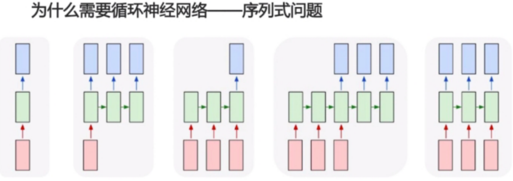
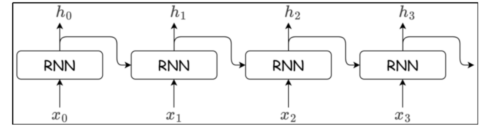
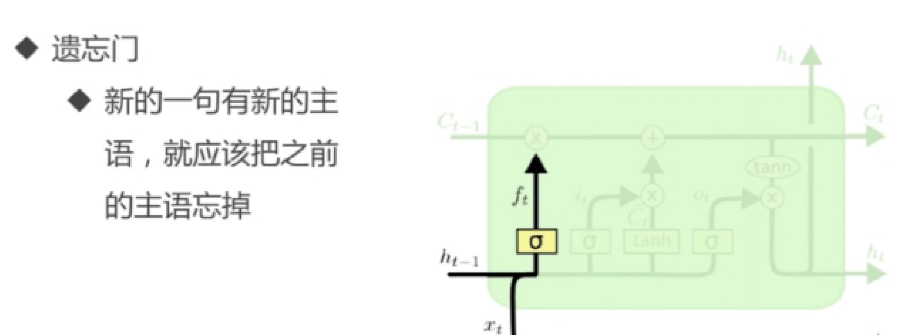
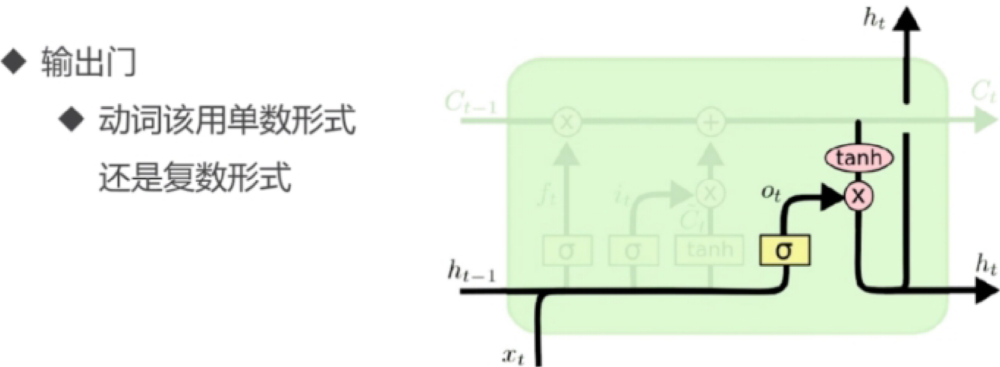

# 循环神经网络RNN

循环神经网络（Recurrent Neural Network， RNN）是一种能够处理时序数据、保留历史信息的神经网络，核心是通过“循环结构 ”让网络在处理当前数据的时候，能用到“上一刻”的计算结果（类似于人可以记住之前发生的事情）

核心特点：

- 时序性：输入数据有先后顺序（如时间步t1、t2、t3...）
- 记忆性：通过隐藏状态（Hidden state）存储历史信息

- 循环性：网络结构中，存在“反馈回路”（上一刻的输出影响当前时刻的输入）

## 为什么需要循环神经网络

> **背景：普通网络怎么处理变长文本？—— "合并 + padding"**
> 普通神经网络（全连接层）要求输入是**固定长度**的向量，而一句话里词的个数是变化的。为了把它塞进网络，只能做两件事：
> - **合并（Merge）**：把整句话多个词的 embedding 合并成一个固定长度向量，最常见的是**求均值**。代价是顺序全丢——`"i love you"` 和 `"you love i"` 平均出来的向量一模一样，模型分不出谁爱谁；而且平均"人人平等"，没有主次，表达情感的关键词（如 `terrible`）会被普通词（如 `the`、`and`）稀释
> - **padding（填充）**：句子有长有短，但一个 batch 的张量形状必须一致，所以短句要补上特殊的 `<PAD>` 填充符补齐到等长。代价是凭空多出大量"假词"，模型也要逐个处理它们，纯属浪费算力
>
> 一句话：**"合并 + padding" = 把所有词"揉"成一个固定向量 + 把句子"补齐"等长**，这是 RNN 出现之前喂给普通网络的笨办法，问题如下。

合并+ padding的缺点：

- 信息丢失
- 多个embedding合并 （求均值）
- Pad噪音、无主次 （padding太多，即便没有padding，一些重要的表达情感的词语，没有主次）
- 无效计算太多,低效
- 太多的padding没有先后位置信息

> **"Pad噪音、无主次"里的"噪音"是什么意思？**
> 噪音指的不是声音，而是**无意义的干扰信号**——`<PAD>` 是人为造的"假词"，不携带任何语义，但模型会真的读到它并参与计算：
> - **平均池化**：短句 padding 多，PAD 的向量混进求均值，把真实词的语义稀释、拖偏；句子越短被稀释得越狠
> - **RNN**：读到 PAD 时照样更新隐藏状态，等于把无效信号"写进记忆"、污染状态（代码里 `padding_idx=0` 只是让 PAD 向量恒为 0，噪音"偏中性"，但照样参与计算）
> - **不均等**：每个样本 padding 量不同，噪音浓度不同，模型学到的特征不稳定
> 正因为如此，代码里才给 RNN 用 `padding_first=True` 把 PAD 放句首——让 RNN 最后一步读到的是真实文本，而不是一堆 PAD。



- 图1：普通神经网络( Vanilla Neural Networks ) 一个样本对应一个输出（卷积神经网络，全连接神经网络）

- 图2：1对多:图片 生成描述

- 图3：多对1:文本分类(文本情感分析)

- 图4：多对多: encoding-decoding,机器翻译，需要在输入最后一个结束后，才能进行输出，是非实时的

- 图5：实时多对多:视频解说

## RNN工作原理

RNN跟传统神经网络最大的区别就在于：**RNN 在每个时间步，都会把上一个时间步的隐藏状态 $h_{t-1}$（"记忆"）和当前输入 $x_t$ 一起计算**。相当于网络处理每个词的时候，都带着之前所有词的"记忆"。

> **先搞懂"时间步"（time step）是什么**
> 时间步是 RNN 处理序列的**基本单位**——"处理序列中的一个元素"就叫一个时间步。这里的"时间"不是真实钟表时间，而是**处理顺序**的抽象：
> - 一句话 `"i love rnn"` 按顺序处理：读 `"i"` 是第 1 步、读 `"love"` 是第 2 步、读 `"rnn"` 是第 3 步，**每个词就是一个时间步**
> - 一段音频，每一"帧"是一个时间步；一段股价序列，每一天是一个时间步
> 每个时间步做一次公式：**读入当前词 $x_t$ + 结合上一步记忆 $h_{t-1}$ → 算出新记忆 $h_t$**。序列多长就有多少个时间步，RNN 就循环执行多少次；**时间步总数 = 序列长度 seq_length**（张量形状 `(batch, seq, input)` 里中间那个 `seq`）。下标 $t$ 只标记"第几步"，**不是权重下标**——权重 $W_{xh}$、$W_{hh}$ 是共享的，没有 $t$。

> **最重要的概念：权重共享（Weight Sharing）**
> RNN 所有时间步用的是**同一套权重矩阵** $W_{xh}$、$W_{hh}$，不会因为时间步 $t$ 不同而变化。序列不管多长，参数都只有这一套——这正是"循环"二字的含义。**所以权重下标千万别写成 $w_t$（不随 $t$ 变化）**。

1. RNN层具有环路，通过环路数据可以在层内循环

   把时序数据$x_1,x_2,...,x_T$依次输入网络，每个时间步算出一个隐藏状态$h_t$，$h_t$ 又作为下一个时间步的输入之一：

   

2. RNN如果以时间步为单位，那么展开形式为：

   

   展开后每个小方块内部，用的还是**同一套权重**，只是输入 $x_t$ 和记忆 $h_{t-1}$ 不同。

3. 前向传播的两个核心公式

   **① 隐藏状态更新（"记忆"的产生）**：
   $$
   h_t=\tanh(W_{xh}·x_t+b_{xh}+W_{hh}·h_{t-1}+b_{hh})
   $$

   - $x_t$：当前时间步的输入（如第 $t$ 个词的 embedding 向量），形状 $(input\_size,)$
   - $W_{xh}$：输入权重矩阵，形状 $(input\_size, hidden\_size)$，把输入变换到"隐藏空间"
     > **形状约定提醒**：这里按"行向量"写法（$x_t$ 是一行向量、乘在矩阵左边），所以 $W_{xh}$ 是 $(input, hidden)$。
     > 但 PyTorch 实际计算是 $h_t=\tanh(x_t W_{ih}^\top + b_{ih} + h_{t-1} W_{hh}^\top + b_{hh})$，`weight_ih_l0`、`weight_hh_l0` 里存的都比公式**多一层转置**（`weight_ih_l0` 形状是 $(hidden, input)$）。
     > 所以下面代码里两个权重都要 `.T` 转回来，行向量约定 `x @ W_xh + h @ W_hh` 才能和手算逐项对上。
   - $b_{xh}$：输入的偏置向量
   - $h_{t-1}$：上一个时间步的隐藏状态（"记忆"），形状 $(hidden\_size,)$；$t=1$ 时用初始状态 $h_0$（通常全 0，也可以是可学习参数）
   - $W_{hh}$：隐藏权重矩阵，形状 $(hidden\_size, hidden\_size)$，**"记忆"就来自这一项**
   - $b_{hh}$：隐藏状态的偏置向量
   - 激活函数使用 $\tanh$：把值压缩到 $(-1,1)$，防止数值无限增大；比 sigmoid 训练更稳定（均值更接近 0）、梯度消失更慢

   > PyTorch 的 `nn.RNN` 里，$b_{xh}$、$b_{hh}$ 分别对应 `bias_ih_l0` 和 `bias_hh_l0`（确实是两个偏置）；也可以合并成一个：$h_t=\tanh(W_{ih}x_t+W_{hh}h_{t-1}+b_h)$，本质一样。

   **② 输出（根据任务选择）**：
   - 每个时间步都输出：$O_t = W_{hy}·h_t + b_y$，适合词性标注、逐字生成
   - 只输出最后一个：只用 $h_T$（整句话信息的"浓缩"），适合情感分类、文本分类
   - PyTorch 的 `nn.RNN` 直接返回隐藏状态本身（$O_t=h_t$），不额外加输出层

   > **理清输入输出（回答你的疑问）**：
   > 每个时间步**只有一个新输入** $x_t$（$h_{t-1}$ 是上一步传下来的"记忆"，不是新的输入）。
   > **隐藏状态 $h_t$ 和输出 $O_t$ 不是一回事**：$h_t$ 负责"记忆"，$O_t$ 负责"对外输出"。`nn.RNN` 返回的 `output` 是**所有时间步的隐藏状态**组成的序列，`hn` 只是**最后一个时间步**的隐藏状态，两者信息量不同，并不"完全一样"。

4. 用具体数值走一遍前向传播（手算）

   ```
   设 input_size=3, hidden_size=2，输入一句话有两个词（两个时间步）：
     x_1 = [1, 0, 1],  x_2 = [0, 1, 0]，初始记忆 h_0 = [0, 0]

     W_xh = [[0.1, 0.2],          W_hh = [[0.5, 0.1],
             [0.3, 0.4],                  [0.2, 0.6]]
             [0.5, 0.6]]
     b_xh = [0.1, 0.1],  b_hh = [0.0, 0.0]

   时间步1：
     z_1 = W_xh·x_1 + b_xh + W_hh·h_0 + b_hh
         = [0.6, 0.8] + [0.1, 0.1] + [0, 0] + [0, 0] = [0.7, 0.9]
     h_1 = tanh([0.7, 0.9]) ≈ [0.604, 0.716]

   时间步2（同一套权重，输入换成 x_2，记忆换成 h_1）：
     W_hh·h_1 = [0.5×0.604+0.1×0.716, 0.2×0.604+0.6×0.716] = [0.374, 0.550]
     z_2 = W_xh·x_2 + b_xh + W_hh·h_1 + b_hh
         = [0.3, 0.4] + [0.1, 0.1] + [0.374, 0.550] = [0.774, 1.050]
     h_2 = tanh([0.774, 1.050]) ≈ [0.649, 0.782]
   ```

   $h_1$、$h_2$ 就是每个时间步的"记忆"。$x_2$ 和 $x_1$ 完全不同，但 $h_2$ 里依然带有 $x_1$ 的痕迹（因为 $h_1$ 参与了计算）——**这就是 RNN 能"记住"历史的原因**。

5. 用代码验证手算结果（对照 nn.RNN）

   ```python
   import torch
   import torch.nn as nn
   
   input_size, hidden_size = 3, 2
   rnn = nn.RNN(input_size, hidden_size, batch_first=True)
   
   # nn.RNN 内部真正用到的参数，正好对应公式里的字母（这就是"权重共享"的那套权重）
   # 注意：PyTorch 存权重时比公式"多一层转置"——weight_ih_l0 形状 (hidden, input)、
   # weight_hh_l0 形状 (hidden, hidden)，手动复现公式时都要 .T 转回（行向量约定 x @ W.T，
   # 才能和手算逐项对上：手算的 W_hh·h_1 其实就等于 h @ W_hh^T）
   W_xh = rnn.weight_ih_l0.T  # (input=3, hidden=2) → 公式里的 W_xh
   W_hh = rnn.weight_hh_l0.T  # (hidden=2, hidden=2) → 公式里的 W_hh
   b_xh = rnn.bias_ih_l0      # (2,)   → b_xh
   b_hh = rnn.bias_hh_l0      # (2,)   → b_hh
   
   x = torch.tensor([[[1., 0., 1.], [0., 1., 0.]]])   # (batch=1, seq=2, input=3)
   output, hn = rnn(x)        # output: (1, 2, 2), hn: (1, 1, 2)
   
   # 手动按公式逐时间步计算（循环里用的始终是同一套 W_xh、W_hh）
   h = torch.zeros(1, hidden_size)          # h_0 = [0, 0]
   for t in range(x.size(1)):
       h = torch.tanh(x[:, t, :] @ W_xh + b_xh + h @ W_hh + b_hh)
       print(f"手动计算 h_{t+1} =", h)
   
   print("nn.RNN 的 output =", output)        # 应等于手算的 h_1, h_2
   print("nn.RNN 的 hn =", hn)                # 应等于最后一个时间步的 h_2
   ```

> **补充：RNN 的代价（为什么后来有了 LSTM）**
   > RNN 每个时间步的梯度要连乘 $\frac{\partial h_t}{\partial h_{t-1}}$（与 $W_{hh}$ 和 tanh 导数有关），序列一长，梯度会指数级变小（**梯度消失**）或变大（**梯度爆炸**），所以普通 RNN "记不住"太远的历史。解决办法：换 LSTM / GRU（用门控机制控制记忆的写入和遗忘）、缩短序列、或做梯度裁剪（gradient clipping）。

### 词典

**构建词典（vocabulary）＝ 给语料里出现过的所有词分配一个唯一的整数 ID**。神经网络只认数字、不认文字，所以每个词都要先变成一个 ID，文本才能喂进网络。

**为什么必须先构建词典，才能 embedding？**
`nn.Embedding(vocab_size, embed_dim)` 在创建时就要知道 `vocab_size`——也就是"词典里有多少个词"。因为 embedding 就是一张 `(vocab_size, embed_dim)` 的查表矩阵，**词典有多大，表就有多大**；不先建词典，就不知道 embedding 表该建多大。

**构建词典做三件事：**

1. **统计词频**：对语料分词后，用 `Counter` 统计每个词出现多少次
2. **限制大小**：真实语料词有几十万，只保留频率最高的前 N 个（如笔记 IMDB 里 `max_vocab_size=20000`，留前 19996 个），其余低频词丢弃、统一映射成 `<OOV>`（未登录词）
3. **编 ID**：字典 `vocab = {词: 整数}`——先预留 4 个特殊符号 `<PAD>=0、<OOV>=1、<BOS>=2、<EOS>=3`，高频词从 4 开始按词频降序编号；同时建反向字典 `{ID: 词}`，方便调试时把数字还原成文字

> **4 个特殊符号分别是干什么的？**
> - **`<PAD>`（0）填充符**：句子有长有短，但一个 batch 必须等长才能堆成张量，短句就用 `<PAD>` 补齐到 batch 内最长——就是前面讲的 padding 里的"假词"
> - **`<OOV>`（1）未登录词（Out Of Vocabulary）**：**不在词典里的词**。词典大小有限——只收语料里频率最高的前 N 个词，低频词、生僻词/专名、新词、拼写错误都进不了词典，于是统一映射到这个 ID 兜底，保证"没见过的词"也能有 ID、不报错。代码里 `vocab.get(word, self.oov_id)`——查得到返回词的 ID，查不到就返回 `<OOV>` 的 ID。代价是所有 OOV 词共享同一个向量，模型分不清它们各自的真实语义（信息丢失）
> - **`<BOS>`（2）句首符**：标记一句话的起点，加在序列最前面（begin of sentence）
> - **`<EOS>`（3）句尾符**：标记一句话的结束，加在序列最后（end of sentence），生成/翻译类任务尤其有用——模型读到它就知道"话说完了"
>
> 为什么固定占 0~3：它们是"元信息"，不参与真实词的编号；其中 `<PAD>=0` 还常配合 `padding_idx=0` 使用，让 PAD 的 embedding 向量恒为 0、不参与学习（减少前面说的"Pad 噪音"）。

**词典建好后，和 embedding 衔接起来：**

```
"i love rnn" → 分词 → ["i","love","rnn"] → 查词典 → [22,183,47] → nn.Embedding 查表 → 词向量序列
```

- 查词典（tokenize）：每个词查 `vocab` 得到整数 ID；词典里没有的词 → `<OOV>` 的 ID（1）
- `nn.Embedding` 的行数就是 `vocab_size`，参数量 = `vocab_size × embed_dim`（笔记 IMDB 里 20000 × 128 ≈ 256 万，占模型参数大头）

> 一句话：**先构建词典确定 `vocab_size`，才能建对应大小的 embedding 表**；之后"词 → ID（查词典）、ID → 向量（embedding 查表）"，文本就变成 RNN 吃得了的向量序列。

### Tokenizer

**Tokenizer 是文本和 ID 序列之间的"翻译官"**——它拿构建好的词典当"字典"，负责把原始文本翻译成模型能吃的数字序列（**encode 编码**），也能把数字序列翻译回文字（**decode 解码**）。

> 词典和 Tokenizer 的分工：
> **词典（vocab）= 静态的"字典"**，只负责 `{词: ID}` 的映射；
> **Tokenizer = 动态的"翻译工具"**，用这本字典把任意一句话来回翻译，截断、padding 也是它干的。

**encode（文本 → 填充好的 ID 序列）**，做 5 件事：

```
"i love rnn"  --分词-->  ["i","love","rnn"]  --查词典-->  [22,183,47]
               +加<BOS>/<EOS>：[2,22,183,47,3]
               +超过 max_length 截断
               +不足补 <PAD>：[0,0,0,2,22,183,47,3]  （padding_first=True 时 PAD 在前）
```

1. **分词**：`text.split()` 把句子按空白切成单词
2. **查词典**：每个词查 `vocab` 变成整数 ID（词典外的词 → `<OOV>` 的 ID）
3. **加特殊符号**：可选地在开头加 `<BOS>`、结尾加 `<EOS>`
4. **截断**：超过 `max_length`（如 500）就砍掉
5. **padding**：把 batch 里所有句子补到一样长，凑成一个规整张量 `(batch, seq_len)`

**decode（ID 序列 → 文本）**：反向把 `[2,22,183,47,3,0,0]` 还原成文字（可选跳过特殊符号），用来调试、验证编码对不对。

**为什么要它？** 模型只吃固定形状的数字张量，而原始文本是长度不一的一句话。Tokenizer 就是中间那层转换：把"长短不一的一句话"变成"等长的、数字化的、带特殊符号标记的矩阵"。

### embedding

**embedding（词嵌入）= 把"词的整数编号"映射成"带语义的稠密向量"**，是文本进入神经网络的第一道工序。

**① 为什么不能直接用 one-hot？**

词要先变成数字才能喂给网络。最朴素的想法是 one-hot 编码：

```
词表 = ["我", "爱", "学习", "RNN"]   （词表大小 vocab_size = 4）
"我"   → [1, 0, 0, 0]
"爱"   → [0, 1, 0, 0]
"学习" → [0, 0, 1, 0]
"RNN"  → [0, 0, 0, 1]
```

one-hot 的问题：
1. **维度爆炸**：真实词表有 10 万+ 个词，每个词就是 10 万维向量，几乎全是 0，极其稀疏、占内存
2. **没有语义**：任意两个 one-hot 向量都"正交"，模型学不到"猫 ≈ 狗""喜欢 ≈ 热爱"这种相似关系

**② embedding 就是一张"可学习的查表矩阵"**

embedding 把每个词映射成一个**稠密的低维向量**（如 100/300 维），语义相近的词在向量空间里距离也更近。这个"词 → 向量"的映射就存在一张大矩阵里：

- 形状：`(vocab_size, embedding_dim)`——第 $i$ 行就是词表第 $i$ 个词的向量
- 使用方式：给定词的索引 $idx$，取出第 $idx$ 行即可——本质就是一次**查表（lookup）**

PyTorch 中用 `nn.Embedding`：

```python
import torch
import torch.nn as nn

embedding = nn.Embedding(num_embeddings=10, embedding_dim=4)  # 词表10个词，每个词映射成4维向量

one_word = torch.tensor([3])           # 一个词的索引
print(embedding(one_word).shape)       # (1, 4)

sentence = torch.tensor([2, 5, 1])     # 一句话的索引序列（序列长度=3）
print(embedding(sentence).shape)       # (3, 4)
```

这张矩阵初始是**随机**的，然后**随当前任务一起训练**（反向传播不断更新权重），训练结束后每一行就"编码"了这个词在任务中的语义。这种叫**可学习的 embedding**。

> **和 Word2Vec 的关系：**
> - **nn.Embedding**：随机初始化，跟着当前任务一起训练（端到端学习）
> - **Word2Vec / GloVe**：在大规模语料上**预训练**好的词向量，可以拿来当 embedding 的初始值（冻结或微调），好处是已经蕴含了通用语义
> - 一句话：**Word2Vec 是"生产词向量"的训练算法，embedding 是"词的向量表示"本身；PyTorch 的 `nn.Embedding` 是一个可训练的查表层**，两者不是一回事，但可以配合使用

**③ embedding 在 RNN 里的位置（数据流）**

```
"i love rnn"
   │ 分词（tokenize）
["i", "love", "rnn"]
   │ 查词表 → 每个词变成整数索引
[22, 183, 47]
   │ nn.Embedding 查表
[[0.12, 0.88, ...],      ← 第0个时间步的输入 x_1（"i"的向量）
 [0.34, 0.12, ...],      ← x_2（"love"的向量）
 [0.90, 0.45, ...]]      ← x_3（"rnn"的向量）
   │ 送入 RNN，按时间步依次输入
  h_1 → h_2 → h_3
```

> 一句话总结：**embedding 把"词的编号"变成"带语义的稠密向量"，RNN 吃进去的就是这一串稠密向量**；对 RNN 来说，`input_size` 就等于 `embedding_dim`。

### 二进制交叉熵损失函数（负对数似然损失）

$$
cost(h_\theta,y)=\sum_{i=1}^{m}-\left[y_i\log(h_\theta(x_i))+(1-y_i)\log(1-h_\theta(x_i))\right]
$$

#### BCE 是怎么工作的（详解）

BCE 度量"模型预测的概率 $p$"和"真实标签 $y \in \{0,1\}$"的差距：

$$
BCE(y,p) = -\big[y\log p + (1-y)\log(1-p)\big]
$$

**① 它是一个"自动开关"**：因为 $y$ 只能是 0 或 1，公式里每次只"活"一项——

- 当 $y=1$：第一项存活 → $BCE=-\log p$（$(1-y)=0$ 把第二项消掉）
- 当 $y=0$：第二项存活 → $BCE=-\log(1-p)$

含义就是"**$-\log$(模型给真实标签的概率)**"：给正确结果的概率越高，损失越小。

| 真实 $y$ | 预测 $p$ | 损失 | 解读 |
|---|---|---|---|
| 1 | 0.9 | 0.11 | 高置信且正确 → 惩罚极小 |
| 1 | 0.5 | 0.69 | 完全没把握（和猜硬币一样） |
| 1 | 0.1 | 2.30 | 低置信且错了 → 惩罚大 |
| 0 | 0.1 | 0.11 | 高置信且正确 |
| 0 | 0.9 | 2.30 | 高置信且错误 → 惩罚最大 |

> 关键直觉：**"很有把握但错了"比"没把握所以错了"罚得更狠**。分类任务最怕的不是错误预测，而是**自信的错误**。

**② 为什么用 log？**

1. **概率相乘 → 损失相加**：一批样本的正确率是 $\prod p_i$，越乘越小容易下溢；取 $-\log$ 变成 $\sum -\log p_i$，乘法变加法
2. **等价于极大似然估计（MLE）**：模型预测 $P(y=1|x)=p$，则"标签恰好为 $y$"的概率是 $p^y(1-p)^{1-y}$。对整个数据集最大化 $\prod_i p_i^{y_i}(1-p_i)^{1-y_i}$，再取 $-\log$ 求和，**恰好就是最上面那个求和公式**。所以"二进制交叉熵" = "伯努利分布下的负对数似然（NLL）"——这就是笔记标题括号里"负对数似然损失"这个名字的来源
3. **信息论**：用预测分布 $[p,1-p]$ 编码真实分布 $[y,1-y]$ 所需比特数，展开就是 BCE。预测越准，编码越省

**③ 为什么分类不用 MSE？**

1. **梯度消失**：分类尾巴是 sigmoid，在 logit 很大/很小时饱和（导数→0）；MSE 对 $z$ 的梯度带着 sigmoid 导数，错得越离谱梯度越接近 0，模型几乎不动。BCE 没有这个问题
2. **惩罚不对等**：分类的"对错"是 0/1 的质变，不是连续量变；BCE 会重罚"高置信错误"
3. **梯度干净**：令 $p=\sigma(z)$，可推出

$$
\frac{\partial BCE}{\partial z} = p - y
$$

**梯度 = 预测概率减真实标签**：$p=0.9$ 但 $y=0$ → 梯度 $+0.9$，狠狠修正；$p=0.9$ 且 $y=1$ → 梯度 $-0.1$，快对了轻轻推一下。这个性质让训练非常高效。

**④ 工程实现：用 `BCEWithLogitsLoss`（数值稳定）**

朴素写法"先 sigmoid 再 log"在 $p\to0$ 或 $p\to1$ 时会出现 $\log(0)=-\infty$，训练直接 NaN：

```python
import torch
import torch.nn.functional as F

z = torch.tensor([[-5.0, 3.0]])        # logit，任意实数
y = torch.tensor([1.0, 1.0])

p = torch.sigmoid(z)                                          # (0,1)
loss = -(y * torch.log(p) + (1 - y) * torch.log(1 - p))       # 危险！p→0/1 会溢出
```

正确做法：把 sigmoid 和 BCE 合成一个表达式，在 logit 空间直接算（不经过中间概率），**数学上完全等价但不溢出**：

```python
loss = F.binary_cross_entropy_with_logits(z, y)   # 等价于 nn.BCEWithLogitsLoss()
```

IMDB 示例里用的 `nn.BCEWithLogitsLoss()` 就是它。

> **和 softmax 方案的关系**：二分类 softmax 的交叉熵（2 类）就是 BCE 的另一个写法。因为 $p_1+p_2=1$，令 $p=p_1$ 则 $1-p=p_2$，两个公式逐项相等。所以笔记最后"推荐单神经元方案"有数学依据——只是省参数，不是不同算法。

单个神经元通过BCE进行二分类：

- 输出层只有一个神经元，使用sigmoid激活函数，将输出值压缩到0-1之间，表示为正类的概率

- 损失函数使用二进制交叉熵（Binary Cross Entropy, BCE）：
  $$
  loss=-[y·log(p)+(1-y)·log(1-p)]
  $$
  

 	其中$y$为真实标签（0或1），$p$为sigmoid输出

- 这种方式适合二分类问题，标签通常为0和1

- 预测时，常以0.5为阈值，大于0.5判正类，否则为负类

  ```
  输入→ 隐藏层 ... →输出层(sigmoid, 1个神经元)→ BCE损失函数
  ```

两个神经元通过Softmax进行二分类：

- 输出层有两个神经元，分别表示“类别0”和“类别1”的得分，使用softmax激活函数将其转化为两个类别的概率，且概率和为1

- 损失函数使用交叉熵（Cross Entropy）：
  $$
  loss=-\sum_{i=1}^{2}y_i·log(p_i)
  $$
  其中$y_i$为one-hot标签（[1,0]或[0,1]），$p_i$为softmax的输出值

- 适用于多分类，也可用于二分类

- 预测时，选择概率最大的类别为预测类别

  ```
  输入→ 隐藏层 ... →输出层(softmax, 2个神经元)→ 交叉熵损失函数
  ```

区别总结：

- 单个神经元+sigmoid+BCE更高效，常用于二分类，标签为0/1
- 两个神经元+softmax+交叉熵适合多分类，也可用于二分类但参数更多，标签为one-hot
- 实际效果相近，但前者更简洁；**在类别完全互斥且只有两类时，推荐使用单神经元方案**

### 单层单向 单层双向 双层单向

**单层单向（`num_layers=1, bidirectional=False`）—— 最朴素/默认配置**

- **结构**：只有一层 RNN，输入直接进这一层，每个时间步算一个隐藏状态：

  ```
  x_1 → [RNN层] → h_1
  x_2 → [RNN层] → h_2
  x_3 → [RNN层] → h_3
  ```

- **方向**：只从左往右读一遍，每个位置的记忆 $h_t$ 只含"过去 + 现在"的上下文（看不到未来）
- **权重共享**：所有时间步共用同一套权重（`weight_ih_l0`/`weight_hh_l0`），这正是"循环"二字的含义
- **取最后一步**：`hn` 形状 `(num_layers, batch, hidden)` = `(1, batch, hidden)`，`hn[-1]` 就是最后一步的隐藏状态；此时 `output[:, -1, :] == hn[0]`
- 对应笔记模型二代码里的 `rnn_model`（`rnn_layers=1, bidirectional=False`，默认配置），也是实际训练用的模型

**单层双向（`num_layers=1, bidirectional=True`）—— 双向读序**

- **结构**：同一层里跑**两个 RNN**——一个从左往右读（正向）、一个从右往左读（反向），每个位置把两个方向的隐藏状态**拼接**起来：

  ```
         x_1 →  x_2 →  x_3      （正向 RNN）
         x_1 ←  x_2 ←  x_3      （反向 RNN）
  h_t = [h_t^→ ; h_t^←]         （拼接，维度翻倍）
  ```

- **为什么有用**：对否定句 `"not good"`，`not` 的意思要靠后面的 `good` 才知道；单向读到 `not` 时还没看到 `good`，信息不全，反向那一支能提前"看到"未来。所以每个位置同时有"过去 + 未来"的上下文
- **代价**：输出维度翻倍（`fc` 输入 = `hidden × 2`），参数量也约翻倍——对应代码里的 `self.num_directions = 2 if bidirectional else 1` 和 `self.fc = nn.Linear(rnn_hidden * self.num_directions, num_class)`
- **取最后一步**：`hn` 形状 `(num_layers × 方向数, batch, hidden)` = `(2, batch, hidden)`，`hn[-2]` 是正向最后一步、`hn[-1]` 是反向最后一步；代码里 `last_hidden = torch.cat([hn[-2], hn[-1]], dim=1)` 把两个方向拼起来
- 对应笔记模型二代码里的 `bi_model`（`rnn_layers=1, bidirectional=True`，仅演示）

**双层单向（`num_layers=2, bidirectional=False`）—— 纵向加深**

- **结构**：两层 RNN 纵向叠起来，**第 1 层每个时间步的输出，作为第 2 层对应时间步的输入**：

  ```
  x_1 → [层1] → h₁⁽¹⁾ → [层2] → h₁⁽²⁾
  x_2 → [层1] → h₂⁽¹⁾ → [层2] → h₂⁽²⁾
  x_3 → [层1] → h₃⁽¹⁾ → [层2] → h₃⁽²⁾
  ```

- **每层各有一套自己的权重**：权重共享是"**同一层内**、跨时间步"共享（所有时间步共用同一套），但**不同层权重不同**——第 1 层是 `weight_ih_l0`/`weight_hh_l0`，第 2 层是 `weight_ih_l1`/`weight_hh_l1`。所以**层数翻倍 → RNN 参数量约翻倍**（计算量也跟着翻倍）
- **纵向加深 vs 横向展开**：层数管"叠多深"（模型深度），时间步管"展开多长"（序列长度），两者正交。`num_layers=2` 只是把深度从 1 变成 2，每个时间步依然照常展开
- **为什么用多层**：低层学局部、浅层特征，高层学更抽象、全局的特征（类似 CNN 先学边缘、再学轮廓）。但对影评情感这种简单任务，单层往往就够，多层更容易过拟合、训练更慢
- **取最后一步**：`hn` 形状 `(num_layers, batch, hidden)` = `(2, batch, hidden)`，`hn[-1]` 是**最后一层（第 2 层）**最后一步的隐藏状态——模型二代码里 `last_hidden = hn[-1]`，双层时取到的就是第 2 层的结果
- 对应笔记模型二代码里的 `two_layer_model`（`rnn_layers=2, bidirectional=False`），输出仍是 `(batch, 1)`

### RNN接口解析

```python
# 0. 导包
import torch
import torch.nn as nn

# 1. 创建RNN模型
# 参数说明:
# input_size: 输入数据的维度，也可以理解为输入数据的特征数量
# hidden_size: 隐藏层的维度， 也可以理解为隐藏状态的特征数量
# num_layers: 隐藏层的层数，如果设置多个层，前一个隐藏层的输出作为下一个隐藏层的输入，一般设置1即可，默认也是1
# batch_first: 如果为True，输入和输出的张量形状为 (batch_size, seq_length,input_size)
rnn_model = nn.RNN(input_size=10, hidden_size=20, num_layers=1, batch_first=True)

# 2. 调用模型
# 输入数据
input_data = torch.randn(3, 5, 10)  # input:	[batch_size 批量大小, seq_length 序列长度, input_size 输入特征维度]
hx = torch.randn(1, 3, 20)  # hx:	[num_layers 隐藏层数, batch_size 批量大小, hidden_size 隐藏层维度]

# 输出数据
output, hn = rnn_model(input_data, hx)  # output:	[batch_size, seq_length, hidden_size]
print(output.shape)  # hn:	[num_layers, batch_size, hidden_size]
print(hn.shape)
```

各数据参数：

- `input: [seq_length序列长度, batch_size 批量大小, input_size输入数据的维度] `
- `hx: [num_layers隐藏层的层数, batch_size批量大小, hidden_size隐藏层的维度] `
- `output: [seq_length序列长度, batch_size 批量大小, hidden_size隐藏层的维度] `
- `hn: [num_layers隐藏层的层数, batch_size批量大小, hidden_size隐藏层的维度]`

参数解释：

- 序列长度是指单个样本的“时间步总数”。假如输入是一句话，那么序列长度就是指句子分词之后的词条数；假如输入是一段音频，那么序列长度就是这段音频的“帧的数量”
- batch_size就是批量大小，也就是一次处理多少个样本
- input_size指的是单条输入数据$x_n$，使用几维向量来表示
- num_layers一般是一层，也可以设置为多层

> **容易混的两个约定（batch_first）：**
> - 上面代码设了 `batch_first=True`，所以 input 形状是 `(batch, seq, input)`；
> - 如果不设置（默认 `batch_first=False`），input 是 `(seq, batch, input)`——**batch 和 seq 的位置交换了**。实际使用一般显式设成 `True`。
> - `output` 是**每个时间步**的隐藏状态序列；`hn` 是**最后一个时间步**的隐藏状态。所以当 `num_layers=1` 时，`output[:, -1, :] == hn[0]`，二者内容只在"取哪一个时间步"上不同。

## 文本生成

### 分词的三种方法

分词（tokenization）把文本切成一个个 token，是文本进模型前绕不开的一步。按**切分粒度**从大到小，主要有三种：词级、字符级、子词级。

**① word-level（词级别）—— 词典太大**

- 按"词"切分：一个词 = 一个 token
- 优点：一个 token 就是一个完整语义单位，直觉清晰
- 缺点：
  - **词典太大**：真实语言有几十万词（英文的派生、变形、专名），embedding 表跟着巨大（`vocab_size × embed_dim`），内存和参数量爆炸
  - **OOV 问题**：新词、拼写错误、网络新词（如 `coronavirus`）词表里没有 → 只能映射成 `<OOV>`，信息直接丢失
  - **学不到词形变化**：`run / runs / running` 是三个独立 token，共享不到词根 run

**② char-level（字符级别）—— 词典太小**

- 按"字符"切分：一个字母 = 一个 token（英文），一个汉字 = 一个 token（中文）
- 优点：
  - **词典极小**：英文就几十个符号，几乎没有 OOV，任何词都能拼出来
- 缺点：
  - **词典太小 → 每个 token 携带的语义信息太少**：`running` 被拆成 7 个字符，模型要从字母一层层拼出词义，序列长度暴涨（一句话变成几十个字符），训练慢、难学
  - 长程依赖更难建模：信息散布在一长串字符里，RNN/注意力要"看"很远

**③ subword-level（子词级别）—— 平衡方案，BPE 是代表**

- 按"子词"切分：**高频词整词保留，低频词拆成词根/词缀**：
  - `"running"` → `["run", "ning"]`，`"unhappiness"` → `["un", "happiness"]`
- **BPE（Byte Pair Encoding，字节对编码）是怎么来的**（"字节对"是历史命名——最早是数据压缩算法作用在字节上，subword-nmt 把它用在**字符/子词**级别）：
  
  1. 初始化：把语料里所有词都拆成一个个字符
  2. 统计：数每对相邻字符出现的次数
  3. 合并：把出现次数最多的那对字符合并成一个新"子词"，加入词表
  4. 重复第 2、3 步，直到词表达到目标大小（如 32000）
  - 最终效果：高频词被整词保留（因为被反复合并过），低频词/生词仍能拆成已存在的子词
- 优点：
  - **词典大小适中**（几万即可），且**没有 OOV**——生词总能拆成已有子词的组合
  - **序列长度适中**：比 char-level 短得多，比 word-level 略长，可接受
  - **学到词形变化**：`run / run+s / run+ning` 共享子词 `run`，词根词缀被共享学习
- 现状：**GPT、BERT、LLaMA 等主流大模型都默认用 BPE / WordPiece / Unigram 这类 subword 分词**，是 NLP 的事实标准

> 一句话对比：**word-level 词义完整但词表爆炸；char-level 词表极小但序列太长、信息太碎；subword-level（BPE）在中间取平衡——词表不大、无 OOV、还能学到词根**，所以成了主流。

#### BPE分词算法

使用subword-nmt库

```bash
# 训练阶段 ①：学习合并规则（-s 8000 = 做 8000 次合并，决定子词表规模）
subword-nmt learn-bpe -s 8000 -i ./imdb_train.txt -o ./imdb_bpe_code
# 训练阶段 ②：用规则把训练集切分成子词，得到 ./imdb_train_bpe.txt
subword-nmt apply-bpe -c ./imdb_bpe_code -i ./imdb_train.txt -o ./imdb_train_bpe.txt
# 训练阶段 ③：统计子词频次，得到词表
subword-nmt get-vocab -i ./imdb_train_bpe.txt -o ./imdb_bpe_vocab
```

> 注意：
> - `learn-joint-bpe-and-vocab` 是为**两个语料联合学习**设计的（机器翻译的源/目标语言，`--write-vocabulary` 也要给两个词表文件名）；单个语料用上面的 `learn-bpe` + `get-vocab` 即可，别混用
> - ①②是"学习"阶段——产出的是**规则文件**和**词表文件**，真正把文本编码成 subword 的是后面的 `apply-bpe`。整条流水线的目的：用子词替代整词，更好防止 OOV，并降低词表规模

imdb_bpe_code文件 是**BPE（字节对编码）的编码规则文件** ，也是 BPE 算法的核心产物：

- **内容**：按**学习顺序**记录了所有合并操作，每一行是一对"被合并的子词"（例如 `s </w>` 表示把 `s` 和词尾标记 `</w>` 合并成 `s</w>`）；行号顺序就是 apply 阶段套用规则的顺序
- **怎么用**：`apply-bpe` 把它当"操作手册"——把新文本里的词按同样的顺序逐条合并，得到子词切分

imdb_bpe_vocab文件 是**BPE训练后的词汇表文件**：

- **内容**：对 `apply-bpe` 切分后的训练文本统计得到——所有子词（subword）及其出现频次（每行"子词 频次"），可用于过滤低频子词 / 控制词表大小

```bash
subword-nmt apply-bpe -c ./imdb_bpe_code -i ./imdb_train.txt -o ./imdb_train_bpe.txt
subword-nmt apply-bpe -c ./imdb_bpe_code -i ./imdb_test.txt -o ./imdb_test_bpe.txt
```

- `-c`：指定BPE编码配置文件（上面学的 `imdb_bpe_code`）
- `-i`：输入文件（如 imdb 训练/测试集）
- `-o`：输出文件（被BPE切分后的子词序列）

BPE算法具体实现

1. 准备足够大的训练语料

2. 确定期望的subword词典大小（超参）

3. 将单词拆分为字符序列，并在**词尾添加边界符 `</w>`**，统计单词频率。本阶段的 subword 粒度是字符。例如 "low" 的频率为 5，那么改写为 `l o w </w>`：5

4. 统计每一个连续"字节对"的出现频率，选择最高频者合并成新的 subword（这里实际是**字符对**，"字节"是历史遗留叫法）

5. 重复第4步，直到达到第2步设定的 subword 词表大小，或下一个最高频字节对的出现频率降为 1（再合并没有信息增益，通常作为停止条件）。每次合并后，词表大小可能出现 3 种变化：
   - **+1**：加入合并后的新子词，原来两个子词都还保留（二者并非总是一起出现，仍会单独出现）
   - **+0**：加入新子词，原来两个子词中一个被"吞并"（一个总是紧跟着另一个出现）
   - **-1**：加入新子词，原来两个子词都被"吞并"（二者总是成对出现）

6. 因此，随着合并次数增加，词表大小通常**先增后减**：早期合并大多净增（词表变大），后期高频对都合完了，合并开始"吞并"旧符号（词表变小）

#### 手算例子：看看 BPE 到底怎么"合并"

用极小的语料（2 个词 + 词频）把完整流程跑一遍，假设合并次数 `-s` 设成 6：

| 单词 | 词频 | 初始拆分（词尾加 `</w>` 表示词边界） |
|---|---|---|
| low | 10 | `l o w </w>` |
| lowest | 2 | `l o w e s t </w>` |

第 0 步：每个词拆成字符 + 词尾 `</w>`。然后**逐轮**统计相邻字对的频次，合并最高频的一对（并列时按从左到右的顺序）：

| 轮次 | 本轮最高频字对 | 频次 | 合并结果 |
|---|---|---|---|
| 1 | l + o | 10+2=12 | `lo` |
| 2 | lo + w | 10+2=12 | `low` |
| 3 | low + `</w>` | 10 | `low</w>` |
| 4 | e + s | 2 | `es` |
| 5 | es + t | 2 | `est` |
| 6 | est + `</w>` | 2 | `est</w>` |

这张表看明白，BPE 的本质就清楚了：

- **高频词被"整词合并"出来**：`l o`、`lo w` 频次高达 12，远大于 `lowest` 里其他字对的 2，所以 `low` 先被合并完整，`low</w>` 直接成为一个子词——这就是"高频词整词保留"的原理：**不是刻意保留，而是它的内部字对先被合并完了**
- **低频词拆得细**：`lowest` 的字对频次只有 2，排到后面慢慢合，最终停在 `low + est` 两个子词——低频词吃不到"整词待遇"，只能拆成已有子词的组合
- **`-s` 在起作用**：如果不设上限，第 7 轮本会把 `low + est</w>` 再合成 `lowest</w>`（整词）；`-s 6` 就停在两个子词。所以 **`-s` 越大子词越接近整词，越小拆得越细**——它就是平衡"词表大小 vs 序列长度"的超参
- 合到后期，剩余字对的频次大多是 1（如只出现 1 次的孤对），再合没有意义——对应停止条件"最高频字对降到 1 就停"

#### 应用阶段：把新词切成子词（apply 在做什么）

训练出 codes 后，切一个新词只做一件事：**从字符开始，按 codes 里的合并顺序逐条尝试，能合就合**。用上面学到的 6 条规则试几个"训练里没出现过的词"：

| 新词 | 字符序列（带 `</w>`） | 套用规则的过程 | 切分结果 | apply-bpe 输出 |
|---|---|---|---|---|
| lower | `l o w e r </w>` | ① l o→lo ② lo w→low，之后 "low e"、"e r" 没学过，停 | low + e + r | `low@@ e@@ r` |
| widest | `w i d e s t </w>` | ① e s→es ② es t→est，其他用不上 | w + i + d + est | `w@@ i@@ d@@ est` |
| quantum | `q u a n t u m </w>` | 一条都用不上 | 拆成 7 个字符 | `q@@ u@@ a@@ n@@ t@@ u@@ m` |

- `@@` 标记"这个词还没切完，后面还有同一词的其他部分"；**最后一个子词不带 `@@`**。解码时删掉所有 `@@ `（含后面的空格）和行尾的 `@@` 就能还原原文
- **关键**：不管词多生僻、是不是训练时见过，只要字符在初始化词表里就一定能切出来——**子词级别天然没有 OOV**，这就是它替代 word-level 分词的核心理由

#### 别混淆：`@@`、`##`、`▁` —— 三种子词标记

不同分词器给"子词边界"打的标记不一样，看论文/代码时最容易混：

| 分词器 | 标记方式 | 代表模型 | 选词标准 |
|---|---|---|---|
| BPE（subword-nmt） | 词内子词带 `@@` 后缀，如 `low@@ est` | GPT-1、早期 NMT | 贪心，按**相邻对频次**最高合并 |
| WordPiece | 续接子词带 `##` 前缀，如 `un ##happy` | BERT、DistilBERT | 按**合并后似然提升**选对（非纯频次） |
| Unigram（SentencePiece） | 词首子词带 `▁` 前缀，如 `▁I ▁love` | T5、ALBERT | 概率模型，一次给出多种候选切分再选最优 |
| Byte-level BPE | 直接对**字节**操作，没有这些标记 | GPT-2/3、RoBERTa | 就是 BPE，但作用在 256 个字节符号上 |

> 一句话：`@@` 是 subword-nmt 的、`##` 是 BERT（WordPiece）的、`▁` 是 SentencePiece 的。笔记前面 codes 文件里写的 `s ##s` 混用了 WordPiece 的记号——subword-nmt 的 codes 文件里应是合并对（如 `s </w>`），apply 输出里是 `low@@ est` 这种带 `@@` 的形式。

#### BPE 的局限 & 主流变体

- **贪心、只看频次**：每步只挑"出现次数最多"的字对，但"常一起出现"≠"合出来最有语义价值"——`t h` 可能超高频（the/that/this），合出 `th` 却未必是好子词。WordPiece 改用似然提升选对，就是针对这一点
- **切分不是最优**：同一个词常有多种合法切分，BPE 给的是贪心解；Unigram 用概率给所有切分打分，选总概率最高的
- **对中文不友好**：subword-nmt 要求语料先按空格切好"词"再学（英文天然满足）；中文没有空格，只能先额外分词，或直接换 **SentencePiece**——它把空格也当普通字符处理，能对原始中文直接无监督学习
- **冷僻字符可能 OOV**：字符级 BPE 对没见过的字符会无解；**Byte-level BPE** 直接作用在字节上，256 个字节符号全覆盖，任何 Unicode（含 emoji）都能拼出来——GPT-2 之后的主流做法

> 一句话：**BPE 是"贪心按频次合并"的开山方案，WordPiece / Unigram / byte-level BPE 分别修它的不同短板**；记不住细节时先记住三种标记别混用（`@@` / `##` / `▁`）。

### 温度（Temperature）

**Temperature（温度，T）是控制大模型输出"随机性/创造性"的参数**——T 越小输出越确定、越保守，T 越大输出越随机、越有想象力。

**它作用在 softmax 之前：模型最后一层先算每个词的分数 logits，再除以 T 才进 softmax 变概率：**

$$
P(词_i)=\frac{\exp(z_i\,/\,T)}{\sum_j \exp(z_j\,/\,T)}
$$

- **`T = 1`**：原始分布，原样输出
- **`T < 1`**（如 0.7、0.1）：分布被"压尖"，高分词的赢面更大 → 输出**更确定、更稳**
- **`T > 1`**（如 1.2、1.5）：分布被"摊平"，低分词也有机会 → 输出**更多样、更跳跃**

**数值例子（更直观）**，假设最后几个词的分数 `z = [2.0, 1.0, 0.5]`：

| 温度 | softmax 概率 | 效果 |
|---|---|---|
| **T = 0.5** | [0.84, 0.11, 0.04] | 几乎总是选第一个词（确定） |
| **T = 1** | [0.63, 0.23, 0.14] | 原始分布 |
| **T = 2** | [0.48, 0.29, 0.23] | 三个词接近均等（随机） |

极限情况：

- **T → 0**：概率只剩最高的那个 → 等价于**贪心（argmax）**，每次选概率最大的词，输出稳定但很"死板"
- **T → ∞**：所有词概率相等 → 完全**随机乱说**

**为什么叫"温度"？** 借用了热力学概念：**温度高，分子运动越随机**。模型也一样——温度越高，token 的"热运动"越剧烈；温度低则"分子"老实待在能量最低处，输出循规蹈矩。

**实际怎么用：**

| 任务 | 温度 | 原因 |
|---|---|---|
| 代码、数学、翻译（要准确） | 低（0~0.7） | 答案唯一，不需要发散 |
| 写故事、写诗、头脑风暴（要创意） | 高（0.8~1.5） | 需要多样、出乎意料 |
| 聊天助手（均衡） | 中（0.7~1.0） | 既通顺又不至于胡说 |

> 一句话：**温度 = 控制大模型"敢不敢冒险"的旋钮**，旋小=稳，旋大=野。

## 长短期记忆网络LSTM

> **先回顾痛点**：上面"RNN 的代价"说过——普通 RNN 的梯度沿时间步连乘，序列一长就**梯度消失**，"记不住"太远的信息。
> LSTM（Long Short-Term Memory，长短期记忆网络）的解决办法是：**给 RNN 加一条"记忆传送带"（细胞状态 $C_t$）**，让历史信息在传送带上几乎不衰减地流动，再用**门（gate）**控制"忘掉什么、记住什么、输出什么"。

### LSTM 比 RNN 多了一个"细胞状态"

普通 RNN 只有一个隐藏状态 $h_t$（既是记忆又是输出）。LSTM 把"记忆"和"输出"拆成**两个状态**：

- $C_t$：**细胞状态（cell state）**——"长期记忆"，藏在肚子里的传送带，几乎不对外
- $h_t$：**隐藏状态（hidden state）**——"对外输出"，从 $C_t$ 里挑一部分"说出来"（给下一时间步 / 下一层用）

> 生活类比：$C_t$ 是一本**日记本**，什么都能记、一直保留；$h_t$ 是**你此刻说出口的话**——只从日记里挑最相关的一段讲出来。下面的三个门，就是"写日记 / 擦日记 / 念日记"的开关。

### 门控机制：三个门 + 候选记忆

每个门都是一个 **sigmoid**（输出 0~1：0=全关、1=全开），门的输出对状态**逐元素相乘**（$\odot$），控制"放多少进来 / 留多少下来"。每个门都要读"拼接后的输入 $[h_{t-1}, x_t]$"（把上一步记忆和当前词拼成一个长向量，再乘权重）。

**① 遗忘门 $f_t$ —— 决定从旧记忆 $C_{t-1}$ 里忘掉什么**



$$
f_t=\sigma(W_f\cdot[h_{t-1},x_t]+b_f)
$$

- $f_t$ 某一维 ≈ 1 → "这部分旧记忆留着"；≈ 0 → "这部分旧记忆清掉"
- 例：读到"…but…（但是）"时，模型打开遗忘门，把上一句的主题清掉，准备装新主题

**② 输入门 $i_t$ + 候选记忆 $\tilde{C}_t$ —— 决定把什么新信息写进细胞状态**


$$
i_t = \sigma(W_i\cdot[h_{t-1},x_t]+b_i)
$$

$$
\tilde{C}_t = \tanh(W_C\cdot[h_{t-1},x_t]+b_C)
$$

- $\tilde{C}_t$（候选记忆）是"根据当前输入草拟的一条新记忆"，用 tanh 让值落在 $(-1,1)$（表示内容的正负/强弱）
- $i_t$（输入门）是"这条草稿要不要真的写进日记"（0 不写、1 全写）

**③ 输出门 $o_t$ —— 决定从更新后的 $C_t$ 里挑哪一部分作为 $h_t$ 对外输出**



$$
o_t = \sigma(W_o\cdot[h_{t-1},x_t]+b_o)
$$

$$
h_t = o_t\odot\tanh(C_t)
$$

### 核心：细胞状态怎么更新


$$
C_t = f_t\odot C_{t-1}+i_t\odot\tilde{C}_t
$$

**一句话：旧记忆按遗忘门"缩一缩"，新候选按输入门"加进来"。** $\odot$ 是逐元素乘法——$C$ 的每一个维度（每条"记忆线"）都有自己独立的遗忘/输入开关，互不干扰。

完整的一步流程（记住这 4 步的顺序）：

```
输入 [h_{t-1}, x_t]（拼接）
  → ① 遗忘门 f_t：旧记忆 C_{t-1} 留多少
  → ② 输入门 i_t、候选记忆 C̃_t：新信息要写多少、写什么
  → ③ 细胞状态更新：C_t = f_t⊙C_{t-1} + i_t⊙C̃_t
  → ④ 输出门 o_t：从 C_t 里挑多少作为 h_t，h_t = o_t⊙tanh(C_t)
```

> **和普通 RNN 对比**：普通 RNN 一步 `h_t = tanh(W·[h_{t-1}, x_t])` 把记忆"全量改写"；LSTM 是"**部分保留 + 部分写入**"，记忆和输出分开管理，所以历史信息能长期留下来。

### 数值例子（手算 2 个时间步）

沿用 RNN 手算例子的设定（input_size=3, hidden_size=2，$x_1=[1,0,1],\ x_2=[0,1,0]$），但权重故意设得很简单，方便看清"门在干什么"。

权重设计（每个门读拼接向量 $[h_1,h_2,x_1,x_2,x_3]$，长度 5）：
- 遗忘门：$W_f=0,\ b_f=[2,2]$ → $f_t=\sigma([2,2])\approx[0.88,0.88]$（几乎全开，记忆基本都留着）
- 输入门 / 候选记忆：只读输入向量的第 1、2 两个分量 → $i_t=\sigma([x_{t1},x_{t2}])$、$\tilde{C}_t=\tanh([x_{t1},x_{t2}])$
- 输出门：$W_o=0,\ b_o=[1,1]$ → $o_t=\sigma([1,1])\approx[0.73,0.73]$（常开，把记忆都念出来）

**时间步 1**：$x_1=[1,0,1]$，初始 $h_0=[0,0],\ C_0=[0,0]$

```
i_1  = σ([x11, x12]) = σ([1, 0])                          ≈ [0.73, 0.50]
C̃_1  = tanh([x11, x12]) = tanh([1, 0])                    ≈ [0.76, 0]
C_1  = f_1⊙C_0 + i_1⊙C̃_1 = [0.88,0.88]⊙[0,0] + [0.73,0.50]⊙[0.76,0]  ≈ [0.56, 0]
o_1  = σ([1, 1])                                           ≈ [0.73, 0.73]
h_1  = o_1⊙tanh(C_1) = [0.73,0.73]⊙[tanh(0.56), tanh(0)] ≈ [0.73,0.73]⊙[0.51,0] ≈ [0.37, 0]
```

**时间步 2**：$x_2=[0,1,0]$（换了个输入，但记忆 C 继续传）

```
i_2  = σ([0, 1])                                           ≈ [0.50, 0.73]
C̃_2  = tanh([0, 1])                                       ≈ [0, 0.76]
C_2  = f_2⊙C_1 + i_2⊙C̃_2 = [0.88,0.88]⊙[0.56,0] + [0.50,0.73]⊙[0,0.76]  ≈ [0.49, 0.56]
o_2  = [0.73, 0.73]
h_2  = o_2⊙tanh(C_2) = [0.73,0.73]⊙[tanh(0.49), tanh(0.56)] ≈ [0.73,0.73]⊙[0.45,0.51] ≈ [0.33, 0.37]
```

读法：细胞状态第 1 维 $C_1[0]=0.56$ 记下了 $x_1$ 的信息；到第 2 步被遗忘门缩成 $0.56\times0.88\approx0.49$，**并没有被洗掉**——上一句的关键信息跨时间步存活了下来；第 2 步又往第 2 维写了 0.56。这就是"部分遗忘 + 部分写入"带来的**长期记忆**。

### 用代码验证（手动实现 vs nn.LSTM）

```python
import torch
import torch.nn as nn

input_size, hidden_size = 3, 2
lstm = nn.LSTM(input_size, hidden_size, batch_first=True)

# nn.LSTM 的权重：weight_ih_l0 形状是 (4*hidden, input)，
# 4 个门按 [输入门 i, 遗忘门 f, 候选记忆 g, 输出门 o] 顺序拼成一份大矩阵，chunk 拆开
W, U, bi, bh = lstm.weight_ih_l0, lstm.weight_hh_l0, lstm.bias_ih_l0, lstm.bias_hh_l0
Wi, Wf, Wg, Wo = W.chunk(4)     # 每个 (hidden, input)
Ui, Uf, Ug, Uo = U.chunk(4)     # 每个 (hidden, hidden)
bi_i, bi_f, bi_g, bi_o = bi.chunk(4)
bh_i, bh_f, bh_g, bh_o = bh.chunk(4)

x = torch.randn(1, 2, 3)                 # (batch=1, seq=2, input=3)
out, (hn, cn) = lstm(x)                  # nn.LSTM 返回 (output, (h_n, c_n))！

# 手动逐时间步（和上面的公式一一对应）
h = torch.zeros(1, hidden_size)          # h_0
c = torch.zeros(1, hidden_size)          # C_0
for t in range(x.size(1)):
    xt = x[:, t, :]                                        # 当前输入 x_t
    i = torch.sigmoid(xt @ Wi.T + bi_i + h @ Ui.T + bh_i)  # 输入门
    f = torch.sigmoid(xt @ Wf.T + bi_f + h @ Uf.T + bh_f)  # 遗忘门
    g = torch.tanh(xt @ Wg.T + bi_g + h @ Ug.T + bh_g)     # 候选记忆 C̃
    o = torch.sigmoid(xt @ Wo.T + bi_o + h @ Uo.T + bh_o)  # 输出门
    c = f * c + i * g                                      # C_t = f⊙C_{t-1} + i⊙C̃
    h = o * torch.tanh(c)                                  # h_t = o⊙tanh(C_t)
    print(f"手动 h_{t+1} =", h)

print("nn.LSTM 的 output =", out)          # 应等于手动算出的 h_1, h_2
print("nn.LSTM 的 hn =", hn)               # 应等于最后一步 h_2
print("nn.LSTM 的 cn =", cn)               # 应等于最后一步 C_2（多出来的细胞状态）
```

> **和 nn.RNN 的两个不同点**：
> 1. 返回值变成 `output, (hn, cn)`——多了一个细胞状态 `cn`（形状和 `hn` 一样）
> 2. 权重是 4 组门拼成的一份 `(4*hidden, input)` 大矩阵，顺序是 `[i, f, g, o]`（其中 `g` 就是公式里的候选记忆 $\tilde{C}_t$）

### 为什么 LSTM 能解决梯度消失

普通 RNN 的梯度沿时间步要**连乘**很多个 $\partial h_t/\partial h_{t-1}$（包含 $W_{hh}$ 和 tanh 导数），连乘结果 < 1 就指数衰减 → 梯度消失。

LSTM 的关键是细胞状态更新是**加法**而不是乘法：

$$
\frac{\partial C_t}{\partial C_{t-1}} = f_t + (\text{与 } i_t,\ \tilde{C}_t \text{ 等有关的项})
$$

只要模型学得遗忘门 $f_t$ 接近 1，误差信号就能**沿着传送带几乎不衰减地反向传回去**——这就是"长短期记忆"里"长期"两个字的来源。训练初期常把遗忘门偏置设大（$b_f=2\sim3$），就是为了先"别乱忘"、再慢慢学。

> 类比：普通 RNN 的记忆像"接力传话"，每一棒都有损耗，传几棒就变样了；LSTM 的记忆像"写在纸条上传递"——纸条本身几乎不磨损，只有拿着橡皮擦（遗忘门）主动去擦才会丢。

## 示例--IMDB 影评情感二分类（词级与Subword BPE + 平均池化与RNN与LSTM）

## 示例--莎士比亚文本生成（Char-level RNN与LSTM）


